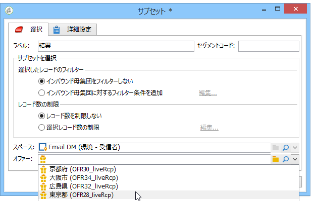

# オファー（セル別）{#offers-by-cell}

「**[!UICONTROL オファー（セル別）]**」アクティビティでは、インバウンド母集団（例：クエリから）を複数のセグメントに分散させ、それらの各セグメントに提示するオファーを指定できます。

このアクティビティは、「**インタラクション**」と一緒の場合のみ使用できます。 詳しくは、この[節](../../interaction/using/about-outbound-channels.md)を参照してください。

手順は次のとおりです。

1. ターゲットの母集団を指定したら、「**[!UICONTROL オファー（セル別）]**」アクティビティを追加して、それを開きます。
1. 「**[!UICONTROL 一般]**」タブで、オファーを提示するオファースペースを選択します。
1. 「**[!UICONTROL セル]**」タブで「**[!UICONTROL 追加]**」ボタンをクリックして、別のサブセットを指定します。

   * 適用可能なフィルタリングおよび制限ルールを使用して、サブセットの母集団を指定します。
   * 次に、サブセットに提案するオファーを選択します。 選択できるオファーは、前の手順で選択したオファースペースに適合するオファーです。

     

1. 次に、選択したチャネルに対応する配信アクティビティを設定します。 [クロスチャネル配信](cross-channel-deliveries.md)を参照してください。
