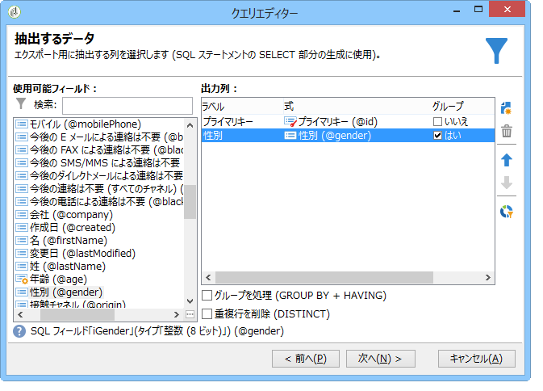
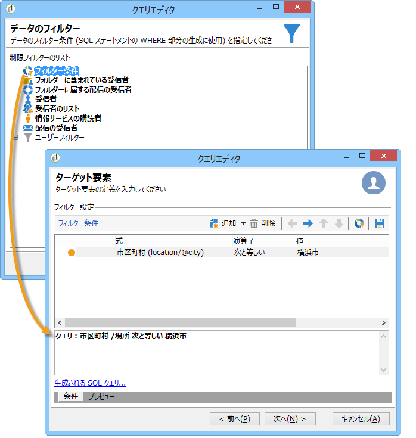
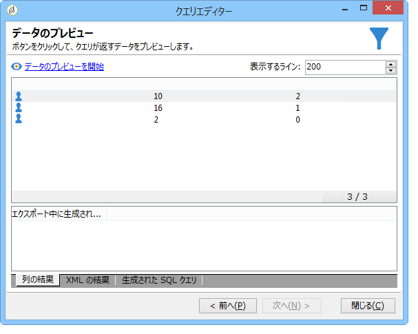

# 集計計算の実行 {#performing-aggregate-computing}

この例では、横浜市に住む受信者の数を性別に基づいてカウントします。

* どのテーブルを選択する必要がありますか。

   受信者テーブル（**nms:recipient**）

* 出力列でどのフィールドを選択する必要がありますか。

   「プライマリキー」（カウントあり）と「性別」

* どのような条件に基づいて情報をフィルターしますか。

   横浜市に住む受信者を基準にします

この例を作成するには、次の手順に従います。

1. In **[!UICONTROL Data to extract]**, define a count for the primary key (as shown in the previous example). Add the **[!UICONTROL Gender]** field in the output column. 列のオプション **[!UICONTROL Group]** をチェックし **[!UICONTROL Gender]** ます。 これにより、受信者は性別でグループ化されます。

   

1. In the **[!UICONTROL Sorting]** window, click **[!UICONTROL Next]**: no sorting is necessary here.
1. データのフィルターを設定します。ここでは、横浜市に住んでいる連絡先に選択を制限します。

   

   >[!NOTE]
   >
   >値では大文字と小文字が区別されます。条件に、大文字を使用せずに値 &quot;london&quot; を入力し、受信者のリストに大文字を使用した「London」という単語が含まれている場合、クエリは失敗します。

1. In the **[!UICONTROL Data formatting]** window, click **[!UICONTROL Next]**: no formatting is required for this example.
1. プレビューウィンドウで、をクリックしま **[!UICONTROL Launch data preview]**&#x200B;す。

   性別別に並べ替えるたびに、次の3つの値が異なります。 **2は女性** 、 **1は男性** 、 **** 0は性別が不明の場合です。 この例では、リストに女性が 10 人、男性が 16 人、性別不明が 2 人含まれています。

   
