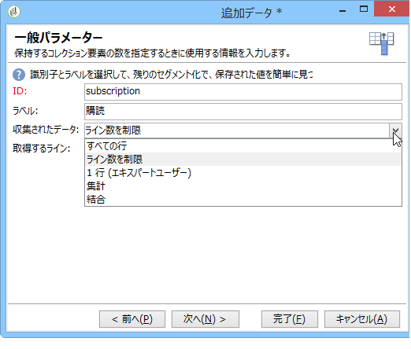

# クエリ{#query}

## クエリの作成 {#creating-a-query}

クエリを使用することで、基準に応じてターゲットを選択できます。セグメントコードをクエリの結果に関連付け、結果に追加データを挿入することができます。クエリーサンプルの詳細については、この節を参照 [してください](../../workflow/using/querying-recipient-table.md)。

>[!NOTE]
>
>Oracleを使用する場合、クエリーアクティビティはCLOBフィールドと互換性がありません。

For more on using and managing additional data, refer to [Adding data](#adding-data).

The **[!UICONTROL Edit query...]** link lets you define the targeting type, the restrictions, and the selection criteria for the population in the following way:

1. ターゲティングとフィルタリングディメンションを選択します。デフォルトでは、ターゲットが受信者から選択されます。制限フィルターのリストは、配信ターゲティングに使用されるリストと同じです。

   ターゲティングディメンションは、操作のターゲットにされた母集団など、作業対象の要素のタイプと一致します。

   フィルタリングディメンションにより、ターゲットされた個人に関連する情報など、これらの要素の収集が可能になります（連絡先、最終的な合意内容など）。

   詳しくは、ディメンションのターゲット設定とフィ [ルターを参照してください](../../workflow/using/building-a-workflow.md#targeting-and-filtering-dimensions)。

   

   A query can be based on data from the inbound transition, if necessary, by selecting **[!UICONTROL Temporary schema]** when choosing targeting and filtering dimensions.

   

1. ウィザードを使用して母集団を定義します。入力するフィールドは、ターゲットのタイプに応じて変わる場合があります。You can preview the targeted population with your current criteria using the **[!UICONTROL Preview]** tab.

   フィルターまたはクエリの作成および使用について詳しくは、この[節](../../platform/using/filtering-options.md)を参照してください。

   

1. If you have selected **[!UICONTROL Filtering conditions]** at step 1 or using the **[!UICONTROL Filters]** > **[!UICONTROL Advanced filter...]** option, then you will have to manually add filtering criteria later on.

   また、対応するボックスを選択することで、データのグループ化条件を追加できます。それには、フィルタリングディメンションが、クエリのターゲティングディメンションとは異なっている必要があります。グループ化について詳しくは、この[節](../../workflow/using/querying-using-grouping-management.md)を参照してください。

   式ビルダーを、AND、OR、EXCEPT などの論理オプションと組み合わせて使用することで、条件をさらに追加することもできます。その後、条件の組み合わせをプ **[!UICONTROL Corresponding SQL query...]** レビューできます。 詳しくは、この[節](../../platform/using/defining-filter-conditions.md#building-expressions)を参照してください。

   後で再利用したい場合、フィルターを保存します。

   

## データの追加 {#adding-data}

追加の列を使用して、契約番号やニュースレターの購読状況、接触チャネルなど、ターゲット母集団についての追加情報を収集できます。このデータは、Adobe Campaign データベースまたは外部データベースに保存できます。

The **[!UICONTROL Add data...]** link lets you select the additional data to collect.

まず、追加するデータのタイプを選択します。

* Adobe Campaignデ **[!UICONTROL Data linked to the filtering dimension]** ータベース内のデータを選択する場合に選択します。
* Select **[!UICONTROL External data]** to add data from an external database. このオプションは、**Federated Data Access** オプションを購入済みである場合のみ、使用できます。For more on this, refer to [Accessing an external database (FDA)](../../workflow/using/accessing-an-external-database--fda-.md).
* Select the **[!UICONTROL An offer proposition]** option to add a set of columns which let you store the best proposition generated by the offer engine. このオプションは、**インタラクション**&#x200B;モジュールを購入済みである場合のみ、使用できます。

プラットフォームにオプションモジュールが何もインストールされていない場合、このステージは表示されません。次のステージに直接移動します。

Adobe Campaign データベースからデータを追加するには：

1. 追加するデータのタイプを選択します。これは、フィルター条件に属するデータまたは、リンクされたテーブルに保存されたテーブルのどちらかになります。

   

1. データがクエリのフィルター条件に属している場合、使用可能なフィールドのリストから選択するだけで、出力列に表示されます。

   

   以下を追加できます。

   * ターゲット母集団から取り出したデータに基づいて自動生成されるフィールド、または集計（先月の保留中の購入の件数、レシートの平均額など）。例えば、「データの選択」に [移動します](../../workflow/using/targeting-data.md#selecting-data)。
   * A new field, created using the **[!UICONTROL Add]** button to the right of the list of output columns.

      例えば、契約者のリスト、最新 5 回の配達といった情報コレクションを追加することもできます。コレクションは、同じプロファイルで複数の値を持つことができるフィールドと一致します（1-N 関係）。For more on this, refer to [Editing additional data](../../workflow/using/targeting-data.md#editing-additional-data).

ターゲット母集団にリンクされたデータコレクションを追加するには：

1. ウィザードの最初の手順で、次のオプションを選択し **[!UICONTROL Data linked to the filtering dimension]** ます。
1. Select the table which contains the information you want to collect and click **[!UICONTROL Next]**.

   

1. If necessary, specify the number of elements of the collection that you want to keep by selecting one of the values in the **[!UICONTROL Data collected]** field. デフォルトで、コレクションのすべての行が収集され、次の手順で指定される条件に応じて、フィルタリングされます。

   * If a single element of the collection coincides with the filtering conditions for this collection, select **[!UICONTROL Single row]** in the **[!UICONTROL Data collected]** field.

      >[!IMPORTANT]
      >
      >このモードでは、コレクション要素を直接結合することで、生成される SQL クエリを最適化します。
      >
      >初期の条件が考慮されない場合、結果は不完全なものになります（行が不足または重複）。

   * If you choose to recover several lines (**[!UICONTROL Limit the line count]**) you can specify the number of lines to collect.
   * 収集された列に集計が含まれる場合（例えば、宣言されたエラー数、サイトの平均支出額など）。 値を使用でき **[!UICONTROL Aggregates]** ます。
   

1. コレクションの補助選択範囲を指定します。例えば、過去 15 日間の購入のみを指定します。

   

1. If you have selected the **[!UICONTROL Limit the line count]** option, define the order in which the collected data is to be filtered. 収集したライン数が制限ライン数を超えた場合、このフィルターの順序により、維持されるラインが決まります。

## Example: Targeting on simple recipient attributes {#example--targeting-on-simple-recipient-attributes}

以下の例のクエリは、フランス在住の 18 歳から 30 歳の男性を識別しようとしています。例えば、このクエリは、対象の男性に限定オファーを提供するワークフローなどで使用されます。

>[!NOTE]
>
>追加のクエリのサンプルについては、[この節](../../workflow/using/querying-recipient-table.md)を参照してください。

1. Name your query then select the **[!UICONTROL Edit query...]** link.
1. Select **[!UICONTROL Filtering conditions]** in the list of types of filter available.
1. 提案されたターゲットについて、異なる条件を入力します。AND オプションを使用して組み合わせた条件を以下に示します。選択範囲に含めるには、受信者が次の条件を満たす必要があります。

   * 敬称が「Mr」である受信者（「**性別**」フィールドの値を「**男性**」を指定して特定できます）
   * 30 歳以下の受信者
   * 18 歳以上の受信者
   * フランスに住んでいる受信者
   

   条件の組み合わせと一致する SQL を確認できます。

   

1. 条件が正しいかどうか確認するには、関連するタブで、クエリと一致する受信者をプレビューします。

   

1. Save your filters so that you can use them again at a later date by clicking **[!UICONTROL Finish]** > **[!UICONTROL OK]**.
1. ほかのアクティビティを追加して、ワークフローを引き続き編集します。ワークフローが開始され、先行するクエリの手順が完了したら、見つかった受信者の数が表示されます。You can display further details using the mouse pop-up menu (right click the transition > **[!UICONTROL Display the target...]**).

   

## 出力パラメーター {#output-parameters}

* tableName
* schema
* recCount

この 3 つの値セットは、クエリのターゲットとなる母集団を識別します。**[!UICONTROL tableName]** はターゲットの識別子を記録するテーブル名、**[!UICONTROL schema]** は母集団のスキーマ（通常は nms:recipient）、**[!UICONTROL recCount]** はテーブル内の要素の数です。

この値は、作業用テーブルのスキーマです。このパラメーターは、**[!UICONTROL tableName]** と **[!UICONTROL schema]** のすべてのトランジションで有効です。

## クエリの最適化 {#optimizing-queries}

以下の節では、Adobe Campaignで実行するクエリを最適化して、データベースの負荷を制限し、ユーザーエクスペリエンスを向上させるためのベストプラクティスを示します。

### 結合とインデックス {#joins-and-indexes}

* 効率的なクエリはインデックスに依存しています。
* すべての結合にインデックスを使用します。
* スキーマ上でリンクを定義すると、結合条件が決まります。 リンクテーブルの主キーに一意のインデックスが必要で、結合はこのフィールドに配置する必要があります。
* 文字列フィールドではなく数値フィールドにキーを定義して結合を実行します。
* 外部結合の実行を避けます。 可能な限り、Zero IDレコードを使用して外部結合機能を実現します。
* 結合には正しいデータ型を使用します。

   句がフィールドと同 `where` じタイプであることを確認してください。

   よくある間違いは、は数 `iBlacklist='3'` 値フィールドで、テ `iBlacklist``3` キスト値を表します。

   クエリの実行計画が何かを知っていることを確認します。 特に、リアルタイムクエリやほぼリアルタイムクエリが毎分実行される場合は、フルテーブルスキャンを避けます。

この詳細については、「データモデルのベス[トプラクティス](https://helpx.adobe.com/campaign/kb/acc-data-model-best-practices.html) 」と「データベースマッピ [ング](../../configuration/using/database-mapping.md) 」を参照してください。

### 関数 {#functions}

* のような機能には注意が必要で `Lower(...)`す。 Lower関数を使用する場合、Indexは使用されません。
* 「いいね！」命令、「upper」命令、「lower」命令を使用して、クエリを慎重にチェックします。 データベースフィールドではなく、ユーザー入力に「Upper」を適用します。

   For more on functions, refer to [this section](../../platform/using/defining-filter-conditions.md#list-of-functions).

### ディメンションのフィルタリング {#filtering-dimensions}

「exists suches」演算子を使用する代わりに、クエリーのフィルターディメンションを使用します。

クエリーでは、フィルターの「次のような存在する」条件は効率的ではありません。 SQLのサブクエリと同等です。

`select iRecipientId from nmsRecipient where iRecipientId IN (select iRecipientId from nmsBroadLog where (...))`

ベストプラクティスは、代わりにクエリーのフィルタリングディメンションを使用することです。

SQLのフィルタリングディメンションと同等のものは、内部結合です。

`select iRecipientId from nmsRecipient INNER JOIN nmsBroadLog ON (...)`

For more on filtering dimensions, refer to [this section](../../workflow/using/building-a-workflow.md#targeting-and-filtering-dimensions).

### アーキテクチャ {#architecture}

* 実稼働プラットフォームと同様のボリューム、パラメータ、アーキテクチャを持つ開発プラットフォームを構築します。
* 開発環境と実稼働環境で同じ値を使用します。 できる限り、同じように使用します。

   * オペレーティングシステム,
   * バージョン,
   * データ,
   * アプリケーション,
   * ボリューム
   >[!NOTE]
   >
   >開発環境で機能する機能は、データが異なる実稼働環境では動作しない場合があります。 リスクを予測し、解決策を準備するために、主な違いを特定してみてください。

* ターゲットボリュームに一致する構成を作成します。 大容量ボリュームには特定の構成が必要です。 100,000人の受信者に対して機能する設定は、10,000,000人の受信者に対しては機能しない場合があります。

   システムが稼働時にどのように拡大するかを検討します。 小規模で機能するからといって、量が多いと適しているわけではない。 テストは、実稼働中のボリュームと同様のボリュームで行う必要があります。 また、プロジェクトのピーク時間、ピーク日、および全期間におけるボリュームの変化（呼び出し回数、データベースのサイズ）の影響も評価する必要があります。
