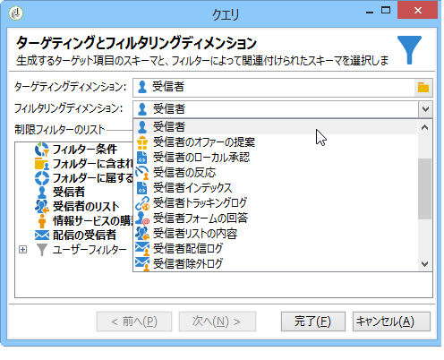

# 配信情報に対するクエリ {#querying-delivery-information}

## 特定の配信のクリック数 {#number-of-clicks-for-a-specific-delivery}

この例では、特定の配信のクリック数を収集します。これらのクリック数は、特定の期間にわたって取得された受信者トラッキングログに記録されています。受信者は E メールアドレスで識別されます。このクエリはテーブルを使用 **[!UICONTROL Recipient tracking logs]** します。

* どのテーブルを選択する必要がありますか。

   The recipient log tracking table (**[!UICONTROL nms:trackingLogRcp]**)

* 出力列に選択するフィールドは何ですか。

   「プライマリキー」（カウントあり）と「E メール」

* どのような条件に基づいて情報をフィルターしますか。

   特定の期間および配信ラベルの要素

この例を実行するには、次の手順に従います。

1. を開き、ス **[!UICONTROL Generic query editor]** キーマを選択 **[!UICONTROL Recipient tracking logs]** します。

   

1. In the **[!UICONTROL Data to extract]** window, we want to create an aggregate to collect information. これを行うには、主キーを追加します(主要要素の上に配置さ **[!UICONTROL Recipient tracking logs]** れます)。トラッキングログカウントはこのフィールドで実行 **[!UICONTROL Primary key]** されます。 編集した式は次のようになりま **[!UICONTROL x=count(primary key)]**&#x200B;す。 この式により、様々なトラッキングログの合計が単一の E メールアドレスにリンクされます。

   手順は次のとおりです。

   * フィールド **[!UICONTROL Add]** の右側のアイコンをクリック **[!UICONTROL Output columns]** します。 ウィンドウ **[!UICONTROL Formula type]** で、オプションを選択 **[!UICONTROL Edit the formula using an expression]** し、をクリックしま **[!UICONTROL Next]**&#x200B;す。 ウィンドウで、 **[!UICONTROL Field to select]** をクリックしま **[!UICONTROL Advanced selection]**&#x200B;す。

      

   * In the **[!UICONTROL Formula type]** window, run a process on the aggregate function. このプロセスはプライマリキーカウントになります。

      セクション **[!UICONTROL Process on an aggregate function]** でを選択し、を **[!UICONTROL Aggregate]** クリックしま **[!UICONTROL Count]**&#x200B;す。

      

      クリック **[!UICONTROL Next]**.

   * フィールドを選 **[!UICONTROL Primary key (@id)]** 択します。 出力列 **[!UICONTROL count (primary key)]** が設定されます。

      

1. 出力列に表示するその他のフィールドを選択します。列でノ **[!UICONTROL Available fields]** ードを開き、を **[!UICONTROL Recipient]** 選択します **[!UICONTROL Email]**。 Check the **[!UICONTROL Group]** box to **[!UICONTROL Yes]** to group the tracking logs by email address: this group links each log to its recipient.

   

1. 最もアクティブな受信者（最もトラッキングログが多い受信者）が最初に表示されるように列の並べ替えを設定します。列をチ **[!UICONTROL Yes]** ェックイン **[!UICONTROL Descending sort]** します。

   

1. 次に、関心のあるログ（2 週間以内のログや営業関連の配信を対象とするログなど）をフィルターする必要があります。

   手順は次のとおりです。

   * データのフィルターを設定します。これを行うには、を選択し、をク **[!UICONTROL Filter conditions]** リックしま **[!UICONTROL Next]**&#x200B;す。

      

   * 特定の配信の特定の期間におけるトラッキングログを収集します。必要になるフィルター条件は、現在の日付の 2 週間前から現在の日付の前日までの検索期間を設定するための 2 つの日付条件と、検索を特定の配信に制限するための条件の 3 つです。

      In the **[!UICONTROL Target element]** window, configure the date starting from which tracking logs will be taken into account. クリック **[!UICONTROL Add]**. 条件ラインが表示されます。関数をクリ **[!UICONTROL Expression]** ックして列を編集し **[!UICONTROL Edit expression]** ます。 ウィンドウで、 **[!UICONTROL Field to select]** を選択しま **[!UICONTROL Date (@logDate)]**&#x200B;す。

      

      演算子を選択 **[!UICONTROL greater than]** します。 列でをク **[!UICONTROL Value]** リックし、ウ **[!UICONTROL Edit expression]**&#x200B;ィンドウでを **[!UICONTROL Formula type]** 選択します **[!UICONTROL Process on dates]**。 最後に、「15」 **[!UICONTROL Current date minus n days]**&#x200B;と入力します。

      クリック **[!UICONTROL Finish]**.

      

   * To select the tracking log search end date, create a second condition by clicking **[!UICONTROL Add]**. 列で、も **[!UICONTROL Expression]** う一度を選択し **[!UICONTROL Date (@logDate)]** ます。

      演算子を選択 **[!UICONTROL less than]** します。 列で、をク **[!UICONTROL Value]** リックします **[!UICONTROL Edit expression]**。 日付処理の場合は、ウィンドウ **[!UICONTROL Formula type]** に「1」と入力します **[!UICONTROL Current date minus n days]**。

      クリック **[!UICONTROL Finish]**.

      

      次に、クエリが対象とする配信ラベルなど、3 番目のフィルター条件を設定します。

   * Click the **[!UICONTROL Add]** function to create another filtering condition. 列で、をク **[!UICONTROL Expression]** リックします **[!UICONTROL Edit expression]**。 ウィンドウ **[!UICONTROL Field to select]** で、ノード内 **[!UICONTROL Label]** のを選択 **[!UICONTROL Delivery]** します。

      クリック **[!UICONTROL Finish]**.

      

      「sales」という単語を含む配信を検索します。Since you don&#39;t remember its exact label, you can choose the **[!UICONTROL contains]** operator and enter &quot;sales&quot; in the **[!UICONTROL Value]** column.

      

1. Click **[!UICONTROL Next]** until you get to the **[!UICONTROL Data preview]** window: no formatting is necessary here.
1. ウィンドウ **[!UICONTROL Data preview]** で、をクリック **[!UICONTROL Start the preview of the data]** して、各配信受信者のトラッキングログ数を表示します。

   結果は降順で表示されます。

   

   この例では、特定のユーザーのログの最大数が 6 で、5 人の異なるユーザーが配信 E メールを開いたり、E メールのいずれかのリンクをクリックしたということになります。

## いずれの配信も開封していない受信者 {#recipients-who-did-not-open-any-delivery}

この例では、過去 7 日間、E メールを開封していない受信者をフィルターします。

この例を作成するには、次の手順に従います。

1. Drag and drop a **[!UICONTROL Query]** activity in a workflow and open the activity.
1. をクリッ **[!UICONTROL Edit query]** クし、ターゲットディメンションとフィルターディメンションをに設定しま **[!UICONTROL Recipients]**&#x200B;す。

   

1. を選択し、 **[!UICONTROL Filtering conditions]** をクリックしま **[!UICONTROL Next]**&#x200B;す。
1. ボタンをクリ **[!UICONTROL Add]** ックし、を選択しま **[!UICONTROL Tracking logs]**&#x200B;す。
1. 式のを **[!UICONTROL Operator]** に設 **[!UICONTROL Tracking logs]** 定します **[!UICONTROL Do not exist such as]**。

   

1. 別の式を追加します。カテゴリ **[!UICONTROL Type]** 内でを選択 **[!UICONTROL URL]** します。
1. 次に、をに設定し、 **[!UICONTROL Operator]** をに設 **[!UICONTROL equal to]** 定し **[!UICONTROL Value]** ます **[!UICONTROL Open]**。

   

1. Add another expression and select **[!UICONTROL Date]**. **[!UICONTROL Operator]** をに設定する必要がありま **[!UICONTROL on or after]**&#x200B;す。

   

1. To set the value last 7 days, click the **[!UICONTROL Edit expression]** button in the **[!UICONTROL Value]** field.
1. カテゴリ **[!UICONTROL Function]** で、ターゲ **[!UICONTROL Current date minus n days]** ットにする日数を選択して追加します。 ここでは、過去 7 日間をターゲティングします。

   

アウトバウンドトランジションには、過去 7 日間、E メールを開封していない受信者が含まれます。

反対に、1 件以上の E メールを開封した受信者をフィルターする場合、クエリは次のようになります。この場合は、をに設定する必要があ **[!UICONTROL Filtering dimension]** りますのでご注意くださ **[!UICONTROL Tracking logs (Recipients)]**&#x200B;い。

## 配信を開封した受信者 {#recipients-who-have-opened-a-delivery}

次の例では、過去 2 週間以内に配信を開封したプロファイルをターゲティングする方法を示します。

1. 配信を開いたプロファイルをターゲットにするには、トラッキングログを使用する必要があります。 リンクテーブルに保存されます。次に示すように、フィールドのドロップダウンリストで次のテーブルを **[!UICONTROL Filtering dimension]** 選択して開始します。

   

1. Concerning filtering conditions, click the **[!UICONTROL Edit expression]** icon of the criteria shown in the sub-tree structure of the tracking logs. フィールドを選 **[!UICONTROL Date]** 択します。

   

   Click **[!UICONTROL Finish]** to confirm selection.

   In order to recover only the tracking logs less than two weeks old, select the **[!UICONTROL Greater than]** operator.

   

   Then click the **[!UICONTROL Edit expression]** icon in the **[!UICONTROL Value]** column to define the calculation formula to be applied. 数式を選択 **[!UICONTROL Current date minus n days]** し、関連するフィールドに15と入力します。

   

   Click the **[!UICONTROL Finish]** button of the formula window. In the filtering window, click the **[!UICONTROL Preview]** tab to check targeting criteria.

   

## 配信後の受信者の行動のフィルタリング {#filtering-recipients--behavior-folllowing-a-delivery}

In a workflow, the **[!UICONTROL Query]** and **[!UICONTROL Split]** boxes let you select a behavior following a previous delivery. This selection is carried out via the **[!UICONTROL Delivery recipient]** filter.

* 例の目的

   配信ワークフローには、最初の E メール通信をフォローアップする複数の方法があります。This type of operation involves using the **[!UICONTROL Split]** box.

* コンテキスト

   「サマースポーツキャンペーン」配信が送信されます。配信の 4 日後、他の 2 つの配信が送信されます。1 つは「ウォータースポーツキャンペーン」、もう 1 つは最初の「サマースポーツキャンペーン」配信のフォローアップです。

   「ウォータースポーツキャンペーン」配信は、最初の配信の「ウォータースポーツ」リンクをクリックした受信者に送信されます。このクリックは、受信者がトピックに関心があることを示しています。これらの受信者を類似の提案に導くことは理にかなっています。ただし、「サマースポーツキャンペーン」をクリックしなかった受信者には同じ内容を再度送信します。

The following steps show you how to configure the **[!UICONTROL Split]** box by integrating two different behaviors:

1. Insert the **[!UICONTROL Split]** box into the workflow. このボックスでは、最初の配信の受信者を次の 2 つの配信に分類します。分類は、最初の配信における受信者の行動にリンクされたフィルター条件に基づいておこなわれます。

   

1. ボックスを開 **[!UICONTROL Split]** きます。 タブに、ラ **[!UICONTROL General]** ベルを入力します。例え **ば、動作に基づいて** 「分割」。

   

1. In the **[!UICONTROL Subsets]** tab, define the first split branch. 例えば、この分岐に対してラベルとして 「**クリックした**」と入力します。
1. オプションを選 **[!UICONTROL Add a filtering condition on the incoming population]** 択します。 クリック **[!UICONTROL Edit]**.
1. ウィンドウ **[!UICONTROL Targeting and filtering dimension]** で、フィルターをダブルクリック **[!UICONTROL Recipients of a delivery]** します。

   

1. In the **[!UICONTROL Target element]** window, select the behavior you want to apply to this branch: **[!UICONTROL Recipients having clicked (email)]**.

   以下で、このオプションを選 **[!UICONTROL Delivery specified by the transition]** 択します。 この機能では、最初の配信でターゲットとされた受信者が自動的に収集されます。

   これは「ウォータースポーツキャンペーン」配信です。

   

1. 2 番目の分岐を定義します。この分岐には、最初の配信と同じ内容のフォローアップ E メールが含まれます。Go to the **[!UICONTROL Subsets]** tab and click **[!UICONTROL Add]** to create it.

   

1. もう 1 つのサブタブが表示されます。このサブタブに、「**クリックしなかった**」という名前を付けます。
1. クリック **[!UICONTROL Add a filtering condition for the incoming population]**. 次に、をクリックしま **[!UICONTROL Edit...]**&#x200B;す。

   

1. ウィンドウ **[!UICONTROL Delivery recipients]** 内をクリック **[!UICONTROL Targeting and filtering dimension]** します。
1. ウィンドウ **[!UICONTROL Target element]** で、動作を選択し **[!UICONTROL Recipients who did not click (email)]** ます。 最後の分岐 **[!UICONTROL Delivery specified by the transition]** に対して表示されているように、オプションを選択します。

   The **[!UICONTROL Split]** box is now fully configured.

   

次に、デフォルトで設定されている各種コンポーネントのリストを示します。

* **[!UICONTROL All recipients]**
* **[!UICONTROL Recipients of successfully sent messages,]**
* **[!UICONTROL Recipients who opened or clicked (email),]**
* **[!UICONTROL Recipients who clicked (email),]**
* **[!UICONTROL Recipients of a failed message,]**
* **[!UICONTROL Recipients who didn't open or click (email),]**
* **[!UICONTROL Recipients who didn't click (email).]**

   
