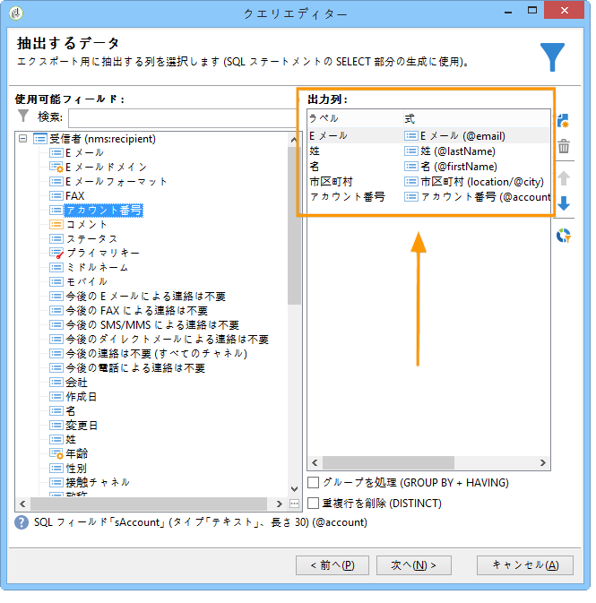
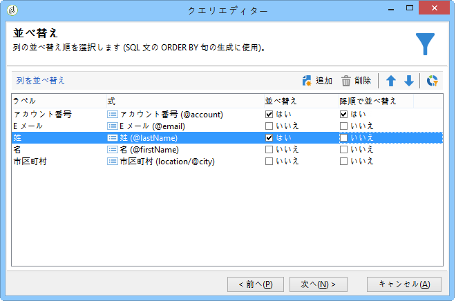
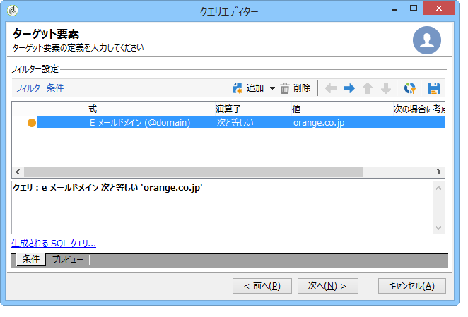
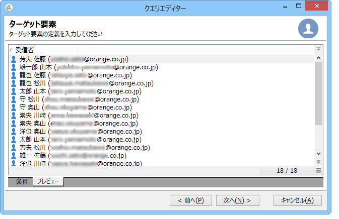
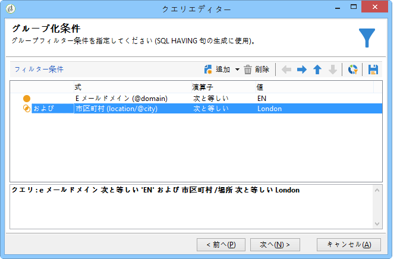
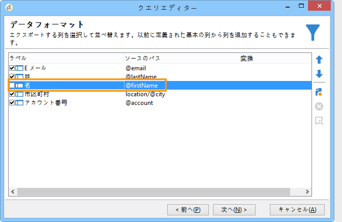
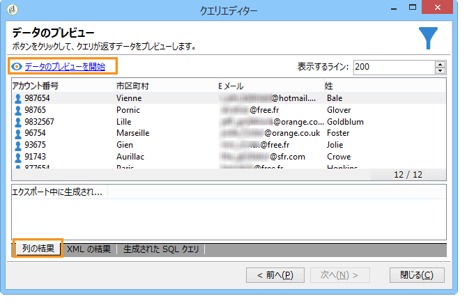
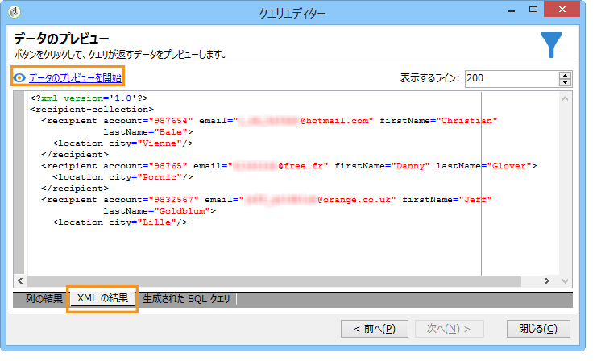
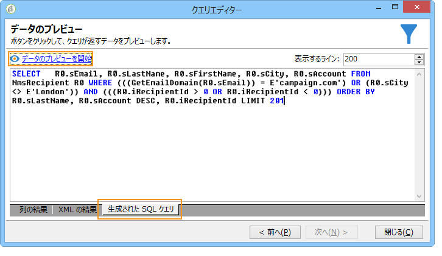

# 受信者テーブルに対するクエリ {#querying-recipient-table}

この例では、E メールドメインが「orange.co.jp」で、横浜市に住んでいない受信者の名前と E メールを収集します。

* どのテーブルを選択する必要がありますか。

   受信者テーブル（nms:recipient）

* 出力列として選択するフィールドは何ですか。

   E メール、名前、市区町村およびアカウント番号

* 受信者のフィルター条件は何ですか。

   市区町村と E メールドメイン

* 並べ替えを設定しますか。

   はい、およびに基づきま **[!UICONTROL Account number]** す。 **[!UICONTROL Last name]**

この例を作成するには、次の手順に従います。

1. をクリ **[!UICONTROL Tools > Generic query editor...]** ックし、「 **Recipients** (**nms:recipient**)」テーブルを選択します。 次に、をクリックしま **[!UICONTROL Next]**&#x200B;す。
1. 選択： **[!UICONTROL Last name]**、 **[!UICONTROL First name]**、 **[!UICONTROL Email]**、 **[!UICONTROL City]** 、 **[!UICONTROL Account number]**、 これらのフィールドはに追加されま **[!UICONTROL Output columns]**&#x200B;す。 次に、をクリックしま **[!UICONTROL Next]**&#x200B;す。

   

1. 列を並べ替えて適切な順序で表示します。ここでは、アカウント番号を降順、名前をアルファベット順に並べ替えます。次に、をクリックしま **[!UICONTROL Next]**&#x200B;す。

   

1. ウィンドウで、 **[!UICONTROL Data filtering]** 検索を絞り込みます。を選択し、 **[!UICONTROL Filtering conditions]** をクリックしま **[!UICONTROL Next]**&#x200B;す。
1. The **[!UICONTROL Target element]** window lets you enter the filter settings.

   E メールドメインが「orange.co.jp」と等しい受信者というフィルター条件を定義します。To do this, choose **Email domain (@email)** in the **[!UICONTROL Expression]** column, choose **equal to** in the **[!UICONTROL Operator]** column and enter &quot;orange.co.uk&quot; in the **[!UICONTROL Value]** column.

   

1. If needed, click the **[!UICONTROL Distribution of values]** button to view a distribution based on the email domain of prospects. データベースでの E メールドメインごとの割合が表示されます。「orange.co.jp」以外のドメインは、フィルターが適用されるまで表示されます。

   クエリーの概要がウィンドウの下部に表示されます。電子メ **ールドメインが「orange.co.uk」に等しい**。

1. Click the **[!UICONTROL Preview]** to get an idea of the query result: only &quot;orange.co.uk&quot; email domains are displayed.

   

1. クエリを変更して、横浜市に住んでいない連絡先を検索します。

   列内 **[!UICONTROL City (location/@city)]** で演算子と **[!UICONTROL Expression]** して **[!UICONTROL different from]** 選択し、列に **[!UICONTROL London]** と入力し **[!UICONTROL Value]** ます。

   

1. This will take you to the **[!UICONTROL Data formatting]** window. 列の順序を確認します。「市区町村」列を「アカウント番号」列の下に移動します。

   「名」列をオフにしてリストから削除します。

   

1. ウィンドウで、 **[!UICONTROL Data preview]** をクリックしま **[!UICONTROL Start the preview of the data]**&#x200B;す。 この機能により、クエリの結果が計算されます。

   The **[!UICONTROL Column results]** tab shows the query result in columns.

   結果には、E メールドメインが「orange.co.jp」で、横浜市に住んでいないすべての受信者が表示されます。前のステージでオフにしたので、「名」列は表示されません。アカウント番号は降順で並べ替えられます。

   

   The **[!UICONTROL XML result]** tab shows the result in XML format.

   

   このタ **[!UICONTROL Generated QSL queries]** ブには、クエリ結果がSQL形式で表示されます。

   
