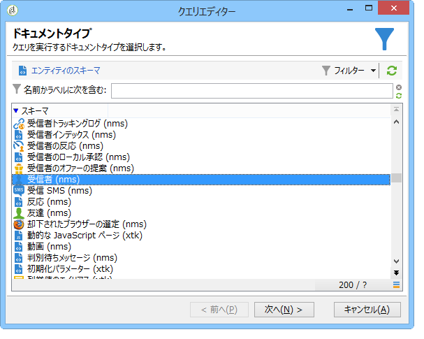
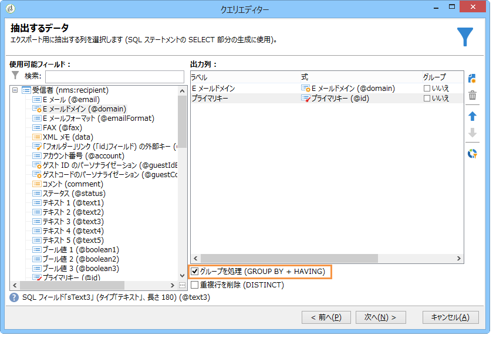
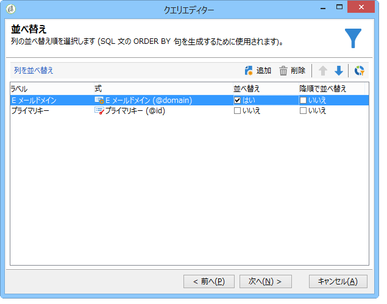
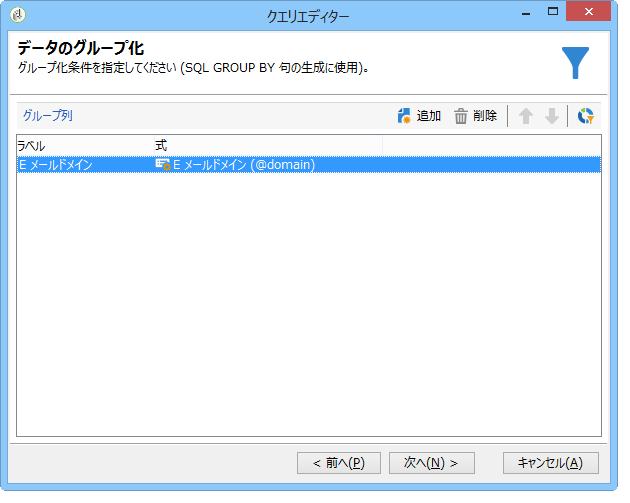
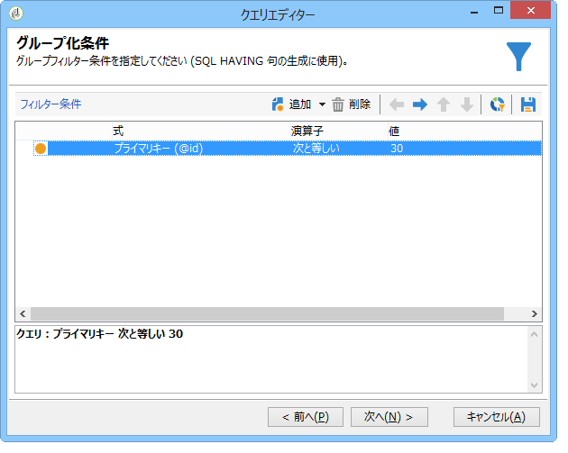
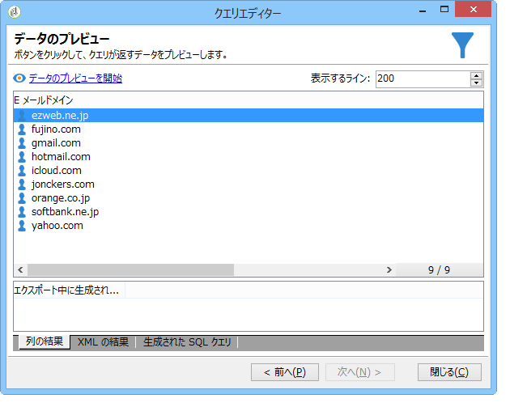

# グループ化管理を使用したクエリ {#querying-using-grouping-management}

この例では、クエリを実行して、以前の配信でターゲットとされた回数が 30 回を超えるすべての E メールドメインを検索します。

* どのテーブルを選択する必要がありますか。

   受信者テーブル（nms:recipient）

* 出力列に選択するフィールドは何ですか。

   「E メールドメイン」と「プライマリキー」（カウントあり）

* データをグループ化する基準は何ですか。

   プライマリキーのカウントが 30 を超える E メールドメインを基準にします。This operation is carried out with the **[!UICONTROL Group by + Having]** option. 「**[!UICONTROL Group by + Having]**」では、データをグループ化し（「group by」）、グループ化した対象を選択（「having」）できます。

この例を作成するには、次の手順に従います。

1. Open the **[!UICONTROL Generic query editor]** and choose the Recipient table (**nms:recipient**).

   

1. ウィンドウ **[!UICONTROL Data to extract]** で、およびフィールド **[!UICONTROL Email domain]** を選択 **[!UICONTROL Primary key]** します。 フィールドに対してカウントを実 **[!UICONTROL Primary key]** 行します。

   プライマリキーカウントについて詳しくは、[この節](../../platform/using/defining-filter-conditions.md#building-expressions)を参照してください。

1. チェックボックスをオ **[!UICONTROL Handle groupings (GROUP BY + HAVING)]** ンにします。

   

1. In the **[!UICONTROL Sorting]** window, sort email domains in descending order. これを行うには、列をチェ **[!UICONTROL Yes]** ックインし **[!UICONTROL Descending sort]** ます。 クリック **[!UICONTROL Next]**.

   

1. で、を **[!UICONTROL Data filtering]**&#x200B;選択しま **[!UICONTROL Filtering conditions]**&#x200B;す。 ウィンドウに移動し、 **[!UICONTROL Target elements]** をクリックしま **[!UICONTROL Next]**&#x200B;す。
1. ウィンドウ **[!UICONTROL Data grouping]** で、をクリックしてを **[!UICONTROL Email domain]** 選択しま **[!UICONTROL Add]**&#x200B;す。

   このデータグループ化ウィンドウは、 **[!UICONTROL Handle groupings (GROUP BY + HAVING]**)ボックスがオンになっている場合にのみ表示されます。

   

1. In the **[!UICONTROL Grouping condition]** window, indicate a primary key count greater than 30 since we only want email domains targeted more than 30 times to be returned as results.

   This window appears when the **[!UICONTROL Manage groupings (GROUP BY + HAVING)]** box was checked: this is where the grouping result is filtered (HAVING).

   

1. ウィンドウで、 **[!UICONTROL Data formatting]** 次の項目をクリックしま **[!UICONTROL Next]**&#x200B;す。ここでは書式設定は必要ありません。
1. In the data preview window, click **[!UICONTROL Launch data preview]**: here, three different email domains targeted over 30 times are returned.

   
