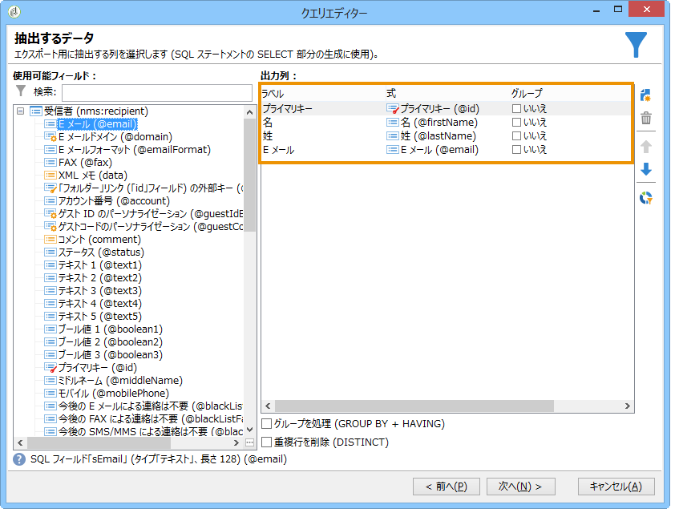
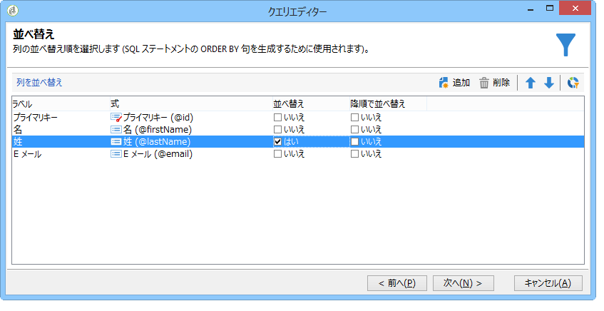
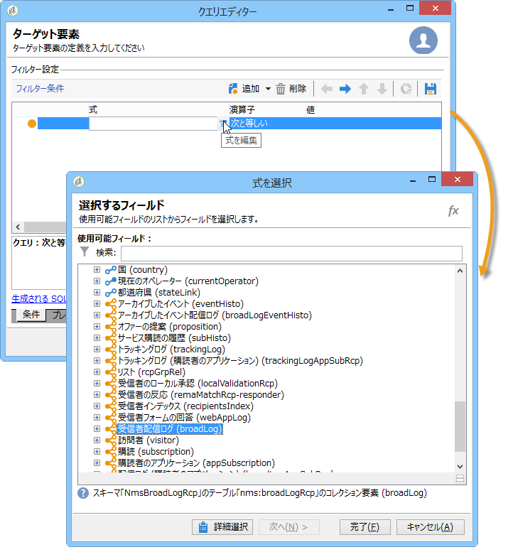
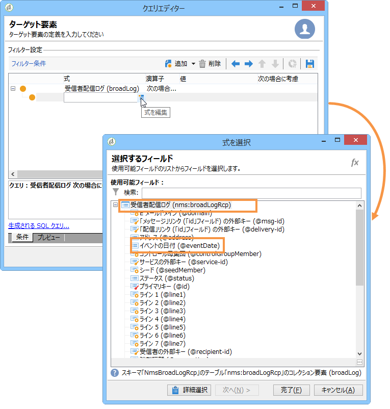
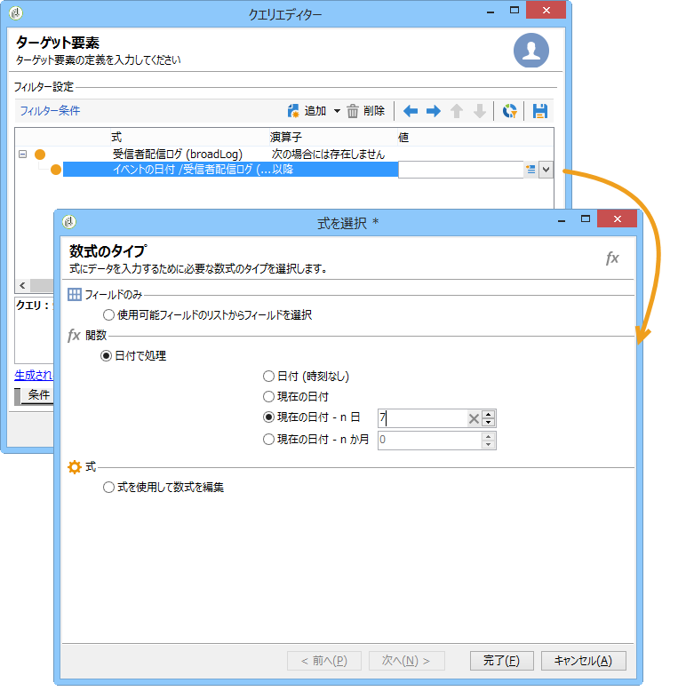
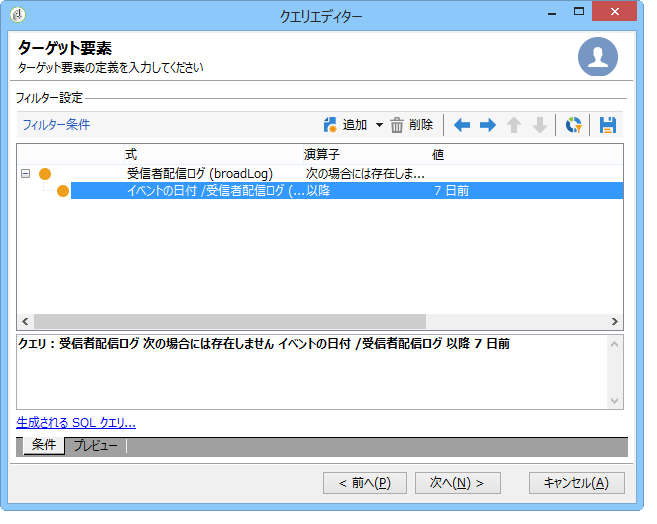
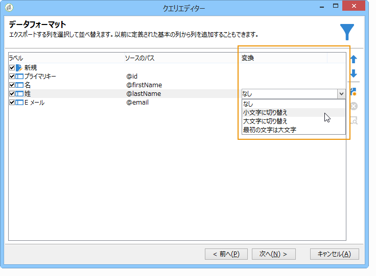
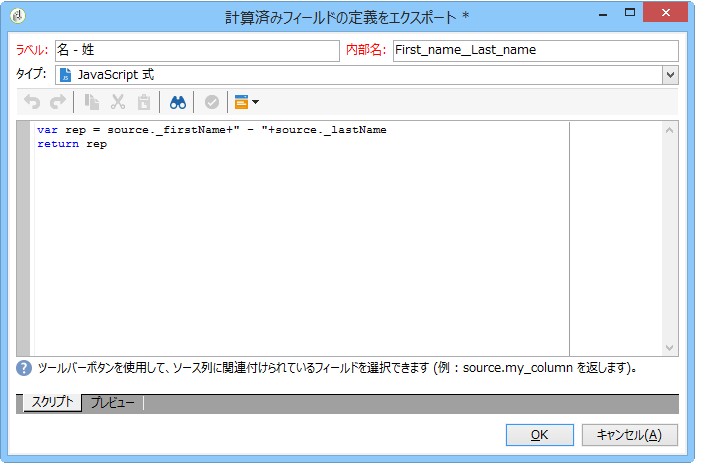
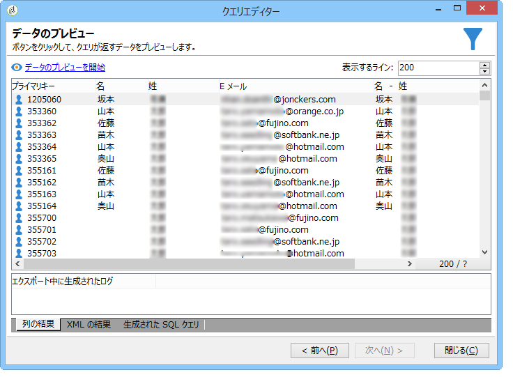

# 多対多関係を使用したクエリ {#querying-using-a-many-to-many-relationship}

この例では、過去 7 日間連絡されていない受信者を収集します。このクエリは、すべての配信を対象とします。

この例では、任意に選択したコレクション要素（オレンジ色のノード）に関連するフィルターを設定する方法も示します。ウィンドウでコレクション要素を使用で **[!UICONTROL Field to select]** きます。

* どのテーブルを選択する必要がありますか。

   受信者テーブル（**nms:recipient**）

* 出力列に選択するフィールドは何ですか。

   「プライマリキー」、「姓」、「名」および「E メール」

* どのような条件に基づいて情報をフィルターしますか。

   過去 7 日間の受信者の配信ログに基づきます。

次の手順に従います。

1. Open the Generic query editor and select the Recipient table **[!UICONTROL (nms:recipient)]**.
1. ウィンドウ **[!UICONTROL Data to extract]** で、、、、およ **[!UICONTROL Primary key]**&#x200B;びを **[!UICONTROL First name]**&#x200B;選択 **[!UICONTROL Last name]** します **[!UICONTROL Email]**。

   

1. 並べ替えウィンドウで、名前をアルファベット順で並べ替えます。

   

1. ウィンドウで、 **[!UICONTROL Data filtering]** を選択しま **[!UICONTROL Filtering conditions]**&#x200B;す。
1. In the **[!UICONTROL Target element]** window, the filtering condition for extracting profiles with no tracking log for the last 7 days involves two steps. 選択する必要がある要素は多対多のリンクです。

   * 最初の列のコレクション **[!UICONTROL Recipient delivery logs (broadlog)]** 要素（オレンジ色のノード）を選択して開始 **[!UICONTROL Value]** します。

      

      演算子を選択 **[!UICONTROL do not exist as]** します。 このラインで 2 番目の値を選択する必要はありません。

   * 2 番目のフィルター条件の内容は、最初のフィルター条件によって異なります。Here, the **[!UICONTROL Event date]** field is offered directly in the **[!UICONTROL Recipient delivery logs]** table since there is a link to this table.

      

      演算子 **[!UICONTROL Event date]** を使用して選 **[!UICONTROL greater than or equal to]** 択します。 Select the **[!UICONTROL DaysAgo (7)]** value. これを行うには、フィールド内 **[!UICONTROL Edit expression]** をクリック **[!UICONTROL Value]** します。 ウィンドウ **[!UICONTROL Formula type]** で、とを選択 **[!UICONTROL Process on dates]** し、 **[!UICONTROL Current date minus n days]**&#x200B;値として「7」を指定します。

      

      フィルター条件が設定されました。

      

1. In the **[!UICONTROL Data formatting]** window, switch the last names to upper-case. 列の線をク **[!UICONTROL Last name]** リックし、ド **[!UICONTROL Transformation]** ロップダウ **[!UICONTROL Switch to upper case]** ンメニューでを選択します。

   

1. この関数を使 **[!UICONTROL Add a calculated field]** 用して、データプレビューウィンドウに列を挿入します。

   この例では、受信者の名と姓を含む計算フィールドを単一の列で追加します。関数をクリック **[!UICONTROL Add a calculated field]** します。 ウィンドウ **[!UICONTROL Export calculated field definition]** で、ラベルと内部名を入力し、タイプを選択し **[!UICONTROL JavaScript Expression]** ます。 次の式を入力します。

   ```
   var rep = source._firstName+" - "+source._lastName
   return rep
   ```

   

   クリック **[!UICONTROL OK]**. ウィン **[!UICONTROL Data formatting]** ドウが設定されます。

   計算フィールドの追加について詳しくは、この節を参照してください。

1. The result is shown in the **[!UICONTROL Data preview]** window. 過去7日間連絡されていない受信者が表示されます。名と姓の列が作成されました。

   
