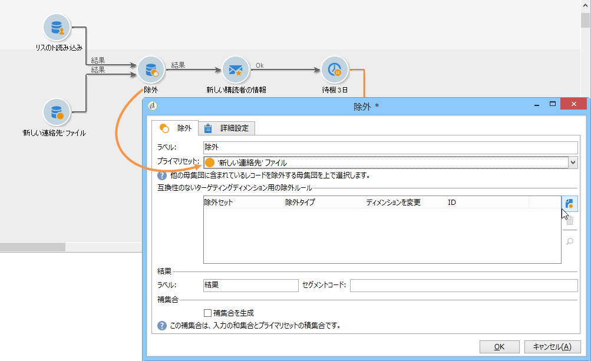

# リストの読み込み{#read-list}

ワークフローで処理されるデータは、（前回のセグメント化またはファイルアップロード後に）あらかじめデータが準備されたか構造化されたリストから取得されます。

The **[!UICONTROL Read list]** activity lets you copy the data from a list in the workflow worktable, like data from a query. その後、コピーされたデータにワークフロー全体を通じてアクセスできます。

The list to be processed can be specified explicitly, computed by a script or localized dynamically, according to options selected and parameters defined in a **[!UICONTROL Read list]** activity.

リストが明示的に指定されない場合、構造を調べるテンプレートとして使用されるリストを提供する必要があります。

Once the list selection has been configured, you can add a filter using the **[!UICONTROL Edit query]** option to keep one part of the population for the next workflow.

>[!CAUTION]
>
>リストの読み込みアクティビティ内にフィルターを作成するには、関連するリストが「ファイル」タイプである必要があります。

The lists can be created directly in Adobe Campaign via the **[!UICONTROL Profiles and Targets > Lists]** link of the home page. They can also be created in a workflow using the **[!UICONTROL List update]** activity.

**例：送信アドレスのリストの除外**

次の例では、E メールアドレスのリストを、E メール配信ターゲットから除外する目的で使用しています。

**新しい連絡先**&#x200B;フォルダーに含まれるプロファイルは、配信アクションのターゲットに設定される必要があります。ターゲットから除外する E メールアドレスは、外部リストに保存されています。この例では、除外に必要な情報は、E メールアドレスのみです。

1. リスト内の情報と整合性を図るには、選択されたプロファイルの E メールアドレスを、**新しい連絡先**&#x200B;フォルダー選択クエリで読み込めるようにする必要があります。

   

1. ここでは、リストは&#x200B;**リスト**&#x200B;フォルダーに保存され、ラベルが自動生成されます。

   

1. 外部リスト内の E メールアドレスをメインターゲットから除外するには、除外アクティビティを設定し、保持するデータが含まれる&#x200B;**新しい連絡先**&#x200B;フォルダーを指定する必要があります。このセットと、除外アクティビティのその他すべてのインバウンドセットとの結合データが、ターゲットから削除されます。

   

   除外ルールは、編集ツールの中央部に設定されています。Click the **[!UICONTROL Add]** button to define the type of exclusion to be applied.

   アクティビティの受信トランジションの数に応じて、複数の除外を定義できます。

1. In the **[!UICONTROL Exclusion set]** field, select the **[!UICONTROL Read list]** activity: the data in this activity is to be excluded from the main set.

   この例では、結合に対する除外があります。リストに含まれるデータは、E メールアドレスを含んでいるフィールド経由でメインセットのデータと紐付けされます。結合を設定するには、フィールド **[!UICONTROL Joins]** でを選択 **[!UICONTROL Change dimension]** します。

   

1. 次に、2 つのセット内（ソースおよびディメンション）で E メールアドレスと対応するフィールドを選択します。列がリンクされ、インポートされたアドレスのリストに E メールアドレスが含まれる受信者が、ターゲットから除外されます。

