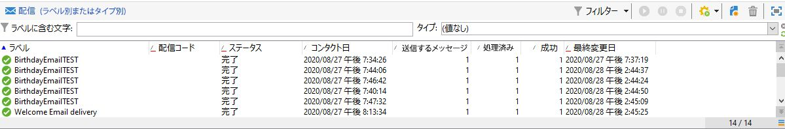

# 繰り返し配信{#recurring-delivery}

「**[!UICONTROL 繰り返し配信]**」アクティビティでは、キャンペーン固有の配信テンプレートの繰り返しを設定できます。

このアクティビティは、キャンペーン内の「**[!UICONTROL ターゲティングとワークフロー]**」タブでのみ使用できます。

手順は次のとおりです。

1. アクティビティのベースにする配信テンプレートを選択します。

   

1. 配信テンプレートを設定します。

このアクティビティの設定プロセスで使用できるオプションは、配信テンプレートの作成プロセスで使用できるオプションとほぼ同じです。詳しくは、[この節](../../delivery/using/about-templates.md)を参照してください。

このアクティビティの使用例については、この[節](../../workflow/using/sending-a-birthday-email.md#creating-a-recurring-delivery-in-a-targeting-workflow)を参照してください。

## 繰り返し配信の設定方法

**繰り返し配信**&#x200B;では、実行のたびに新しい配信インスタンスを作成します。例えば、ワークフローが週に 1 回実行されるようにスケジュールされている場合、1 年後には 52 件の配信が存在することになります。また、broadLog とトラッキングログは、各配信インスタンスで区切られます。

このビデオでは、繰り返し配信とスケジューラーアクティビティを設定する方法を説明します。

>[!VIDEO](https://video.tv.adobe.com/v/25040?quality=12&captions=jpn)

>[!NOTE]
>
>「**[!UICONTROL 繰り返し配信]**」タイプアクティビティから配達確認を送信することはできません。\
>キャンペーンワークフロー経由で配信を直接作成するには、事前設定されたチャネル固有のアクティビティを使用します（「**[!UICONTROL E メール配信]**」など）。
