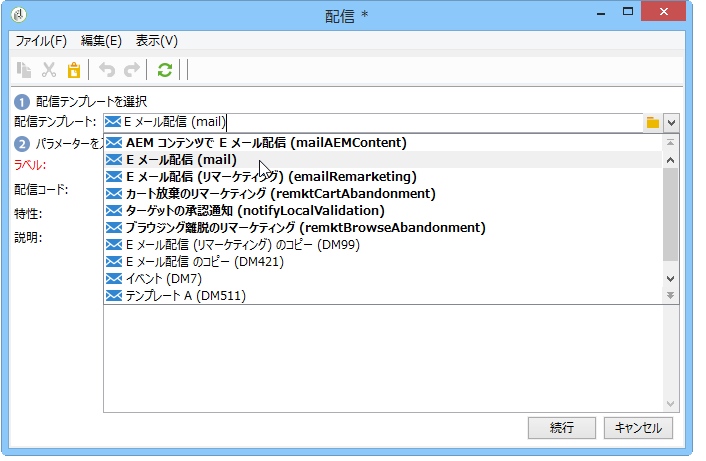

# 繰り返し配信{#recurring-delivery}

A **[!UICONTROL Recurring delivery]** activity lets you configure a delivery template occurrence that is specific to a campaign.

This activity is only available from the **[!UICONTROL Targeting and workflows]** tab found in a campaign.

手順は次のとおりです。

1. アクティビティのベースにする配信テンプレートを選択します。

   

1. 配信テンプレートを設定します。

このアクティビティの設定プロセスで使用できるオプションは、配信テンプレートの作成プロセスで使用できるオプションとほぼ同じです。詳しくは、[この節](../../delivery/using/about-templates.md)を参照してください。

このアクティビティの使用例については、この[節](../../workflow/using/sending-a-birthday-email.md#creating-a-recurring-delivery-in-a-targeting-workflow)を参照してください。

>[!NOTE]
>
>It is not possible to send a proof from a **[!UICONTROL Recurring delivery]** type activity.\
>To directly create a delivery via a campaign workflow, use the channel specific activities that are preconfigured (e.g. **[!UICONTROL Email delivery]**).

