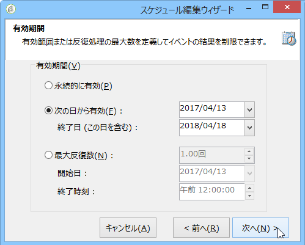

# スケジューラー{#scheduler}

**スケジューラー**&#x200B;は、スケジュールで指定された時間にトランジションを有効化する永続的なタスクです。

The **[!UICONTROL Scheduler]** activity should be considered as a scheduled start. The activity positioning rules within the chart are the same as for the **[!UICONTROL Start]** activity. このアクティビティはインバウンドトランジションを持つことはできません。

システム全体のパフォーマンスが落ちたり、データベースにブロックが作成されたりする可能性があるので、ワークフローの実行スケジュールは 15 分以上の間隔を開けることをお勧めします。

When building your workflow, never use more than one **[!UICONTROL Scheduler]** activity per branch. For more on this, refer to: [Using activities](../../workflow/using/workflow-best-practices.md#using-activities).

スケジューラーは、トランジションの有効化スケジュールを定義します。To configure it, double-click the graphical object, then click **[!UICONTROL Change...]**

ウィザードを使用して、アクティビティの頻度と有効期限を定義できます。設定手順は、以下のとおりです。

1. Select the activation frequency and click **[!UICONTROL Next]**.

   

1. 有効化する時間と曜日を指定します。この手順のパラメーターは、前の手順で選択した頻度によって決まります。アクティビティを 1 日に何度も起動するように選択した場合、設定は以下のようになります。

   

1. スケジュールの有効期限を定義するか、実行回数を指定します。

   

1. Check the configuration and click **[!UICONTROL Finish]** to save.

   

スケジューラーアクティビティを使用すると、同時に複数のワークフローが実行される場合があります。 例えば、1 時間ごとにワークフローの実行をトリガーするようにスケジューラーを設定できますが、ワークフロー全体の実行に 1 時間以上かかる場合があります。ワークフローが既に実行中の場合、実行をスキップしたいことがあります。ワークフローの同時実行を防ぐ方法の詳細については、このページを参照 [してください](../../workflow/using/monitoring-workflow-execution.md#preventing-simultaneous-multiple-execution)。

なお、ワークフローがインポートなどの長期タスクを実行している場合、または wfserver が当分の間停止している場合は、トランジションを数時間後に有効化することもできます。この場合、スケジューラーによって有効化されるタスクの実行の制限が一定期間必要になることがあります。
