# 誕生日の E メールの送信{#sending-a-birthday-email}

## はじめに {#introduction}

この使用例では、リスト内の受信者に対し誕生日に繰り返し E メールを送信する方法を説明します。

この使用例を設定するうえで、以下のターゲティングワークフローを作成しました。

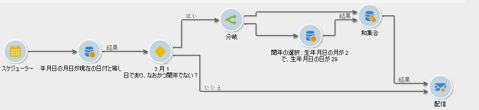

この（日々実行される）ワークフローでは、現在の日付が誕生日であるすべての受信者を選択します。

この使用例は、ビデオでも紹介しています。詳しくは、[ワークフローの作成](https://docs.campaign.adobe.com/doc/AC/en/Videos/Videos.html)のビデオを参照してください。

To do this, create a campaign and click the **[!UICONTROL Targeting and workflows]** tab. For more on this, refer to the [Building the main target in a workflow](../../campaign/using/marketing-campaign-deliveries.md#building-the-main-target-in-a-workflow) section.

その後、以下の手順に従います。

## 送信のスケジュール {#configuring-the-scheduler}

1. First, add a **Scheduler** to trigger sending the delivery every day. 以下の例では、毎日午前 6 時に配信が作成されます。

   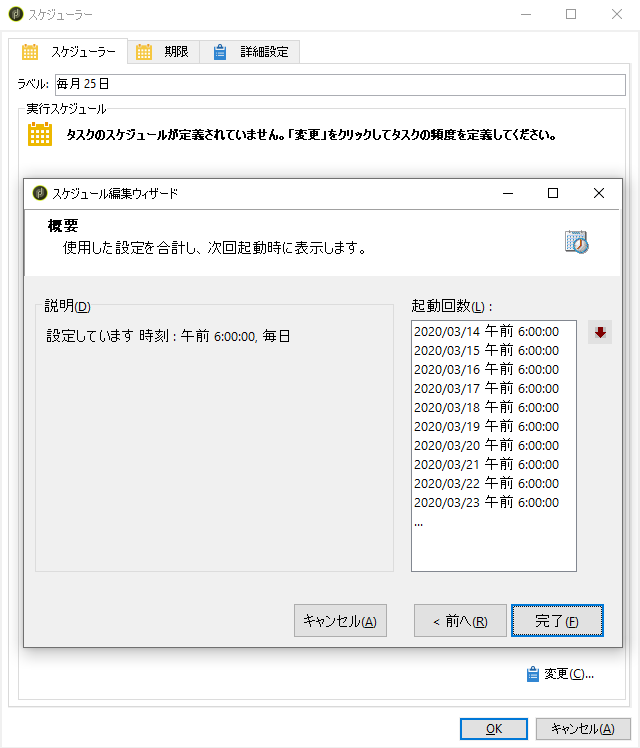


## その日が誕生日の受信者の識別 {#identifying-recipients-whose-birthday-it-is}

After configuring the **[!UICONTROL Scheduler]** activity so that the workflow starts every day, identify all of the recipients whose date of birth equals the current date.

それには、次の手順に従います。

1. Drag and drop a **[!UICONTROL Query]** activity into the workflow and double-click it.
1. Click the **Edit query** link and select **[!UICONTROL Filtering conditions]**.

   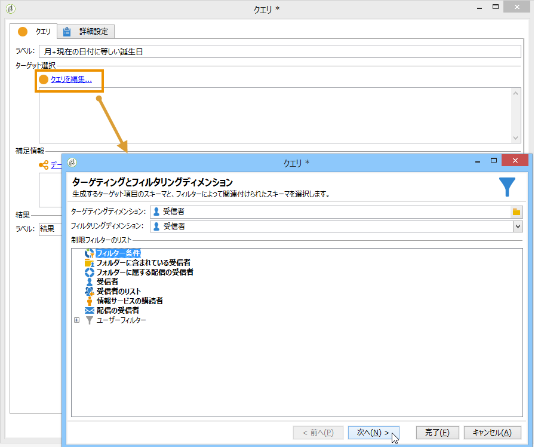

1. Click the first cell of the **[!UICONTROL Expression]** column and click **[!UICONTROL Edit expression]** to open the expression editor.

   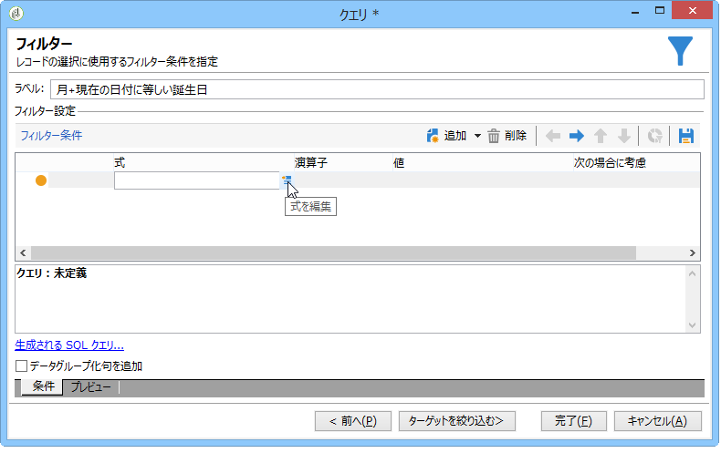

1. をクリック **[!UICONTROL Advanced selection]** して、フィルタリングモードを選択します。

   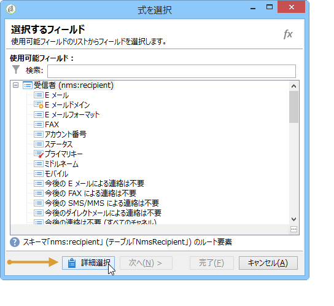

1. を選択し、 **[!UICONTROL Edit the formula using an expression]** をクリックし **[!UICONTROL Next]** て式エディターを表示します。
1. In the list of functions, double-click **[!UICONTROL Day]**, which is accessible via the **[!UICONTROL Date]** node. この関数は、パラメーターとして渡された日付に対応する日を表す数値を返します。

   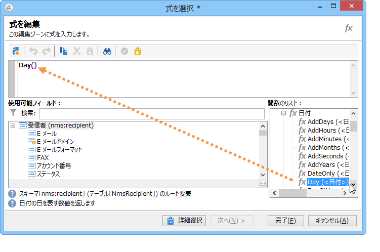

1. In the list of available fields, double-click **[!UICONTROL Birth date]**. エディターの上部セクションに、次の数式が表示されます。

   ```
   Day(@birthDate)
   ```

   Click **[!UICONTROL Finish]** to confirm.

1. In the query editor, in the first cell of the **[!UICONTROL Operator]** column, select **[!UICONTROL equal to]**.

   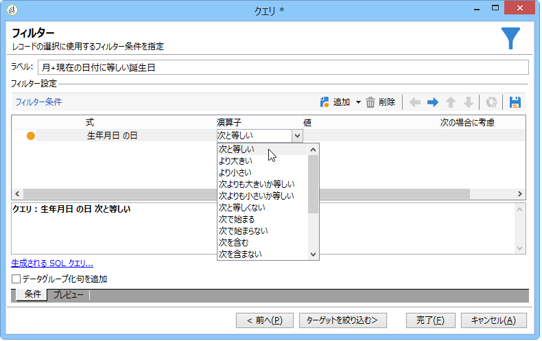

1. Next, click the first cell of the second column (**[!UICONTROL Value]**), and click **[!UICONTROL Edit expression]** to open the expression editor.
1. In the list of functions, double-click **[!UICONTROL Day]**, which is accessible via the **[!UICONTROL Date]** node.
1. 「**[!UICONTROL GetDate]**」関数をダブルクリックして現在の日付を取得します。

   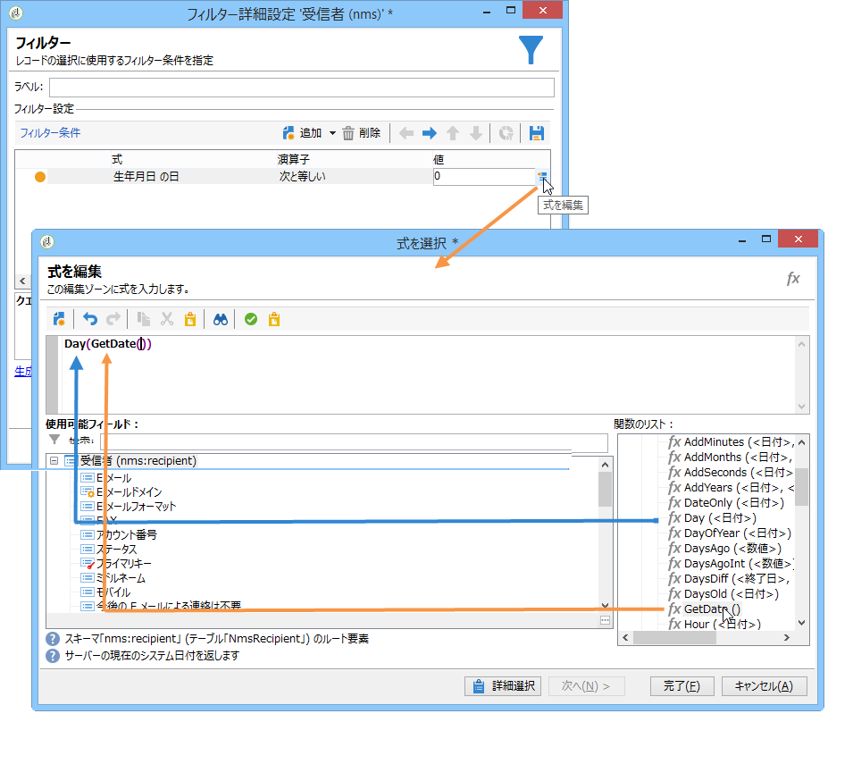

   エディターの上部セクションに、次の数式が表示されます。

   ```
   Day(GetDate())
   ```

   Click **[!UICONTROL Finish]** to confirm.

1. この手順を繰り返して、現在の月に対応する誕生月を取得します。To do this, click the **[!UICONTROL Add]** button and repeat steps 3 to 10, replacing **[!UICONTROL Day]** with **[!UICONTROL Month]**.

   完成したクエリは次のようになります。

   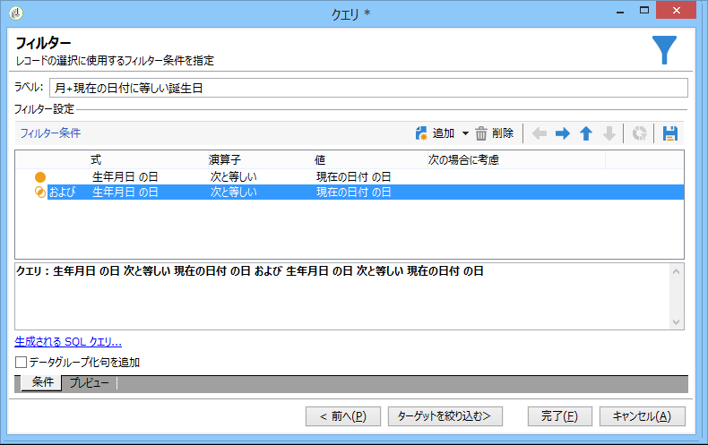

Link the result of the **[!UICONTROL Query]** activity to an **[!UICONTROL Email delivery]** activity to send an email to the list of all of your recipients on their birthday.

## Including recipients born on February 29th (optional) {#including-recipients-born-on-february-29th--optional-}

2 月 29 日に生まれた受信者全員を含めたい場合、この使用例では、閏年かどうかに関わらず、リスト内の受信者に対し、誕生日に繰り返し E メールを送信する方法を示します。

この使用例の主な実装手順は次のとおりです。

* 受信者の選択
* 閏年であるかどうかを選択
* 2 月 29 日生まれの受信者をすべて選択

この使用例を設定するうえで、以下のターゲティングワークフローを作成しました。


現在の年が&#x200B;**閏年でなく**、ワークフローが 3 月 1 日に実行された場合、2 月 29 日が誕生日の受信者すべてを選択して、受信者のリストに追加する必要があります。その他の場合については追加のアクションは不要です。

### 手順1:受信者の選択 {#step-1--selecting-the-recipients}

After configuring the **[!UICONTROL Scheduler]** activity so that the workflow starts every day, identify all of the recipients whose anniversary is the current day.

>[!NOTE]
>
>今年が閏年の場合、2 月 29 日生まれの受信者すべてが自動的に対象になります。

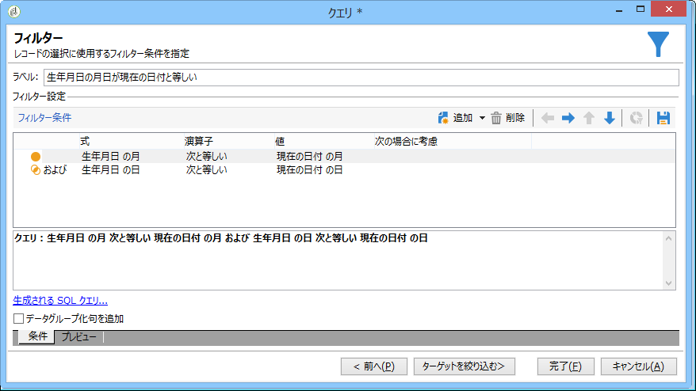

現在の日付に対応する誕生日を持つ受信者を選択する方法については、[誕生日を持つ [受信者の識別]セクションを参照してくだ](#identifying-recipients-whose-birthday-it-is) さい。

### Step 2: Select whether or not it is a leap year {#step-2--select-whether-or-not-it-is-a-leap-year}

The **[!UICONTROL Test]** activity allows you to check whether or not it is a leap year and whether the current date is March 1st.

テストの結果、今年が閏年ではなくて 2 月 29 日は存在せず、さらに現在の日付が 3 月 1 日である場合、「**[!UICONTROL True]**」トランザクションが有効になり、2 月 29 日生まれの受信者が 3 月 1 日の配信に追加されます。そうでない場合は、「**[!UICONTROL False]**」トランザクションが有効になり、3 月 1 日生まれの受信者だけが配信を受け取ります。

Copy and paste the code below into the **[!UICONTROL Initialization script]** section of the **[!UICONTROL Advanced]** tab.

```
function isLeapYear(iYear)
{
    if(iYear/4 == Math.floor(iYear/4))
    {
        if(iYear/100 != Math.floor(iYear/100))
        {
            // Divisible by 4 only -> Leap Year
            return 1;
        }
        else
        {
            if(iYear/400 == Math.floor(iYear/400))
            {
                // Divisible by 4, 100 and 400 -> Leap year
                return 1;
            }
        }
    }
    // all others: no leap year
    return 0;
}

// Return today's date and time
var currentTime = new Date()
// returns the month (from 0 to 11)
var month = currentTime.getMonth() + 1
// returns the day of the month (from 1 to 31)
var day = currentTime.getDate()
// returns the year (four digits)
var year = currentTime.getFullYear()

// is current year a leap year?
vars.currentIsALeapYear = isLeapYear(year);

// is current date the first of march?
if(month == 3 && day == 1) {
  // today is 1st of march
vars.firstOfMarch = 1;
}
```

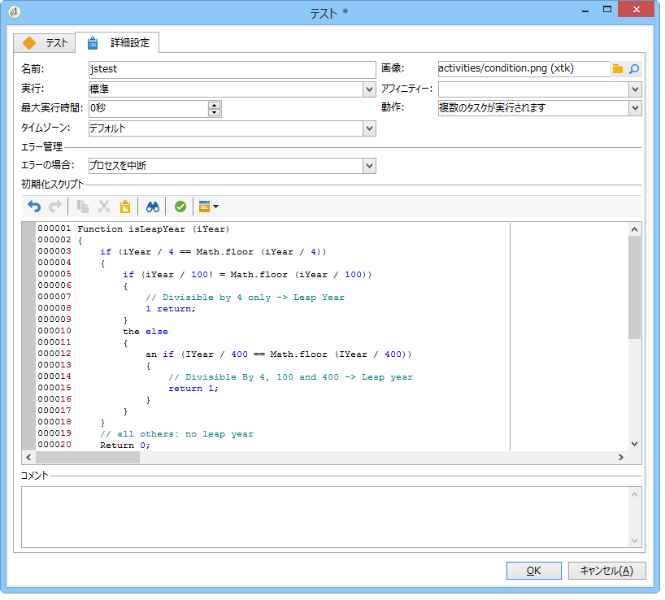

Add the following condition in the **[!UICONTROL Conditional forks]** section:

```
vars.currentIsALeapYear == 0 && vars.firstOfMarch == 1
```

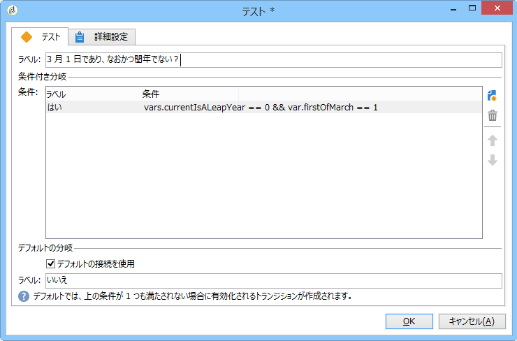

### Step 3: Select any recipients born on February 29th {#step-3--select-any-recipients-born-on-february-29th}

Create a **[!UICONTROL Fork]** activity and link one of the outbound transitions to a **[!UICONTROL Query]** activity.

このクエリで、誕生日が 2 月 29 日の受信者すべてを選択します。

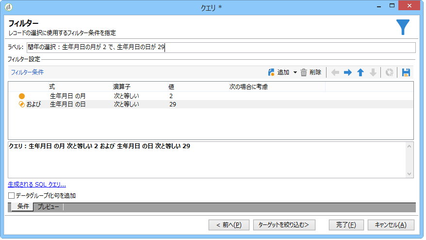

Combine the results with a **[!UICONTROL Union]** activity.

Link the results of the two **[!UICONTROL Test]** activity branches to an **[!UICONTROL Email delivery]** activity to send an email to the list of all of your recipients on their birthday, even to those born on February 29th during a non-leap year.

## 定期的な配信の作成 {#creating-a-recurring-delivery-in-a-targeting-workflow}

送信する誕生日メールテンプレートに基づいて、「**繰り返し配信**」アクティビティを追加します。

>[!CAUTION]
>
>ワークフローを実行するには、キャンペーンプロセスに関するテクニカルワークフローを開始する必要があります。詳しくは、「キャンペーンプロセスワークフ [ローのリスト](../../workflow/using/campaign.md) 」を参照してください。
>
>キャンペーンに対して承認手順が有効になっている場合は、これらの手順が確認された後でのみ配信されます。詳しくは、「承認するプロセスの選 [択」の節を参照してください](../../campaign/using/marketing-campaign-approval.md#choosing-the-processes-to-be-approved) 。


