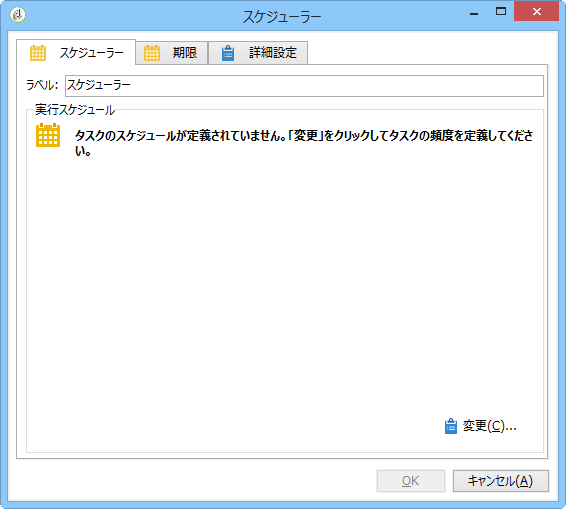

# リストへのレポートの送信{#sending-a-report-to-a-list}

This use case details how to generate a monthly out-of-the-box **[!UICONTROL Tracking indicators]** report in PDF format and how to send it to a list of recipients.


この使用例の主な実装手順は次のとおりです。

* 配信を受け取る受信者のリストの作成(次を参照：手 [順1:受信者リストの作成](#step-1--creating-the-recipient-list))。
* Creating a delivery template that will let you generate a new delivery each time the workflow is executed (refer to: [Step 2: Creating the delivery template](#step-2--creating-the-delivery-template)).
* Creating a workflow that will let you generate the report in PDF format and send it to the list of recipients (refer to: [Step 3: Creating the workflow](#step-3--creating-the-workflow)).

## Step 1: Creating the recipient list {#step-1--creating-the-recipient-list}

宇宙に移動し **[!UICONTROL Profiles and targets]** 、リンクをクリ **[!UICONTROL Lists]** ックして、ボタンをクリッ **[!UICONTROL Create]** クします。 Select **[!UICONTROL New list]** and create a new recipient list for the report to be sent to.


リストの作成について詳しくは、この[節](../../platform/using/creating-and-managing-lists.md)を参照してください。

## Step 2: Creating the delivery template {#step-2--creating-the-delivery-template}

1. Adobe Campaignエクスプ **[!UICONTROL Resources > Templates > Delivery templates]** ローラーのノードに移動し、あらかじめ用意され **[!UICONTROL Email delivery]** ているテンプレートを複製します。

   

   配信テンプレートの作成について詳しくは、この[節](../../delivery/using/about-templates.md)を参照してください。

1. ラベル、ターゲット（前に作成した受信者のリスト）など、各種テンプレートパラメーターのほか、件名、コンテンツを入力します。

   

1. ワークフローが実行されるたびに、レ **[!UICONTROL Tracking indicators]** ポートが更新されます(手順3 [を参照：ワークフローの作成](#step-3--creating-the-workflow))。 To include the latest version of the report in the delivery, you need to add a **[!UICONTROL Calculated attachment]**:

   計算による添付ファイルの作成について詳しくは、この[節](../../delivery/using/attaching-files.md#creating-a-calculated-attachment)を参照してください。

   * リンクをクリ **[!UICONTROL Attachments]** ックし、をクリ **[!UICONTROL Add]**&#x200B;ックして、を選択しま **[!UICONTROL Calculated attachment]**&#x200B;す。

      

   * Go to the **[!UICONTROL Type]** field and select the fourth option: **[!UICONTROL File name is computed during delivery of each message (it may then depend on the recipient profile)]**.

      

      The value entered in the **[!UICONTROL Label]** field will not appear in the final delivery.

   * 編集ゾーンに移動し、アクセスパスとファイルの名前を入力します。

      

      >[!CAUTION]
      >
      >ファイルはサーバー上に置かれている必要があります。そのパスと名前は、ワークフローのタイプアクティビティで入力され **[!UICONTROL JavaScript code]** たものと同じである必要があります（次を参照）。手 [順3:ワークフローの作成](#step-3--creating-the-workflow))。

   * タブを選択し、チ **[!UICONTROL Advanced]** ェックをオンにしま **[!UICONTROL Script the name of the file name displayed in the mails sent]**&#x200B;す。 編集ゾーンに移動し、最終の配信で使用する添付ファイルの名前を入力します。

      

## 手順3:ワークフローの作成 {#step-3--creating-the-workflow}

この使用例では、次のようなワークフローを作成しています。アクティビティは 3 つあります。

* One **[!UICONTROL Scheduler]** type activity that lets you execute the workflow once a month,
* One **[!UICONTROL JavaScript code]** type activity that lets you generate the report in PDF format,
* one **[!UICONTROL Delivery]** type activity that uses the previously created delivery template.


1. 次に、ノードに移動し、 **[!UICONTROL Administration > Production > Technical workflows]** 新しいワークフローを作成します。

   

1. Start by adding a **[!UICONTROL Scheduler]** type activity and configure it so that the workflow executes on the first Monday of the month.

   

   For more on configuring the scheduler, refer to [Scheduler](../../workflow/using/scheduler.md).

1. 次に、タイプアクティビテ **[!UICONTROL JavaScript code]** ィを追加します。

   

   編集ゾーンで次のコードを入力します。

   ```
   var reportName = "deliveryFeedback";
   var path = "/tmp/deliveryFeedback.pdf";
   var exportFormat = "PDF";
   var reportURL = "<PUT THE URL OF THE REPORT HERE>";
   var _ctx = <ctx _context="global" _reportContext="deliveryFeedback" />
   var isAdhoc = 0;
   
   xtk.report.export(reportName, _ctx, exportFormat, path, isAdhoc);
   ```

   次の変数が使用されます。

   * **var reportName**：ダブルコーテーションで囲い、レポートの内部名を入力します。このケースでは、「**トラッキング指標**」レポートの内部名は「deliveryFeedback」になります。
   * **var path**：ファイルの保存先のパス（「tmp/files/」）、ファイルに付与する名前（「deliveryFeedback」）、およびファイルの拡張子（「.pdf」）を入力します。このケースでは、ファイル名に内部名を使用します。それぞれの値は、ダブルコーテーションで囲い、「+」の文字で区切る必要があります。

      >[!CAUTION]
      >
      >ファイルはサーバー上に保存されている必要があります。You must enter the same path and the same name in the **[!UICONTROL General]** tab of the edit window for the calculated attachment (refer to: [Step 2: Creating the delivery template](#step-2--creating-the-delivery-template)).

   * **var exportFormat**：ファイルのエクスポートフォーマット（「PDF」）を入力します。
   * **var _ctx** (context):この場合、レポートはグローバルコンテキ **[!UICONTROL Tracking indicators]** ストで使用されています。

1. Finish by adding a **[!UICONTROL Delivery]** type activity with the following options:

   * **[!UICONTROL Delivery]**:を選択 **[!UICONTROL New, created from a template]**&#x200B;し、以前に作成した配信テンプレートを選択します。
   * フィールドとフ **[!UICONTROL Recipients]** ィールド **[!UICONTROL Content]** に対してを選択しま **[!UICONTROL Specified in the delivery]**&#x200B;す。
   * **[!UICONTROL Action to execute]**:を選択しま **[!UICONTROL Prepare and start]**&#x200B;す。
   * とのチェックを **[!UICONTROL Generate an outbound transition]** 解除しま **[!UICONTROL Process errors]**&#x200B;す。
   

