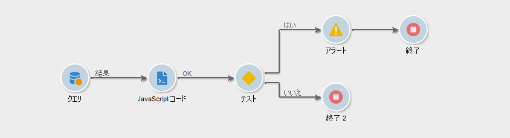
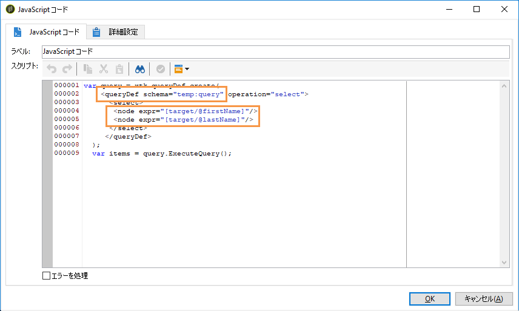
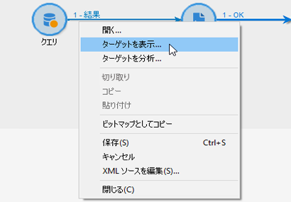
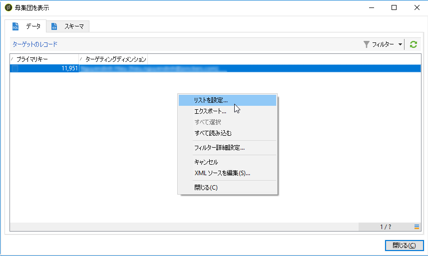
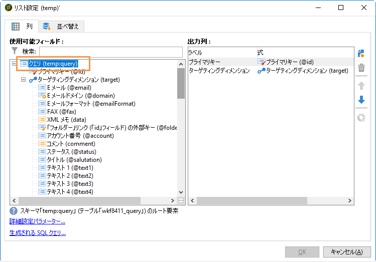
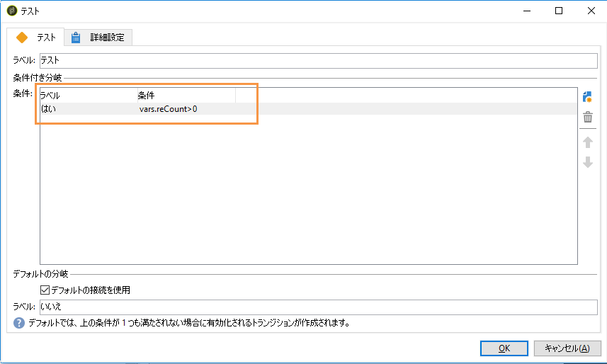
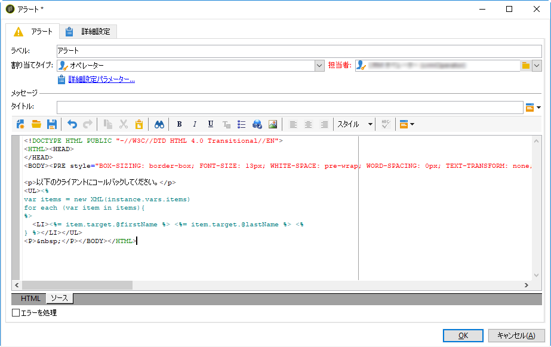

# パーソナライズされたアラートのオペレーターへの送信{#sending-personalized-alerts-to-operators}

この例では、ニュースレターを開封したがそれに含まれるリンクをクリックしなかったプロファイルの名前を記載したアラートをオペレーターに送信します。

The profiles&#39; first and last name fields are linked to the **[!UICONTROL Recipients]** targeting dimension, whereas the **[!UICONTROL Alert]** activity is linked to the **[!UICONTROL Operator]** targeting dimension. 結果として、2 つのターゲティングディメンション間で、紐付けを実行し、氏名フィールドを取得して、アラートアクティビティに表示するのに使用できるフィールドはありません。

このプロセスでは、次のようにワークフローを構築できます。

1. Use a **[!UICONTROL Query]** activity to target data.
1. Add a **[!UICONTROL JavaScript code]** activity into the workflow to save the population form the query to the instance variable.
1. Use a **[!UICONTROL Test]** activity to check the population count.
1. Use an **[!UICONTROL Alert]** activity to send an alert to an operator, depending on the **[!UICONTROL Test]** activity result.



## 母集団のインスタンス変数への保存 {#saving-the-population-to-the-instance-variable}

Add the code below into the **[!UICONTROL JavaScript code]** activity.

```
var query = xtk.queryDef.create(  
    <queryDef schema="temp:query" operation="select">  
      <select>  
       <node expr="[target/recipient.@firstName]"/>  
       <node expr="[target/recipient.@lastName]"/>  
      </select>  
     </queryDef>  
  );  
  var items = query.ExecuteQuery();
```

JavaScript コードがワークフロー情報に対応していることを確認します。

* **[!UICONTROL queryDef schema]** タグは、クエリアクティビティで使用されるターゲティングディメンションの名前に対応している必要があります。
* **[!UICONTROL node expr]** タグは、取得するフィールドの名前に対応している必要があります。



これらの情報を取得するには、以下の手順に従います。

1. アクティビティからのアウトバウンドトランジションを右 **[!UICONTROL Query]** クリックし、を選択しま **[!UICONTROL Display the target]**&#x200B;す。

   

1. リストを右クリックし、を選択しま **[!UICONTROL Configure list]**&#x200B;す。

   

1. クエリターゲティングディメンションおよびフィールド名がリストに表示されます。

   

## 母集団の数のテスト {#testing-the-population-count}

Add the code below into the **[!UICONTROL Test]** activity to check if the targeted population contains at least 1 profile.

```
var.recCount>0
```



## アラートの設定 {#setting-up-the-alert}

Now that the population has been added into the instance variable with the desired fields, you can add these information into the **[!UICONTROL Alert]** activity.

To do this, add into the **[!UICONTROL Source]** tab the code below:

```
<ul>
<%
var items = new XML(instance.vars.items)
for each (var item in items){
%>
<li><%= item.target.@firstName %> <%= item.target.@lastName %></li>
<%
} %></ul>
```

>[!NOTE]
>
>The **[!UICONTROL <%= item.target.recipient.@fieldName %>]** command lets you add one of the fields that have been saved to the instance variable through the **[!UICONTROL JavaScript code]** activity.\
>フィールドが JavaScript コードに追加されている限り、フィールドを好きな数だけ追加できます。



