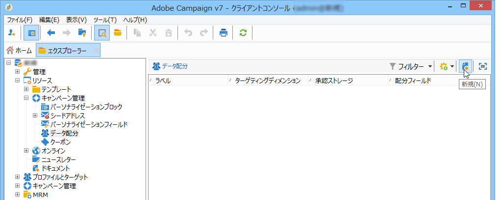

# 分割{#split}

「**分割**」タイプのアクティビティはターゲットを複数のサブセットに分割します。ターゲットは、受信したすべての結果から構築されます。したがって、すべての先行アクティビティは、このアクティビティが実行される前に完了している必要があります。

このアクティビティは、インバウンド母集団の和集合をトリガーしません。If several transitions land in one split activity, we recommend inserting a **[!UICONTROL Union]** activity in front of it.

使用する分割アクティビティの例については、分割アクティビティを使用し [たサブセットの作成を参照してください](../../workflow/using/targeting-data.md#creating-subsets-using-the-split-activity)。

フィルター条件を使用してターゲットを別々の母集団にセグメント化する分割アクティビティの使用方法を示した例については、[この節](../../workflow/using/cross-channel-delivery-workflow.md)を参照してください。

An example showing how to use an instance variable in a Split activity is available in [this section](../../workflow/using/javascript-scripts-and-templates.md).

To configure this activity, define the subset content and label in the **[!UICONTROL Subsets]** tab, then choose the target dimension in the **[!UICONTROL General]** tab.

## サブセットの作成 {#creating-subsets}

サブセットを作成するには：

1. 該当するフィールド内のラベルをクリックし、適用するフィルターを選択します。
1. 受信母集団をフィルターするには、このオプションを **[!UICONTROL Add a filtering condition]** 選択し、リンクをクリック **[!UICONTROL Edit...]** します。

   このセットに含めるデータに適用するフィルターのタイプを選択します。

   プロセスは、「**クエリ**」タイプアクティビティの場合と同じです。

   >[!NOTE]
   >
   >最大 2 個の外部データベース（FDA）のデータをフィルターできます。

1. ターゲットから抽出してサブセットを作成するレコードの最大数を指定できます。これを行うには、オプションをオン **[!UICONTROL Limit the selected records]** にしてリンクをクリック **[!UICONTROL Edit...]** します。

   ウィザードが表示されたら、このサブセットのレコードの選択モードを選択します。手順は、サブセットレコード [数の制限を参照してください](#limiting-the-number-of-subset-records)。

   

1. If you wish, you can **add other subsets** using the **[!UICONTROL Add]** button.

   

   >[!NOTE]
   >
   >このオプシ **[!UICONTROL Enable overlapping of output populations]** ョンを選択しない場合、サブセットはタブの順序で作成されます。 ウィンドウの右上にある矢印を使用して、タブ間を移動できます。例えば、最初のサブセットが初期母集団の 70% を取り出す場合、次のサブセットの選択条件は残りの 30% のみに適用されます。

   作成される各サブセットについて、アウトバウンドトランジションが分割アクティビティに追加されます。

   

   You can choose to generate a single outbound transition (and identify sets using the segment code, for example): to do this, select the **[!UICONTROL Generate subsets in the same table]** option in the **[!UICONTROL General]** tab.

   完了したら、各サブセットのセグメントコードは自動的に追加列に保存されます。この列は、配信レベルのパーソナライゼーションフィールドでアクセス可能です。

## サブセットレコード数の制限 {#limiting-the-number-of-subset-records}

サブセット内に含まれている母集団を一部だけ使用したい場合、サブセットに含まれるレコード数を制限することができます。

1. サブセット編集ウィンドウで、オプションをチェ **[!UICONTROL Limit the selected records]** ックし、リンクをクリック **[!UICONTROL Edit...]** します。
1. 適用する制限タイプを選択します。

   * **[!UICONTROL Activate random sampling]**:このオプションは、レコードのランダムなサンプルを取得します。 適用されるランダムサンプリングのタイプは、データベースエンジンに依存します。
   * **[!UICONTROL Keep only the first records after sorting]**:このオプションを使用すると、1つ以上の並べ替え順に基づく制限を定義できます。 If you select the **[!UICONTROL Age]** field as a sorting criterion and 100 as the limit, only the youngest 100 recipients will be kept.
   * **[!UICONTROL Keep the first ones after sorting (criteria, random)]**:このオプションは、前の2つのオプションを組み合わせます。 1 つまたは複数の並べ替え順に基づいて制限を定義し、定義された条件と同じ値を含むレコードが複数ある場合、最初のレコードにランダム選択を適用できます。

      For example, if you select the **[!UICONTROL Age]** field as a sorting criteria, and you then define a limit of 100, but the 2000 youngest recipients in the database are all 18, then 100 recipients will be randomly selected out of those 2000.
   

1. 並べ替え基準を定義する場合、追加の手順で、列と並べ替え順を定義することができます。

   

1. その後、データの制限方法を選択します。

   

   それには、いくつかの方法があります。

   * **[!UICONTROL Size (in %)]**:レコードの割合。 例えば、以下の設定では、母集団の合計の 10% を抽出します。

      この割合は、アクティビティの結果ではなく、初期母集団に適用されます。

   * **[!UICONTROL Size (as a % of the segment)]**:サブセットのみに関するレコードの割合で、初期母集団に関するレコードの割合。
   * **[!UICONTROL Maximum size]**:最大レコード数。
   * **[!UICONTROL By data grouping]**:インバウンド母集団の指定したフィールドの値に応じて、レコード数の制限を設定できます。 この件について詳しくは、「データのグループ化によ [るサブセットレコード数の制限」を参照してください](#limiting-the-number-of-subset-records-by-data-grouping)。
   * **[!UICONTROL By data grouping (in %)]**:パーセントを使用して、インバウンド母集団の指定したフィールドの値に応じたレコード数の制限を設定できます。 この件について詳しくは、「データのグループ化によ [るサブセットレコード数の制限」を参照してください](#limiting-the-number-of-subset-records-by-data-grouping)。
   * **[!UICONTROL By data distribution]**:グループ化フィールドの値が多すぎる場合や、新しい分割アクティビティごとに値を再入力しない場合は、Adobe Campaignで制限を設定できます(オプションの分散マーケティングモ **[!UICONTROL By data distribution]** ジュール)。 詳しくは、「データ配信ごとのサブセ [ットレコード数の制限」を参照してください](#limiting-the-number-of-subset-records-per-data-distribution)。

1. Click **[!UICONTROL Finish]** to approve the record selection criteria. 定義した設定が、エディターのウィンドウの中央部分に表示されます。

## データのグループ化によるサブセットレコード数の制限 {#limiting-the-number-of-subset-records-by-data-grouping}

データのグループ化により、レコードの数を制限できます。この制限は、固定値またはパーセント値を使用して実行されます。

For instance, if you select the **[!UICONTROL Language]** field as a group field, you can define a list of records for each language.

1. データ制限値を選択した後、またはを選択し **[!UICONTROL By data grouping]** てをク **[!UICONTROL By data grouping (as a %)]** リックしま **[!UICONTROL Next]**&#x200B;す。

   

1. Then select the grouping field(s) (the **[!UICONTROL Language]** field for instance) and click **[!UICONTROL Next]**.

   

1. 最後に、データのグループ化のしきい値を指定します（以前に選択したグループ化の方法に応じて、固定値またはパーセント値を使用）。To set the same threshold for every value, for example if you wish to set the number of records for each language to 10, select the **[!UICONTROL All data groupings are the same size]** option. 値ごとに異なる制限を設定する場合は、このオプションを選択 **[!UICONTROL Limitations by grouping value]** します。 これにより、英語やフランス語など、言語ごとに異なる制限を選択することもできます。

   

1. Click **[!UICONTROL Finish]** to approve the limitation and return to editing the split activity.

## データ配分ごとのサブセットレコード数の制限 {#limiting-the-number-of-subset-records-per-data-distribution}

グループ化フィールドに含まれる値が多すぎる場合、または新規分割アクティビティを作成するたびに値を再設定したくない場合、Adobe Campaign でデータ配分ごとに制限を設定できます。When selecting data limitation values (for more on this subject see the [Creating subsets](#creating-subsets) section), select the **[!UICONTROL By data distribution]** option and select a template from the drop-down menu. データ配分テンプレートの作成については、以降で詳しく説明します。

配布テンプレートを使用したア **[!UICONTROL Local approval]** クティビティの例については、「ローカル承認ア [クティビティの使用」を参照してください](../../workflow/using/using-the-local-approval-activity.md)。

>[!IMPORTANT]
>
>この機能を利用するには、キャンペーンのオプション、分散型マーケティングモジュールを購入する必要があります。使用許諾契約書を確認してください。

データ配分テンプレートを使用すると、グループ値のリストを使用してレコードの数を制限できます。データ配分テンプレートを作成するには、次の手順に従います。

1. データ配布テンプレートを作成するには、ノードに移動し、を **[!UICONTROL Resources > Campaign management > Data distribution]** クリックしま **[!UICONTROL New]**&#x200B;す。

   

1. The **[!UICONTROL General]** tab lets you enter the label and the execution context of the distribution (targeting dimension, distribution field).

   

   以下のフィールドの内容を入力する必要があります。

   * **[!UICONTROL Label]**:配布テンプレートのラベル。
   * **[!UICONTROL Targeting dimension]**:例えば、データ配布を適用するターゲットディメンションを **[!UICONTROL Recipient]** 入力します。 このスキーマは、ターゲティングワークフローで使用されるデータとの互換性を常に維持する必要があります。
   * **[!UICONTROL Distribution field]**:ターゲットディメンションを介してフィールドを選択します。 For instance, if you select the **[!UICONTROL Email domain]** field, the list of recipients will be broken down by domain.
   * **[!UICONTROL Distribution type]**:ターゲットの制限値をタブで分類する方法を選択し **[!UICONTROL Distribution]** ます。ま **[!UICONTROL Percentage]** た **[!UICONTROL Set]**&#x200B;は
   * **[!UICONTROL Assignment type]**:データ配布の割り当てタイプを選択します。 グループまたはオペレーターによる割り当て、またはローカルエンティティによる割り当てのいずれかを選択できます。ローカルエンティティによる割り当ては、「**分散マーケティング**」で使用されます。詳しくは、この[節](../../campaign/using/about-distributed-marketing.md)を参照してください。
   * **[!UICONTROL Approval storage]**:ターゲット設定ワーク **[!UICONTROL Local approval]** フローでアクティビティを使用する場合(「ローカ [ルの承認](../../workflow/using/local-approval.md)」を参照)、承認結果を保存するスキーマを入力します。 ターゲティングスキーマごとに、1 つのストレージスキーマを指定する必要があります。ターゲットスキーマを使 **[!UICONTROL Recipients]** 用する場合は、デフォルトのストレージスキーマ **[!UICONTROL Local approval of recipients]** を入力します。

      In case of a simple limitation by data grouping without local approval, you do not need to enter the **[!UICONTROL Approvals storage]** field.

1. アクティビティを使用し **[!UICONTROL Local approval]** ている場合(「ローカル [承認](../../workflow/using/local-approval.md)」を参照 **[!UICONTROL Advanced settings]** )、配布テンプレートのを入力します。

   

   以下のフィールドの内容を入力する必要があります。

   * **[!UICONTROL Approve targeted messages]**:承認する受信者のリストからすべての受信者を事前に選択する場合は、このオプションを選択します。 このオプションを選択していない場合、受信者は事前に選択されません。

      >[!NOTE]
      >
      >このオプションはデフォルトで選択されています。

      

   * **[!UICONTROL Delivery label]**:返信通知に配信ラベルを表示する式を定義できます。 デフォルトの式は、配信の標準ラベルに関する情報を提供します（自動生成された文字列）。この式を変更することができます。

      

   * **[!UICONTROL Grouping field]**:このフィールドでは、受信者を承認および返信通知で表示するためのグループを定義できます。

      

   * **[!UICONTROL Web Interface]**:Webアプリケーションを受信者リストにリンクできます。 承認と配信通知内で、各受信者は、選択された Web アプリケーションへのクリック可能なリンクとして表示されます。The **[!UICONTROL Parameters]** field (for example **[!UICONTROL recipientId]**) lets you configure the additional parameter to be used in the URL and the web application.

      

1. The **[!UICONTROL Breakdown]** tab lets you define the list of distribution values.

   

   * **[!UICONTROL Value]**:分布値を入力します。
   * **[!UICONTROL Percentage / Set]**:各値にリンクされたレコードの制限（固定値または割合）を入力します。

      This column is defined by the **[!UICONTROL Distribution type]** field within the **[!UICONTROL General]** tab.

   * **[!UICONTROL Label]**:各値にリンクされたラベルを入力します。
   * **[!UICONTROL Group or operator]**:アクティビティを使用し **[!UICONTROL Local approval]** ている場合(「ローカ [ルの承認](../../workflow/using/local-approval.md)」を参照)は、各配分値に割り当てられている演算子または演算子のグループを選択します。

      In case of a simple limitation by data grouping without local approval, you do not need to enter the **[!UICONTROL Group or operator]** field.

      >[!IMPORTANT]
      >
      >オペレーターには必ず適切な権限を付与するようにしてください。

   * **[!UICONTROL Local entity]**:各配分値に割り当てられたローカルエンティティを選択します。 ローカルエンティティは、「**分散マーケティング**」で使用されます。詳しくは、この[節](../../campaign/using/about-distributed-marketing.md)を参照してください。

## フィルタリングパラメーター {#filtering-parameters}

Click the **[!UICONTROL General]** tab to enter the activity label. 分割のターゲットおよびフィルターディメンションを選択します。必要に応じて、指定されたサブセットについて、これらのディメンションを変更できます。

Check the **[!UICONTROL Generate complement]** option if you wish to exploit the remaining population. 補集合は、インバウンドターゲットからサブセットの和集合を引いた部分です。その後、次の図のように、追加のアウトバウンドトランジションがアクティビティに追加されます。

このオプションが正しく機能するには、インバウンドデータにプライマリキーが必要です。

For example, if the data is read directly from an external database such as Netezza (which does not support the notion of an index) via a **[!UICONTROL Data loading (RDBMS)]** activity, the complement generated by the **[!UICONTROL Split]** activity will be incorrect.

To avoid this, you can drag and drop an **[!UICONTROL Enrichment]** activity just before the **[!UICONTROL Split]** activity. アクティビティ **[!UICONTROL Enrichment]** で、をチェ **[!UICONTROL Keep all additional data from the main set]** ックし、追加データでアクティビティのフィルターの設定に使用する列を指定し **[!UICONTROL Split]** ます。 The data from the inbound transition of the **[!UICONTROL Split]** activity are then stored locally in a temporary table on the Adobe Campaign server and the complement can be generated correctly.

このオ **[!UICONTROL Enable overlapping of output populations]** プションを使用すると、複数のサブセットに属する訪問者を管理できます。

* このオプションを選択していないと、サブセットの条件を複数満たす場合でも、受信者は複数の出力トランジションに表示されません。受信者は、一致した基準の 1 番目のタブのターゲットになります。
* このオプションを選択していると、サブセットのフィルター条件を複数満たす場合、受信者は複数のサブセットに表示されます。Adobe Campaign は、排他的な条件の使用をお勧めします。

## 入力パラメーター {#input-parameters}

* tableName
* schema

各インバウンドイベントは、これらのパラメーターによって定義されるターゲットを指定する必要があります。

## 出力パラメーター {#output-parameters}

* tableName
* schema
* recCount

この 3 つの値セットは、除外によって生成されたターゲットを識別します。**[!UICONTROL tableName]** はターゲットの識別子を記録するテーブル名、**[!UICONTROL schema]** は母集団のスキーマ（通常は nms:recipient）、**[!UICONTROL recCount]** はテーブル内の要素の数です。

補集合に関連付けられたトランジションは、同じパラメーターを持ちます。
