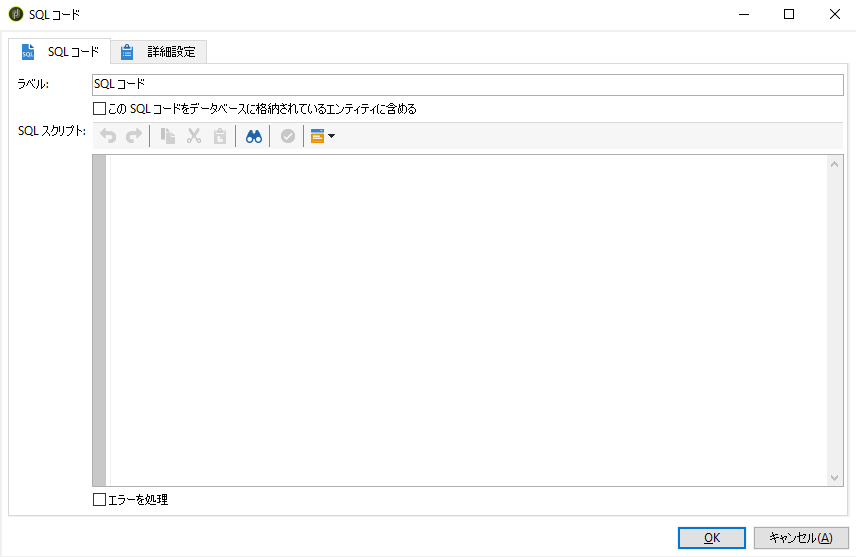
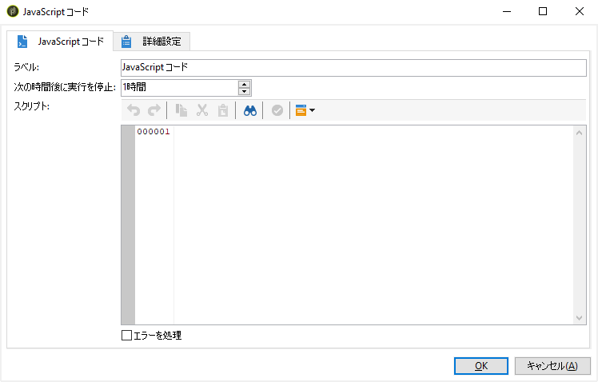
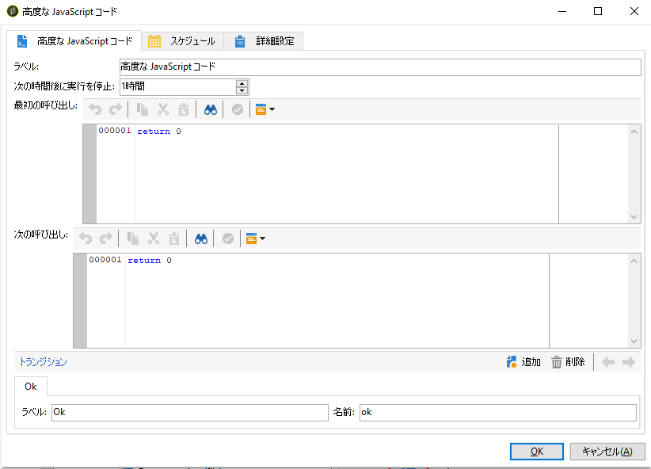

# SQL コードと JavaScript コード{#sql-code-and-javascript-code}

## SQL コード {#sql-code}

*アクティビティは&#x200B;*[!UICONTROL SQL code*]* 、SQLスクリプトを実行します。 スクリプトは、JST テンプレートです。

* **[!UICONTROL Script]**

   エディターの中央部に、実行されるスクリプトが含まれています。このスクリプトは、JST テンプレートであり、ワークフローのコンテキストに応じて設定できます。

* **[!UICONTROL Processing errors]**

   詳しくは、処理エ [ラーを参照してくださ](../../workflow/using/monitoring-workflow-execution.md#processing-errors)い。

## JavaScriptコードおよび高度なJavaScriptコード {#javascript-code}

**[!UICONTROL JavaScript code]** アクティビテ **[!UICONTROL Advanced JavaScript code]** ィは、ワークフローのコンテキストでJavaScriptスクリプトを実行します。 スクリプティングについて詳しくは、 [JavaScriptスクリプトとテンプレートの節を参照してください](../../workflow/using/javascript-scripts-and-templates.md) 。

>[!NOTE]
>
>デフォルトでは、およびアクティビティの実 **[!UICONTROL JavaScript code]** 行フェー **[!UICONTROL Advanced JavaScript code]** ズは1時間を超えることはできません。 この遅延の後、エラーメッセージが表示されてプロセスが中止され、アクティビティの実行が失敗します。
>
>この遅延は、アクティビティのプロパテ **[!UICONTROL Stop execution after]** ィで使用可能なフィールドで変更できます。

* **[!UICONTROL JavaScript code]**

   

   * **[!UICONTROL Script]**:エディターの中央の領域には、実行するスクリプトが含まれます。
   * **[!UICONTROL Processing errors]**:詳しくは、処理エ [ラーを参照してくださ](../../workflow/using/monitoring-workflow-execution.md#processing-errors)い。

* **[!UICONTROL Advanced JavaScript code]**

   

   * **[!UICONTROL First call]**:エディターの最初の領域には、最初の呼び出し時に実行するスクリプトが含まれます。
   * **[!UICONTROL Next calls]**:エディターの2番目の領域には、次の呼び出し時に実行するスクリプトが含まれます。
   * **[!UICONTROL Transitions]**:複数のアクティビティ出力トランジションを定義できます。
   * **[!UICONTROL Schedule]**:このタ **[!UICONTROL Schedule]** ブでは、アクティビティをトリガーするタイミングをスケジュールできます。
