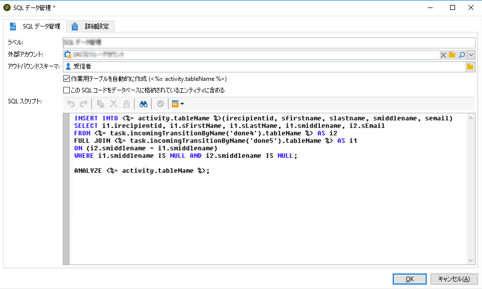

# SQL データ管理{#sql-data-management}

「**SQL データ管理**」アクティビティでは、作業用テーブルを作成および設定する独自の SQL クエリを記述できます。

## 前提条件 {#prerequisites}

アクティビティを設定する前に、以下の前提条件を満たしていることを確認してください。

* このアクティビティは、リモートデータソースに対してのみ使用できます。そのため、インスタンスに **[!UICONTROL FDA]**（Federated Data Access）パッケージをインストールする必要があります（[この節](../../platform/using/accessing-an-external-database.md)を参照）。
* アウトバウンドスキーマがデータベースに存在し、FDA データベースにリンクされている必要があります（データスキーマについて詳しくは、[この節](../../configuration/using/about-schema-reference.md)を参照）。
* The operator executing the workflow must have the **[!UICONTROL USE SQL DATA MANAGEMENT ACTIVITY (useSqlDmActivity)]** named right. ネームド権限について詳しくは、[この節](../../platform/using/access-management.md#named-rights)を参照してください。

## 「SQL データ管理」アクティビティの設定{#configuring-the-sql-data-management-activity}

1. Specify the activity **[!UICONTROL Label]**.
1. 使用するアカ **[!UICONTROL External account]** ウントを選択し、この外部アカウントにリ **[!UICONTROL Outbound schema]** ンクされているアカウントを選択します。

   >[!CAUTION]
   >
   >アウトバウンドスキーマは固定されており、編集することはできません。

1. SQL スクリプトを追加します。

   >[!CAUTION]
   >
   >SQL スクリプトが機能し、その参照（フィールド名など）がアウトバウンドスキーマに従っていることを確認するのは、SQL スクリプト作成者の責任です。

   既存のSQLコードを読み込む場合は、このオプションを選択 **[!UICONTROL The SQL script is contained in an entity stored in the database]** します。 SQLスクリプトは/ **[!UICONTROL Administration]** /メニューで作成し、保存する必要が **[!UICONTROL Configuration]** あ **[!UICONTROL SQL scripts]** ります。

   または、専用の領域に SQL スクリプトを入力するか、コピーして貼り付けます。

   

   このアクティビティでは、スクリプト内で次の変数を使用できます。

   * **activity.tableName**:アウトバウンド作業テーブルのSQL名。
   * **task.incomingTransitionByName(‘name’).tableName**:使用する着信トランジションによって保持される作業テーブルのSQL名（トランジションは名前で識別されます）。

      >[!NOTE]
      >
      >&#39;) 値は、トランジションプロパティの「**[!UICONTROL Name]**&#x200B;名前」フィールドに対応しています。

1. If the SQL script already contains commands to create an outbound work table, unselect the **[!UICONTROL Automatically create work table]** option. 選択を解除しない場合、ワークフローが実行されると作業用テーブルが自動的に作成されます。
1. 「**[!UICONTROL Ok]**」をクリックして、アクティビティの設定を確定します。

これでアクティビティが設定され、ワークフローで実行する準備が整いました。

>[!CAUTION]
>
>アクティビティ実行後のアウトバウンドトランジションレコード数は単なる目安です。SQL スクリプトの複雑さのレベルによって異なる場合があります。
>  
>アクティビティを再開すると、実行ステータスに関係なく、スクリプト全体が最初から実行されます。

## SQL スクリプトのサンプル {#sql-script-samples}

>[!NOTE]
>
>この節にあるスクリプトのサンプルは、PostgreSQL で実行することを想定しています。

以下のスクリプトは、作業用テーブルを作成し、この同じ作業用テーブルにデータを挿入します。

```
CREATE UNLOGGED TABLE <%= activity.tableName %> (
  iRecipientId INTEGER DEFAULT 0,
  sFirstName VARCHAR(100),
  sMiddleName VARCHAR(100),
  sLastName VARCHAR(100),
  sEmail VARCHAR(100)
);

INSERT INTO <%= activity.tableName %>
SELECT iRecipientId, sFirstName, sMiddleName, sLastName, sEmail
FROM nmsRecipient
GROUP BY iRecipientId, sFirstName, sMiddleName, sLastName, sEmail;
```

以下のスクリプトは、CTAS 操作（CREATE TABLE AS SELECT）を実行し、作業用テーブルのインデックスを作成します。

```
CREATE TABLE <%= activity.tableName %>
AS SELECT iRecipientId, sEmail, sFirstName, sLastName, sMiddleName
FROM nmsRecipient
WHERE sEmail IS NOT NULL
GROUP BY iRecipientId, sEmail, sFirstName, sLastName, sMiddleName;

CREATE INDEX ON <%= activity.tableName %> (sEmail);

ANALYZE <%= activity.tableName %> (sEmail);
```

以下のスクリプトは、2 つの作業用テーブルを結合します。

```
CREATE TABLE <%= activity.tableName %>
AS SELECT i1.sFirstName, i1.sLastName, i2.sEmail
FROM <%= task.incomingTransitionByName('input1').tableName %> i1
JOIN <%= task.incomingTransitionByName('input2').tableName %> i2 ON (i1.id = i2.id)
```

