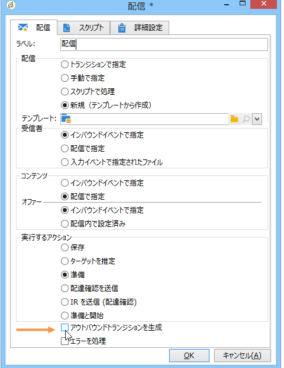

# 開始および終了{#start-and-end}

The **[!UICONTROL Start]** and **[!UICONTROL End]** activities allow you to graphically mark the start and end of a workflow. これらのアクティビティは、機能上の影響はないので、省略可能です。

* **[!UICONTROL Start]**

   ワークフローの実行は、インバウンドトランジションのないアクティビティと、「開始」タイプアクティビティから開始します。

   

* **[!UICONTROL End]**

   You can configure the **[!UICONTROL End]** activity to interrupt all tasks that are in progress. それには、アクティビティをダブルクリックしてプロパティを標示し、適切なオプションを選択します。

   

   作業用テーブル内のデータは、「終了」アクティビティが有効になると自動的に削除されます。データを削除する必要がなく、不要な負荷を避けたい場合は、最後のアクティビティ出力でトランジションを無効にすることもできます。例えば、配信出力でプロセスが何もスケジュールされていない場合、次に示す関連オプションのチェックを外します。

   

