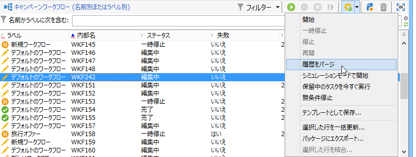
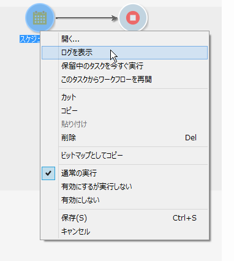

# ワークフローの開始 {#starting-a-workflow}

ワークフローは、必ず手動で開始します。開始しても、スケジューラー（[スケジューラー](scheduler.md)を参照）経由で指定された情報またはアクティビティのスケジュール設定に基づいて、ワークフローが非アクティブのままになることもあります。

ターゲティングワークフローの実行に関連するアクション（開始、停止、一時停止など）は、**非同期**&#x200B;プロセスです。プロセスの実行順序は記録され、サーバーが順序を適用できるようになるとすぐに実行されます。

ツールバーを使用して、ワークフローの実行を開始およびトラッキングできます。

**[!UICONTROL アクション]**&#x200B;メニューおよび右クリックメニューから選択できる各オプションについては、次項で詳しく説明します。

>[!IMPORTANT]
>
>オペレーターがワークフローに対するアクションを実行すると（開始、停止、一時停止など）、アクションは即座に実行されるのではなく、[ワークフローモジュール](architecture.md)に処理されるまでキューに入れられるので、ご注意ください。

## アクションツールバー {#actions-toolbar}

ツールバーのボタンについて詳しくは、この[節](../../campaign/using/marketing-campaign-deliveries.md#building-the-main-target-in-a-workflow)を参照してください。「**[!UICONTROL アクション]**」ボタンを使用して、選択したワークフローに対して実行する追加の実行オプションにアクセスできます。または、**[!UICONTROL ファイル／アクション]**&#x200B;メニューを選択するか、ワークフローを右クリックして「**[!UICONTROL アクション]**」を選択することもできます。

* **[!UICONTROL 開始]**

   このアクションは、ワークフローの実行を開始します。「**終了**」、「**編集中**」、「**一時停止**」のワークフローのステータスが、「**開始済み**」に変わります。続いて、ワークフローエンジンが、ワークフローの実行を処理します。ワークフローが一時停止していた場合は再開します。それ以外の場合は、ワークフローが最初から開始し、初期のアクティビティが有効化されます。

   開始は非同期プロセスです。リクエストは保存され、ワークフローサーバーでただちに処理されます。

* **[!UICONTROL 一時停止]**

   このアクションは、ワークフローのステータスを「**一時停止**」に設定します。ワークフローが再開するまでは、一切のアクティビティは有効化されません。ただし、進行中の操作は一時停止されません。

* **[!UICONTROL 停止]**

   このアクションは、現在実行中のワークフローを停止します。インスタンスのステータスは「**終了**」に設定されます。可能な場合、進行中の操作を中止します。インポートおよび SQL クエリはただちにキャンセルされます。

   >[!IMPORTANT]
   >
   >ワークフローの停止は、非同期プロセスです。リクエストが登録されると、ワークフローサーバーは進行中の操作をキャンセルします。 このため、ワークフローインスタンスの停止には時間がかかります。特に、ワークフローが複数のサーバーで実行されている場合は、各サーバーがそれぞれ進行中のタスクのキャンセルを処理する必要があるので、時間がかかります。問題を回避するには、停止操作が完了するのを待ち、同じワークフローで複数の停止リクエストを実行しないでください。

* **[!UICONTROL 再起動]**

   ワークフローを停止したあとに、再起動します。多くの場合、この操作をおこなうことでワークフローの再起動が高速化されます。また、停止にある程度の時間がかかるときに、再起動を自動化するのに便利です。再起動を自動化する理由は、ワークフローの停止中は「停止」コマンドを利用できないからです。

   **[!UICONTROL 開始 / 一時停止 / 停止 / 再起動]**&#x200B;の各アクションは、ツールバーの実行アイコンから実行できます。詳しくは、[この節](../../campaign/using/marketing-campaign-deliveries.md#creating-a-targeting-workflow)を参照してください。

* **[!UICONTROL 履歴をパージ]**

   このアクションでは、ワークフローの履歴をパージできます。詳しくは、[ログのパージ](monitoring-workflow-execution.md#purging-the-logs)を参照してください。

* **[!UICONTROL シミュレーションモードで開始]**

   ワークフローを、リアルモードとは対照的なシミュレーションモードで開始できます。つまり、このモードを有効にした場合、データベースおよびファイルシステムに影響のないアクティビティ（**[!UICONTROL クエリ]**、**[!UICONTROL 和集合]**、**[!UICONTROL インタラクション]**&#x200B;など）だけが実行されます。影響のあるアクティビティ（「**[!UICONTROL エクスポート]**」、「**[!UICONTROL インポート]**」など）とそれらのアクティビティと同じ分岐にある後続のアクティビティは、実行されません。

* **[!UICONTROL 保留中のタスクを今すぐ実行]**

   このアクションでは、保留中のタスクをただちに開始できます。特定のタスクを開始するには、そのタスクのアクティビティを右クリックして、「**[!UICONTROL 保留中のタスクを今すぐ実行]**」を選択します。

* **[!UICONTROL 条件なしの停止]**

   このオプションは、ワークフローのステータスを「**[!UICONTROL 終了]**」に変更します。通常の停止プロセスが実施数分後に失敗する場合にのみ、最終手段として使用します。条件なしの停止を使用できるのは、進行中の実際のワークフロージョブが何もないことを確認できている場合だけです。

   >[!CAUTION]
   >
   >このオプションはエキスパートユーザー向け機能として予約されています。

* **[!UICONTROL テンプレートとして保存]**

   このアクションは、選択したワークフローに基づいて、新しいワークフローテンプレートを作成します。作成したテンプレートを保存するフォルダーを、指定する必要があります（「**[!UICONTROL フォルダー]**」フィールドで指定）。

   「**[!UICONTROL 選択したラインを一括更新]**」と「**[!UICONTROL 選択した行を結合]**」の各オプションは、すべての&#x200B;**[!UICONTROL アクション]**&#x200B;メニューから選択できる一般的なプラットフォームオプションです。詳しくは、[この節](../../platform/using/updating-data.md)を参照してください。

## 右クリックメニュー {#right-click-menu}

1 つまたは複数のワークフローアクティビティが選択されている場合、右クリックすることで選択したものを操作できます。

右クリックメニューでは、次のオプションを使用できます。

**[!UICONTROL 開く]**：アクティビティのプロパティを開きます。

**[!UICONTROL ログを表示]**：選択したアクティビティのタスク実行ログを表示します。[ログの表示](monitoring-workflow-execution.md#displaying-logs)を参照してください。

**[!UICONTROL 保留中のタスクを今すぐ実行]**：保留中のタスクをただちに開始します。

**[!UICONTROL タスクからワークフローを再起動]**：このアクティビティ用に以前に保存しておいた結果を使用して、ワークフローを再起動します。

**[!UICONTROL 切り取り / コピー / 貼り付け / 削除]**：アクティビティを切り取り、コピー、貼り付け、削除します。

**[!UICONTROL ビットマップとしてコピー]**：すべてのアクティビティのスクリーンショットを撮ることができます。

**[!UICONTROL 通常の実行 / 有効にするが実行しない / 有効にしない]**：これらのオプションは、「**[!UICONTROL 詳細設定]**」タブからも選択できます。詳しくは、[実行](advanced-parameters.md#execution)を参照してください。

**[!UICONTROL 保存 / キャンセル]**：ワークフローに加えた変更を保存またはキャンセルします。

>[!NOTE]
>
>アクティビティのグループを選択し、上記のいずれかのコマンドを適用することができます。

右クリックメニューの詳しい説明は、この[節](../../campaign/using/marketing-campaign-deliveries.md#executing-a-workflow)でも参照できます。
