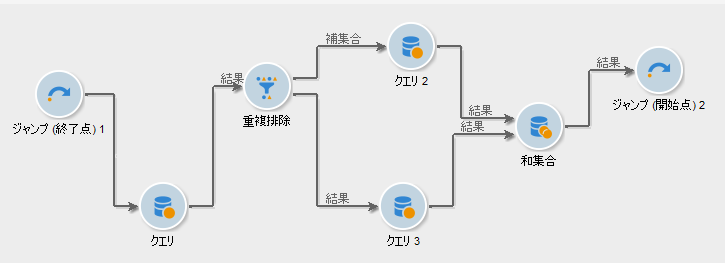
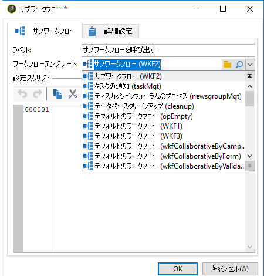
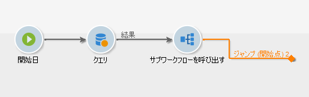

# サブワークフロー{#sub-workflow}

**[!UICONTROL サブワークフロー]**&#x200B;を使用すれば、別のワークフローの実行をトリガーし、結果を取得できます。このアクティビティにより、簡素化されたインターフェイス経由で、複雑なワークフローを使用できます。

1 つのワークフローで複数のサブワークフローを呼び出すことができます。サブワークフローは、同期して実行されます。

>[!NOTE]
>
>サブワークフローが正常に動作するよう、一番小さい数の「到着」タイプのジャンプを 1 つのみ、一番大きい数の「開始」タイプのジャンプを 1 つのみにする必要があります。例えば、優先度が 1、2、および 3 の「開始」ジャンプタイプがある場合、優先度 3 の「開始」ジャンプタイプを 1 つにする必要があります。

1. 別のワークフローでサブワークフローとして使用するワークフローを作成します。
1. ワークフローの最初に、優先度が 1 の&#x200B;**[!UICONTROL ジャンプ (終了点)]** アクティビティを挿入します。「到着」タイプジャンプが複数ある場合、Adobe Campaign は一番小さい数の「到着」ジャンプを使用します。

   ワークフローの最後に、優先度が 2 の&#x200B;**[!UICONTROL ジャンプ (開始点)]** アクティビティを挿入します。「開始」タイプジャンプが複数ある場合、Adobe Campaign は一番大きい数の「開始」ジャンプを使用します。

   

   >[!NOTE]
   >
   >サブワークフローアクティビティが複数の「**[!UICONTROL ジャンプ]**」アクティビティを伴うワークフローを参照している場合、サブワークフローは最小数値の「到着」タイプジャンプと、最大数値の「開始」タイプジャンプの間に実行されます。

1. この「サブワークフロー」を完了して保存します。
1. 「マスター」ワークフローを作成します。
1. **[!UICONTROL サブワークフロー]**&#x200B;アクティビティを挿入して開きます。
1. **[!UICONTROL ワークフローテンプレート]**&#x200B;ドロップダウンリストから、使用するワークフローを選択します。

   

1. さらに、参照先ワークフローを変更するための設定スクリプトを追加することもできます。
1. 「**[!UICONTROL OK]**」をクリックします。これにより、選択したワークフローから、**[!UICONTROL ジャンプ (開始点)]** アクティビティラベルのついたアウトバウンドトランジションを自動的に作成します。

   

1. ワークフローを実行します。

実行すると、ワークフローはサブワークフローと呼ばれ、引き続き「**[!UICONTROL 編集中]**」ステータスとなります。

* トランジションを右クリックしてターゲットを表示することはできません。
* 中間母集団の数は表示できません。
* ログは「マスター」ワークフローで集計され、「サブワークフロー」としてのみラベルが付けられます。

実際、このワークフローはテンプレートに過ぎません。「マスター」ワークフローから呼び出すと、このテンプレートに基づいて新しいサブワークフローが作成されます。

## 入力パラメーター（オプション）{#input-parameters--optional-}

* tableName
* schema

各インバウンドイベントは、これらのパラメーターによって定義されるターゲットを指定する必要があります。

## 出力パラメーター {#output-parameters}

* tableName
* schema
* recCount

この 3 つの値セットは、クエリのターゲットとなる母集団を識別します。**[!UICONTROL tableName]** はターゲットの識別子を記録するテーブル名、**[!UICONTROL schema]** は母集団のスキーマ（通常は nms:recipient）、**[!UICONTROL recCount]** はテーブル内の要素の数です。

* targetSchema

この値は、作業用テーブルのスキーマです。このパラメーターは、**[!UICONTROL tableName]** と **[!UICONTROL schema]** のすべてのトランジションで有効です。
