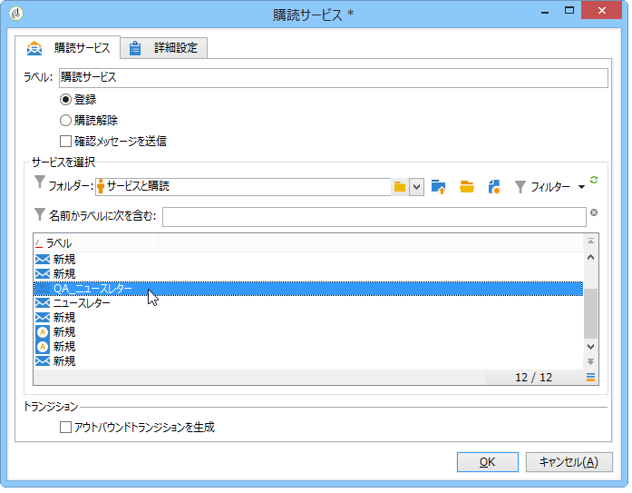
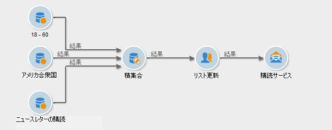

# 購読サービス{#subscription-services}

「**購読サービス**」タイプのアクティビティでは、トランジションで指定された母集団の情報サービスに対する購読を作成または削除できます。

購読サービスを設定するには、次の例に示すように、アクティビティを編集してラベルを入力します。その後、実行するアクション（購読または購読解除）と該当するサービスを選択します。

1. アクティビティのラベルを入力します。
1. Select **[!UICONTROL Generate an outbound transition]** if you wish to create a transition at the end of the execution.

   通常、ターゲットの情報サービスの購読は、ターゲティングワークフローの終わりを示します。そのため、このオプションはデフォルトでは有効にされていません。

1. Click **[!UICONTROL Subscription]** or **[!UICONTROL Unsubscription]** if you wish to subscribe or unsubscribe the specified population to or from the selected information service.
1. Select **[!UICONTROL Send a confirmation message]** to notify recipients that they are subscribed to or unsubscribed from a service.

   このメッセージのコンテンツは、情報サービスに関連付けられた配信テンプレートで指定されています。詳しくは、[この節](../../delivery/using/managing-subscriptions.md)を参照してください。

## Example: Subscribe a list of recipients to a newsletter {#example--subscribe-a-list-of-recipients-to-a-newsletter}

次のワークフローは、1 回の操作で、ニュースレター購読の資格のある受信者のリストを作成することを目的としています。パリに住んでいる人々に働きかけ、購読を申し込んでもらうことがねらいです。

そのためには、既に登録されている受信者を除外する必要があります。

>[!CAUTION]
>
>手動で受信者をサービスに登録する前に、これらの受信者がメッセージを受けることを承諾していることを確認してください。

1. 次の 3 つのクエリを追加します。

   * 1 番目のクエリは、18 歳～ 60 歳の受信者をターゲティングしています。
   * 2 番目のクエリは、パリに住んでいる受信者をターゲティングしています。
   * 3 番目のクエリは、ニュースレターを現在購読していない受信者をターゲティングしています。

1. それぞれの結果を相互参照させるために、積集合アクティビティを追加します。
1. 必要に応じて、リスト更新アクティビティを挿入すれば、購読者のリストを最新状態に維持できます。
1. 購読サービスアクティビティを挿入したら、これをクリックして設定します。
1. Enter the activity label and select **[!UICONTROL Subscription]**.

   If you like, you can inform recipients of their newsletter subscription by checking the **[!UICONTROL Send a confirmation message]** box.

1. ニュースレターが含まれているフォルダーを選択し、フォルダー内のリストからニュースレターを選択します。
1. Leave the **[!UICONTROL Generate outbound transition]** unchecked so that this activity will mark the end of the workflow, then click **[!UICONTROL Ok]**.

ワークフローの実行中、この 3 つのすべてのクエリに該当する受信者はリストに追加され、ニュースレターの購読者として登録されます。

You can check that the subscription was successful by going to the **[!UICONTROL Subscription]** tab for your recipients.

## 入力パラメーター {#input-parameters}

* tableName
* schema

各インバウンドイベントは、これらのパラメーターによって定義されるターゲットを指定する必要があります。
