# データのターゲティング{#targeting-data}

## クエリの作成 {#creating-queries}

### データの選択 {#selecting-data}

A **[!UICONTROL Query]** activity lets you select basic data to build the target population. For more on this, refer to [Creating a query](../../workflow/using/query.md#creating-a-query).

You can also use the following activities to query and refine data from the database: [Incremental query](../../workflow/using/incremental-query.md), [Read list](../../workflow/using/read-list.md).

ワークフローのライフサイクルを通じて転送され、処理される追加情報を収集することができます。詳しくは、「データの追加」および「追加 [データの編集](../../workflow/using/query.md#adding-data)[」を](#editing-additional-data)参照してください。

### 追加データの編集 {#editing-additional-data}

追加のデータが追加されたら、編集したり、クエリアクティビティで定義されたターゲットの調整に使用することができます。

The **[!UICONTROL Edit additional data...]** link lets you view the added data and modify it or add to it.

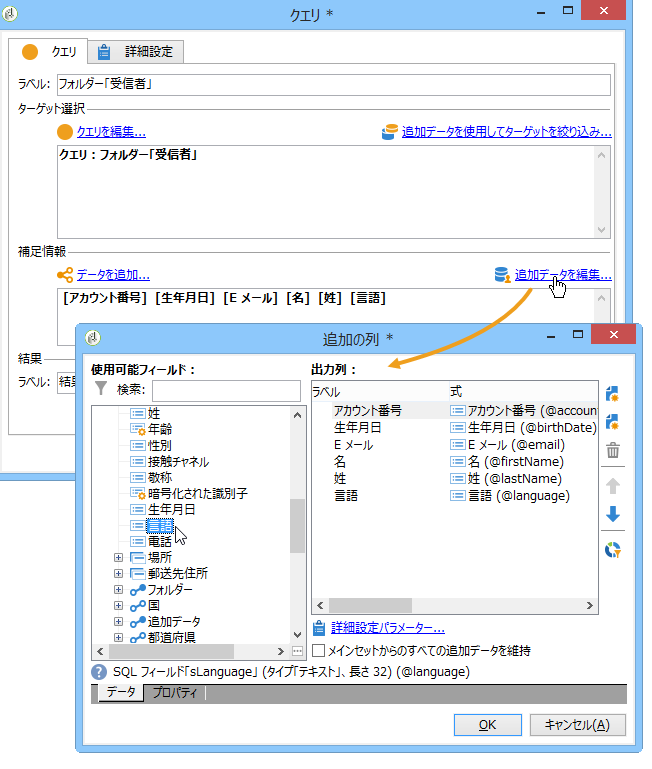

前に定義した出力列にデータを追加するには、使用可能なフィールドのリストからフィールドを選択します。To create a new output column, click the **[!UICONTROL Add]** icon, then select the field and click **[!UICONTROL Edit expression]**.

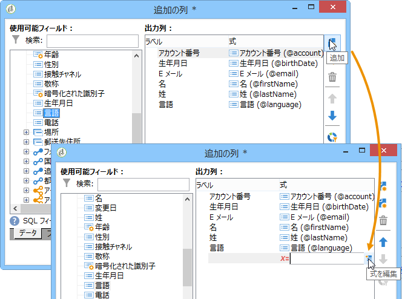

例えば集計など、追加するフィールドの計算モードを定義します。

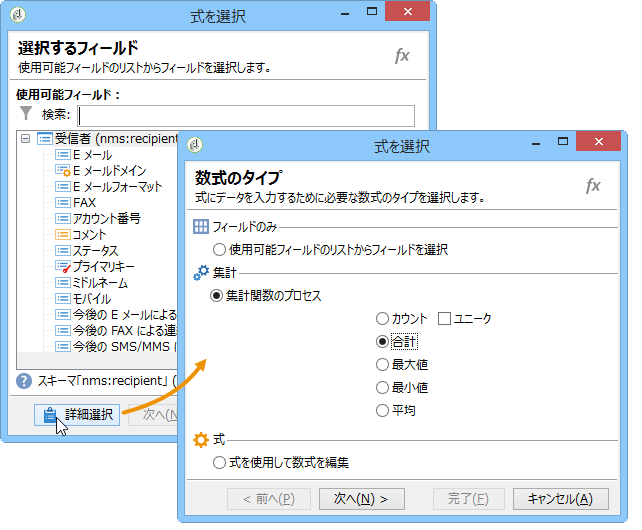

The **[!UICONTROL Add a sub-item]** option lets you attach computed data to the collection. これにより、コレクションから、追加データを選択したり、コレクション要素に対する集計計算を定義できます。

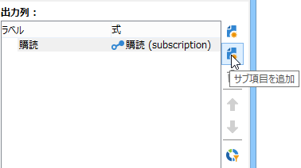

サブ要素は、マッピング先のコレクションのサブツリーに表されます。

Collections are shown in the **[!UICONTROL Collections]** sub-tab. You can filter the collected elements by clicking the **[!UICONTROL Detail]** icon of the selected collection. フィルターウィザードでは、収集したデータを選択し、コレクション内のデータに適用するフィルター条件を指定できます。

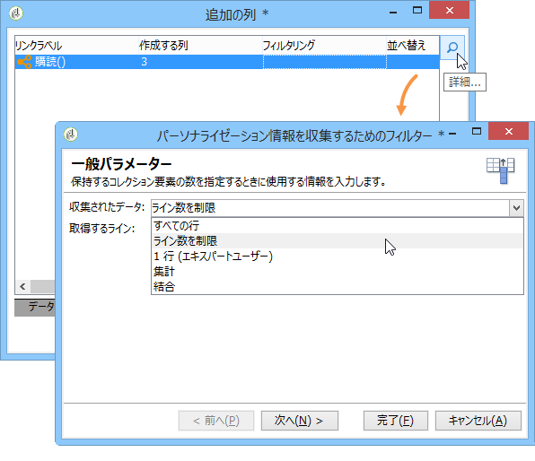

### 追加データを使用したターゲットの絞り混み {#refining-the-target-using-additional-data}

収集された追加データを使用して、データベース内でのフィルターされたデータを絞り込むことができます。これを行うには、次のリンクをクリック **[!UICONTROL Refine the target using additional data...]** します。これにより、追加したデータに対してオーバーフィルターを実行できます。

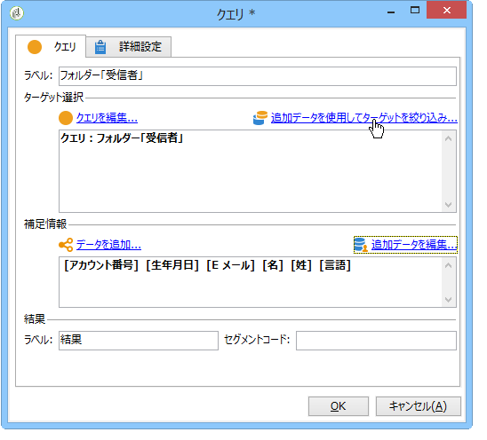

### データの均質化 {#homogenizing-data}

In **[!UICONTROL Union]** or **[!UICONTROL Intersection]** type activities, you can choose to keep only shared additional data to keep the data consistent. この場合、このアクティビティの一時的な出力作業テーブルには、すべてのインバウンドセットで見つかった追加データのみが含まれます。

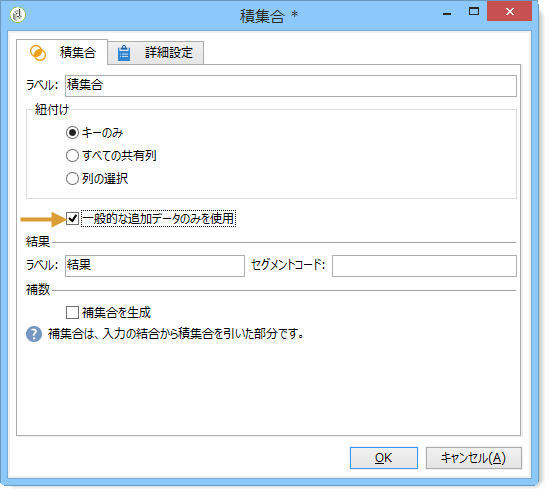

### 追加データとの紐付け {#reconciliation-with-additional-data}

データ調整フ&#x200B;**[!UICONTROL Union]**&#x200B;ェー **[!UICONTROL Intersection]**&#x200B;ズ(、 アクティビティを参照)、追加の列からデータ調整に使用する列を選択できます。 それには、列の選択の紐付けを設定し、メインセットを指定します。次に、以下の例に示すように、ウィンドウ下部の列から列を選択します。

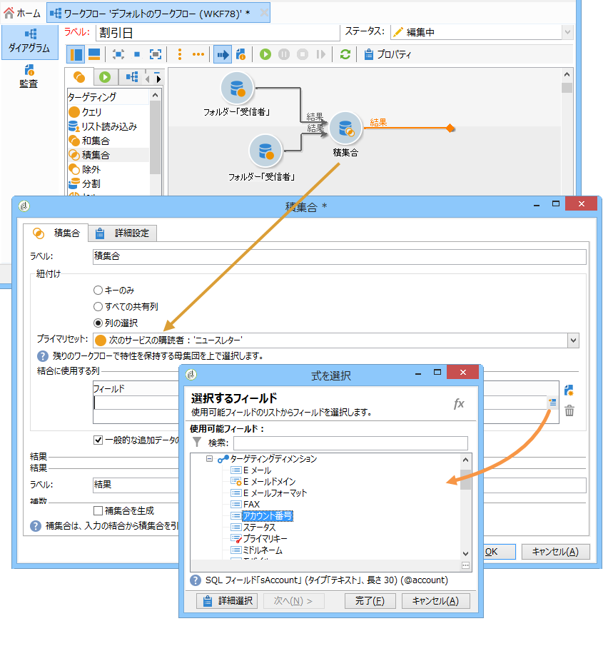

### サブセットの作成 {#creating-subsets}

The **[!UICONTROL Split]** activity lets you create subsets on criteria defined via extraction queries. 各サブセットについて、母集団に対するフィルター条件を編集する場合、標準クエリアクティビティにアクセスし、ターゲットのセグメント化条件を定義します。

追加データのみを、またはターゲットデータと追加データをフィルター条件として使用し、ターゲットを複数のサブセットに分割できます。さらに、**Federated Data Access** オプションを購入済みの場合は、外部データも使用できます。

詳しくは、Splitアクティビティを使用し [たサブセットの作成を参照してください](#creating-subsets-using-the-split-activity)。

## データのセグメント化 {#segmenting-data}

### Combining several targets (Union) {#combining-several-targets--union-}

和集合アクティビティでは、1 つのトランジション内で複数のアクティビティの結果を組み合わせることができます。セットは、同質である必要はありません。

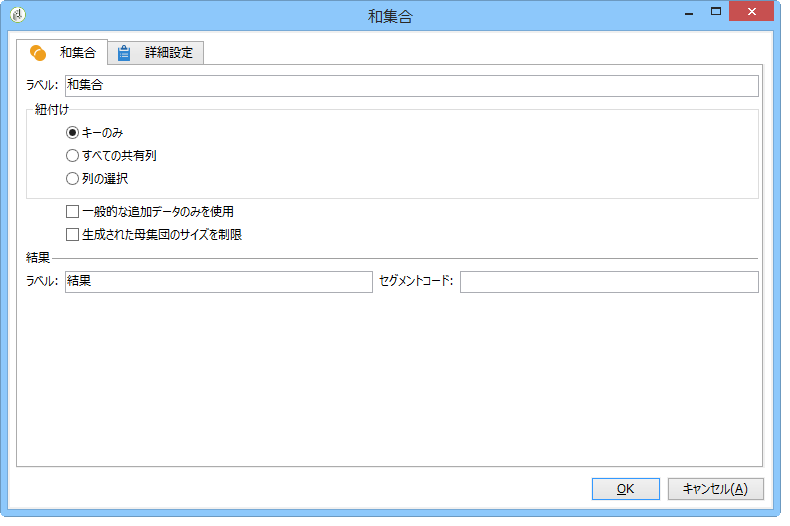

次のデータ紐付けオプションを使用できます。

* **[!UICONTROL Keys only]**

   このオプションは、入力母集団が同質である場合に使用できます。

* **[!UICONTROL All columns in common]**

   このオプションでは、ターゲットの各種母集団すべてに共通する共有列に基づいてデータを紐付けできます。

   Adobe Campaign は、名前に基づいて列を識別します。許容しきい値を使用できます。この値を使用すると、例えば、Email 列は @email 列と同じであると認識されます。

* **[!UICONTROL A selection of columns]**

   このオプションを選択し、データの紐付けが適用される列のリストを定義します。

   まず、メインセットを選択し（ソースデータが含まれるセット）、次に結合に使用される列を選択します。

   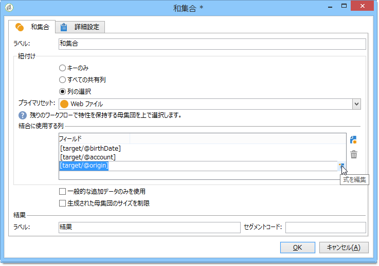

   >[!CAUTION]
   >
   >データの紐付け中、母集団は重複排除されません。

   レコード数を指定することで、母集団のサイズを制限できます。それには、適切なオプションをクリックし、保持するレコード数を指定します。

   さらに、インバウンド母集団の優先順位を指定します。ウィンドウの下部セクションには、和集合アクティビティのインバウンドトランジションがリストされます。このリストを、ウィンドウ右側の青い矢印を使用して並べ替えます。

   レコードは、最初のインバウンドトランジションの母集団から取り出され、その時点で最大値に達しなければ、次に 2 番目のインバウンドトランジションの母集団から取り出されます。

   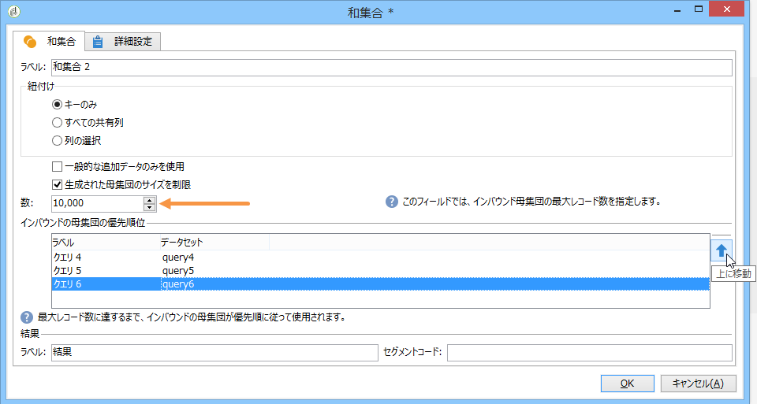

### Extracting joint data (Intersection) {#extracting-joint-data--intersection-}

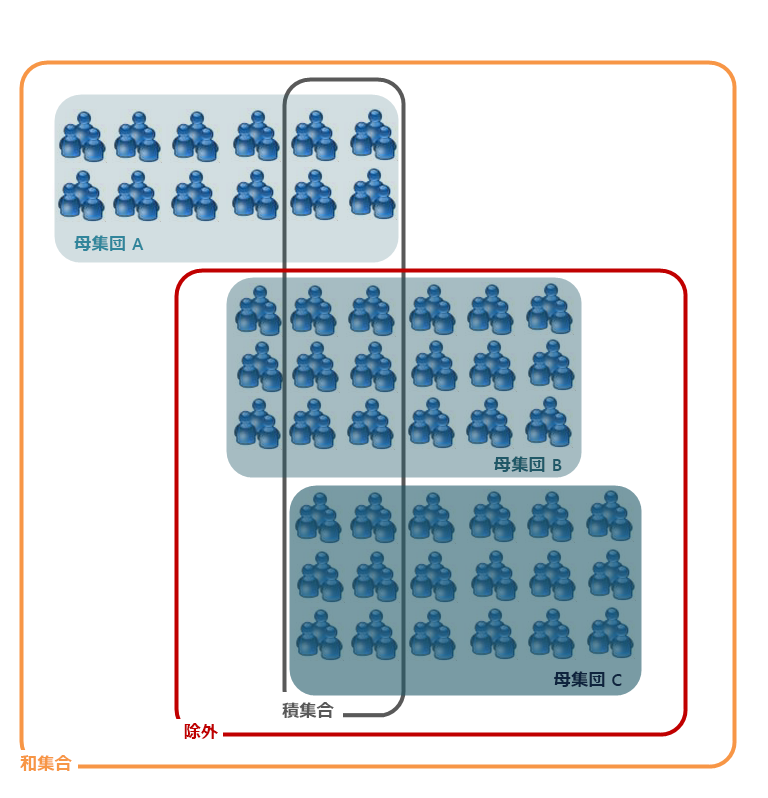

積集合は、インバウンドトランジションの母集団で共有される行のみを取り出します。このアクティビティは、和集合アクティビティと同様に設定されます。

さらに、列の選択だけ、またはインバウンド母集団によって共有される列だけを保持することもできます。

The intersection activity is detailed in the [Intersection](../../workflow/using/intersection.md) section.

### Excluding a population (Exclusion) {#excluding-a-population--exclusion-}

除外アクティビティを使用して、異なるターゲット母集団からターゲットの要素を除外できます。このアクティビティの出力ターゲティングディメンションは、メインセットからのものになります。

必要に応じて、インバウンドテーブルの操作も可能です。別のディメンションからターゲットを除外するには、このターゲットが同じターゲティングディメンションをメインターゲットとして返します。To do this click the **[!UICONTROL Add]** button and specify the dimension change conditions.

データの紐付けは、識別子、変更軸、結合を使用して実行されます。例は、リストのデー [タを使用する：リストを読み取ります](../../workflow/using/importing-data.md#using-data-from-a-list--read-list)。

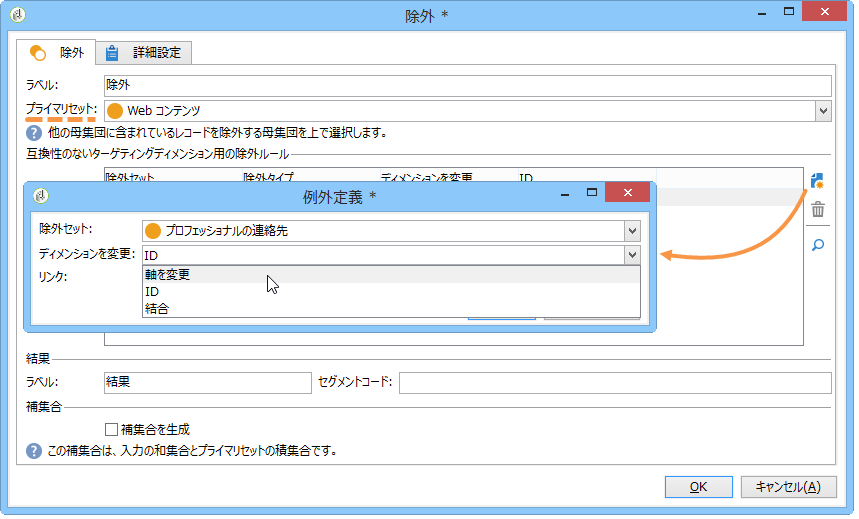

### 分割アクティビティを使用したサブセットの作成 {#creating-subsets-using-the-split-activity}

The **[!UICONTROL Split]** activity is a standard activity which lets you create as many sets as necessary via one or several filtering dimensions, as well as generating either one output transition per subset or a unique transition.

インバウンドトランジションによって伝達された追加データは、フィルター条件内で使用できます。

これを設定するには、最初に条件を選択する必要があります。

1. In your workflow, drag and drop a **[!UICONTROL Split]** activity.
1. In the **[!UICONTROL General]** tab, select the desired option: **[!UICONTROL Use data from the target and additional data]**, **[!UICONTROL Use the additional data only]** or **[!UICONTROL Use external data]**.
1. このオプション **[!UICONTROL Use data from the target and additional data]** を選択すると、ターゲットディメンションでは、インバウンドトランジションによって伝達されるすべてのデータを使用できます。

   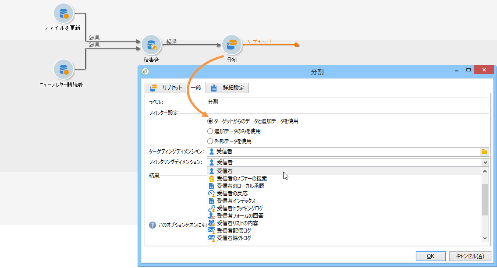

   サブセットが作成されると、前述のフィルタリングパラメーターが使用されます。

   フィルター条件を定義するには、オプションを **[!UICONTROL Add a filtering condition on the inbound population]** 選択し、リンクをクリック **[!UICONTROL Edit...]** します。 次に、このサブセットを作成するためのフィルタリング条件を指定します。

   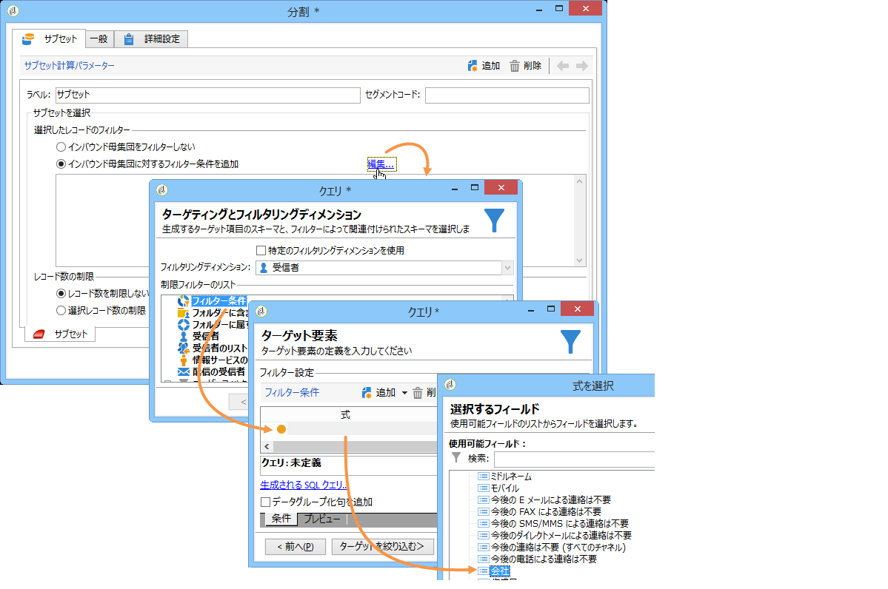

   An example showing how to use filtering conditions in the **[!UICONTROL Split]** activity to segment the target into different populations is described in [this section](../../workflow/using/cross-channel-delivery-workflow.md).

   The **[!UICONTROL Label]** field lets you give the newly created subset a name, which will match the outbound transition.

   さらに、サブセットに識別用のセグメントコードを割り当てて、母集団のターゲティングにそのコードを使用できます。

   必要に応じて、作成したい各サブセットについて、ターゲティングおよびフィルタリングディメンションを個別に変更できます。これを行うには、サブセットのフィルタリング条件を編集し、オプションをオンに **[!UICONTROL Use a specific filtering dimension]** します。

   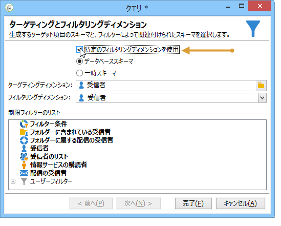

1. このオプションを **[!UICONTROL Use the additional data only]** 選択すると、サブセットフィルタリングに追加のデータのみが提供されます。

   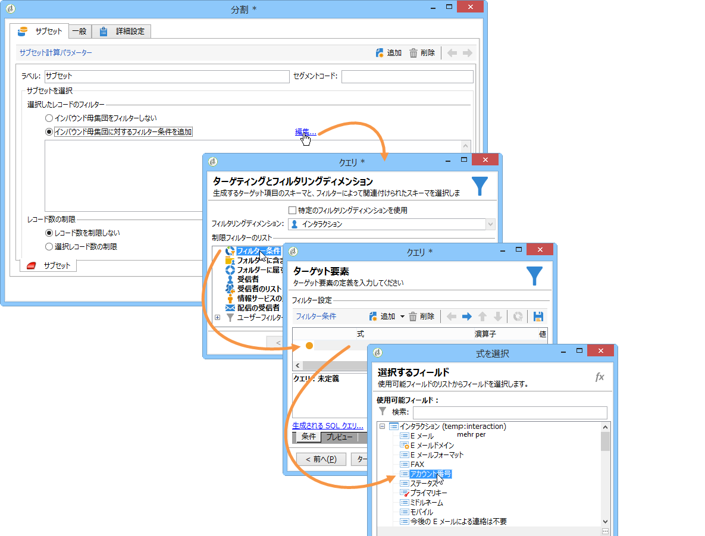

1. If the **Federated Data Access** option is enabled, the **[!UICONTROL Use external data]** lets you process data in an external database which is already configured, or create a new connection to a database.

   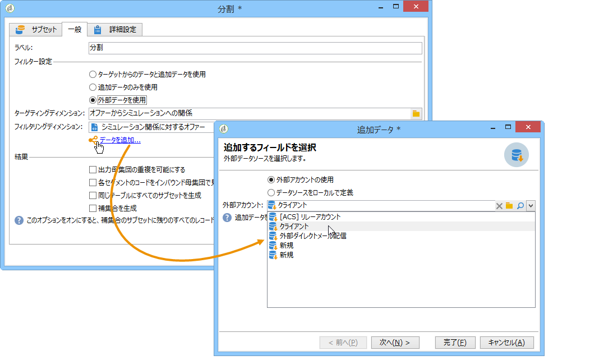

   詳しくは、[この節](../../platform/using/accessing-an-external-database.md)を参照してください。

次に、新しいサブセットを追加する必要があります。

1. Click the **[!UICONTROL Add]** button and define the filtering conditions.

   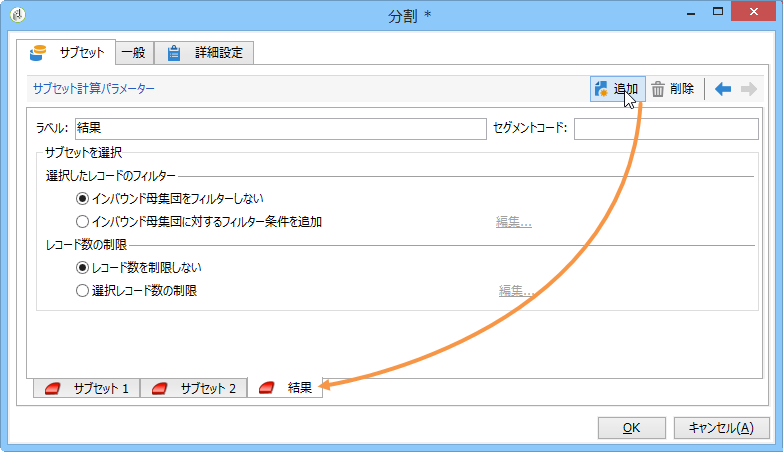

1. Define the filtering dimension in the **[!UICONTROL General]** tab of the activity (see above).It applies to all subsets by default.

   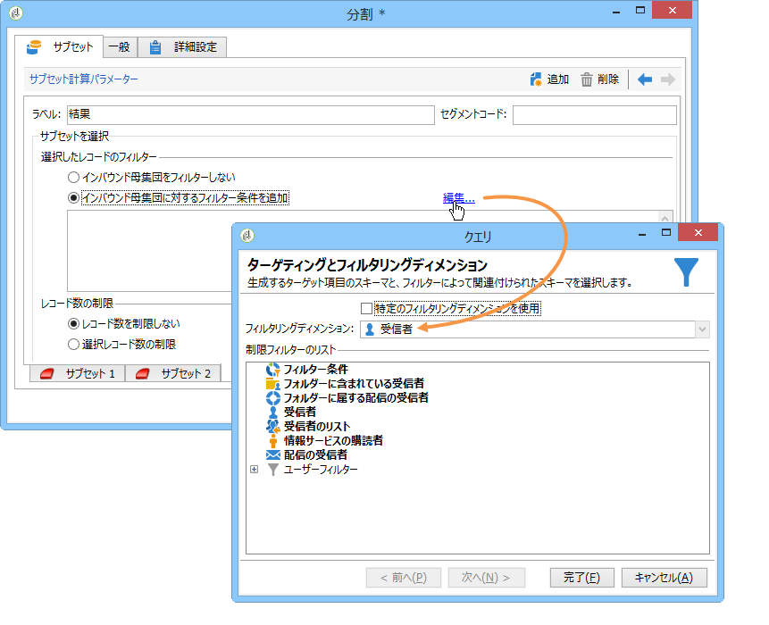

1. 必要に応じて、各サブセットで個別にフィルタリングディメンションを変更できます。これにより、同じ 1 つの分割アクティビティを使用して、ゴールドカード所有者のセットを １ つと、最新のニュースレター内でクリックした受信者のセットを 1 つ、過去 30 日間に店舗で購入をおこなった 18 歳から 25 歳の人々のセットを 1 つ作成できます。これを行うには、このオプションを選択し **[!UICONTROL Use a specific filtering dimension]** 、データフィルターコンテキストを選択します。

   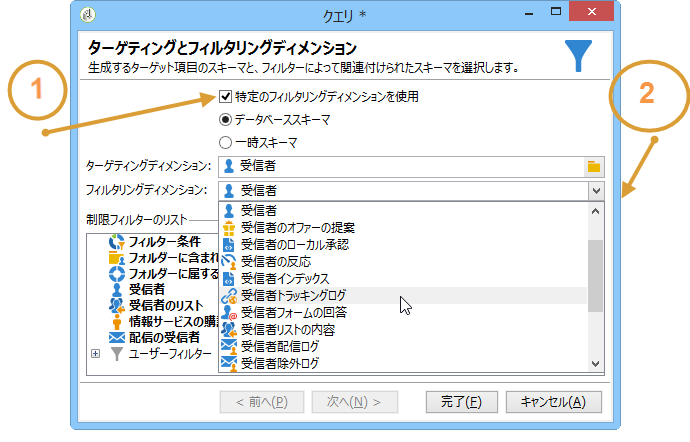

   >[!NOTE]
   >
   >**Federated Data Access** オプションを購入している場合、外部データベース内に含まれる情報に基づいて、サブセットを作成できます。To do this, select the schema of the external table in the **[!UICONTROL Targeting dimension]** field. For more on this, refer to [Accessing an external database (FDA)](../../workflow/using/accessing-an-external-database--fda-.md).

サブセットが作成されたら、分割アクティビティは、デフォルトでサブセットと同数の出力トランジションを表示します。

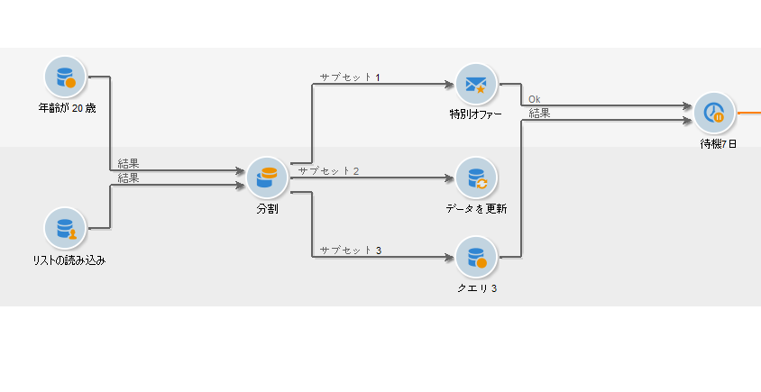

すべてのサブセットを、1 つの出力トランジションにグループ化できます。この場合、それぞれのサブセットへのリンクは、セグメントコード内に表示されます。To do this, select the **[!UICONTROL Generate all subsets in the same table]** option.

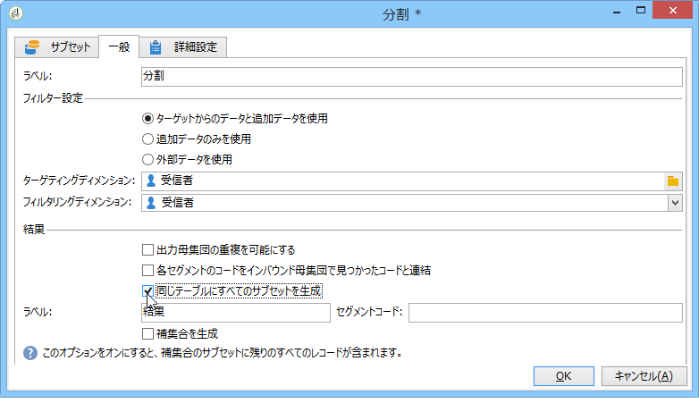

例えば、1 つの配信アクティビティを配置し、各受信者セットのセグメントコードに基づいて配信コンテンツをパーソナライズすることができます。

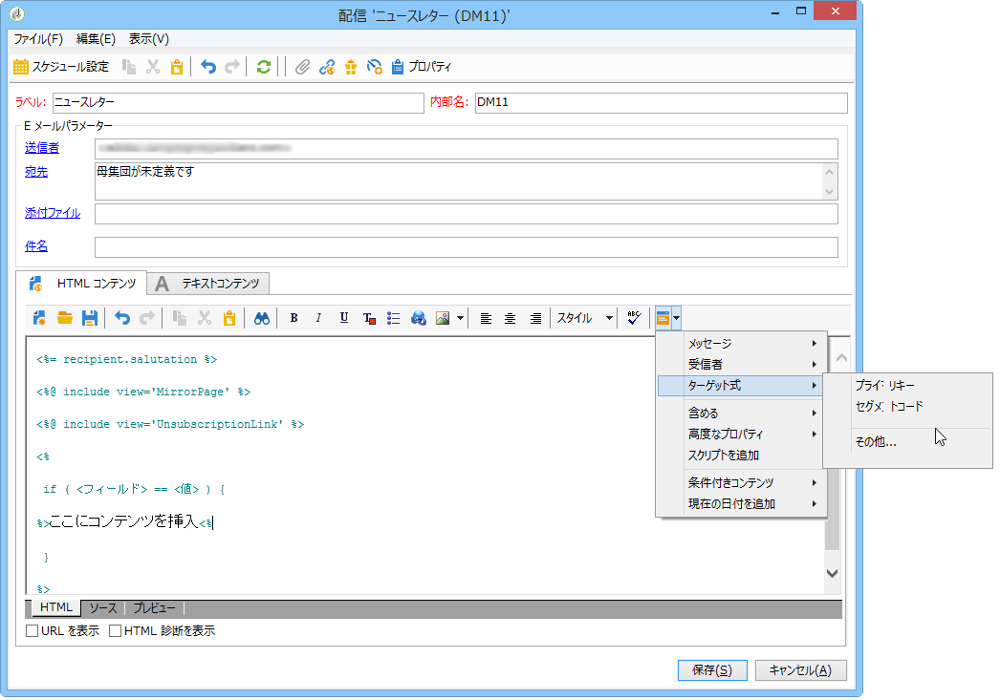

Subsets can also be created using the **[!UICONTROL Cells]** activity. For more on this, refer to the [Cells](../../workflow/using/cells.md) section.

### ターゲット済みのデータの使用 {#using-targeted-data}

識別され、準備されたデータは、次のコンテキストで使用できます。

* 各種ワークフローステージで、データ操作の後でデータベース内のデータを更新できます。

   詳しくは、「データを更新 [する](../../workflow/using/update-data.md)」を参照。

* さらに、既存のリストのコンテンツを更新できます。

   For more on this, refer to [List update](../../workflow/using/list-update.md).

* ワークフロー内で直接、配信を準備または開始できます。

   詳しくは、「配信」、「配信制御 [」](../../workflow/using/delivery.md)、「連 [続配信](../../workflow/using/delivery-control.md)[」を参照](../../workflow/using/continuous-delivery.md)してください。

## データ管理 {#data-management}

Adobe Campaign では、より効率的で柔軟なツールを提供することで複雑なターゲティングの課題を解決できるように、データ管理によってアクティビティセットを組み合わせます。これにより、契約や購読、配信に対する反応などに関連する情報を使用して、連絡先とのすべての通信の一貫した管理の実装が可能になります。データ管理によって、セグメント化の操作時にデータのライフサイクルをトラッキングできます。具体例を以下に示します。

* データマートでモデル化されていないデータを含めることで、ターゲティングプロセスを簡素化し、最適化する（新規テーブルを作成：設定に応じた各ターゲティングワークフローへのローカル拡張）。
* 特にターゲットの構築フェーズで、またはデータベース管理中に、バッファ計算を保持し、伝達する。
* 外部データベースへのアクセス（オプション）：ターゲティングプロセス中に、異種データベースを処理する。

これらの操作を実装するために、Adobe Campaign は以下を提供します。

* データ収集アクティビティ： [File transfer](../../workflow/using/file-transfer.md), [Data loading (file)](../../workflow/using/data-loading--file-.md), Data loading (RDBMS) [,](../../workflow/using/data-loading--rdbms-.md)Update data [for](../../workflow/using/update-data.md)Update Data Loading データ収集の最初の手順では、その他のアクティビティ内で処理するためにデータを準備します。ワークフローを正確に実行し、予測した結果が確実に得られるようにするには、複数のパラメーターを監視する必要がります。例えば、データをインポートする場合、データのプライマリキー（Pkey）は、レコードごとに一意である必要があります。
* ターゲットアクティビティがデータ管理オプションで強化されました。 [Query](../../workflow/using/query.md), [Union](../../workflow/using/union.md), [Intersection](../../workflow/using/intersection.md), [Split](../../workflow/using/split.md)Split Deplit Split Detar これにより、データの紐付けが可能な場合、様々なターゲティングディメンションから和集合または積集合を設定できます。
* データ変換アクティビティ：エンリッ [チ](../../workflow/using/enrichment.md)、デ [ィメンション](../../workflow/using/change-dimension.md)。

>[!CAUTION]
>
>2 つのワークフローがリンクされている場合、ソーステーブル要素を削除することは、その要素にリンクされているすべてのデータの削除を意味するわけではありません。
>  
>例えば、ワークフロー経由で受信者を削除しても、受信者の配信履歴すべてが削除されることはありません。ただし、受信者フォルダーから直接受信者を削除すると、その受信者にリンクされたすべてのデータが削除されます。

### データのエンリッチメントと変更 {#enriching-and-modifying-data}

ターゲティングディメンションに加えて、フィルタリングディメンションでも、収集したデータの特性を指定できます。詳しくは、ディメンシ [ョンのターゲット設定とフィルターを参照してくださ](../../workflow/using/building-a-workflow.md#targeting-and-filtering-dimensions)い。

識別され、収集されたデータに対して、ターゲットの構築を最適化するために、エンリッチメントや集計、操作をおこなうことができます。To do this, in addition to the data manipulation activities detailed in the [Segmenting data](#segmenting-data) section, use the following:

* The **[!UICONTROL Enrichment]** activity lets you momentarily add columns to a schema, as well as add information to certain elements. It is detailed in the [Enrichment](../../workflow/using/enrichment.md) section of the repository of activities.
* The **[!UICONTROL Edit schema]** activity lets you modify the structure of a schema. It is detailed in the [Edit schema](../../workflow/using/edit-schema.md) section of the repository of activities.
* The **[!UICONTROL Change dimension]** activity lets you change the targeting dimension during the target construction cycle. It is detailed in the [Change dimension](../../workflow/using/change-dimension.md) section.

