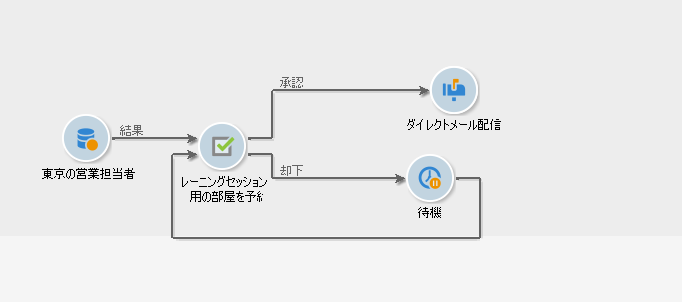
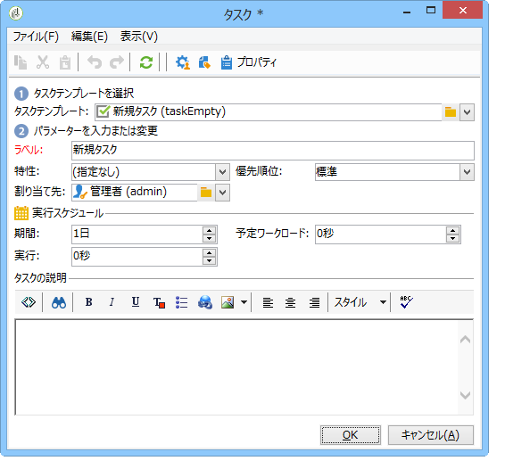

# タスク{#task}

>[!AVAILABILITY]
>
>`:warning:` この機能は、Campaign Classic v7 でのみ使用できます。 [詳細情報](../../mrm/using/creating-and-managing-tasks.md)

キャンペーンワークフローでは、「**[!UICONTROL タスク]**」アクティビティで 2 つのシナリオを指定できます。1 つはタスクが完了した場合、もう 1 つはタスクが完了しなかった場合（手動で未完了とマークした場合、または期限切れとなった場合）。

タスクの設定と操作の方法について詳しくは、[Campaign Classic v7 ドキュメント](../../mrm/using/creating-and-managing-tasks.md)を参照してください。

「**[!UICONTROL リソース]**」オプションで、複数のオペレーターとタスクの承認スケジュールを定義できます。 承認が拒否されても、これによってタスク自体が拒否されることにはなりません。

