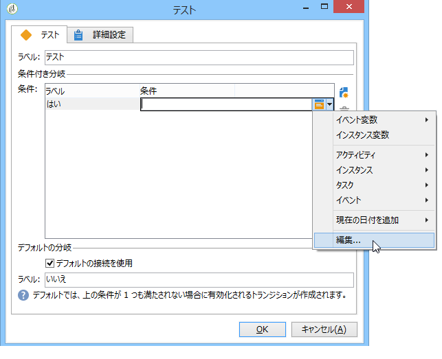

# テスト{#test}

「**テスト**」タイプのアクティビティは、自身に関連付けられている条件を最初に満たしたトランジションを有効化します。 条件が 1 つも満たされず、「**[!UICONTROL デフォルト分岐を使用]**」オプションが有効化されている場合、デフォルトのトランジションが有効化されます。

条件は、true または false によって必ず評価される JavaScript 式です。 式を入力するには、条件名の右にあるアイコンをクリックし、「**[!UICONTROL 編集...]**」を選択します。

ワークフロー JavaScript 経由でアクセス可能なアプリケーションサーバーのその他すべての JavaScript 関数および SOAP メソッドの詳細については、[JSAPI ドキュメント](https://experienceleague.adobe.com/developer/campaign-api/api/index.html?lang=ja)を参照してください。

このエディターから変数を直接挿入することもできます。 変数の使用方法について詳しくは、[この節](javascript-scripts-and-templates.md#variables)を参照してください。

条件は、アクティビティプロパティの編集ウィンドウから追加や削除、並べ替えるができますが、トランジションから編集することもできます。

計算結果を別の条件で再利用する場合、アクティビティの初期化スクリプトで再計算することも可能です。 結果は、条件スクリプトによってアクセスされるタスクの変数（task.vars.xxx）に格納する必要があります。

