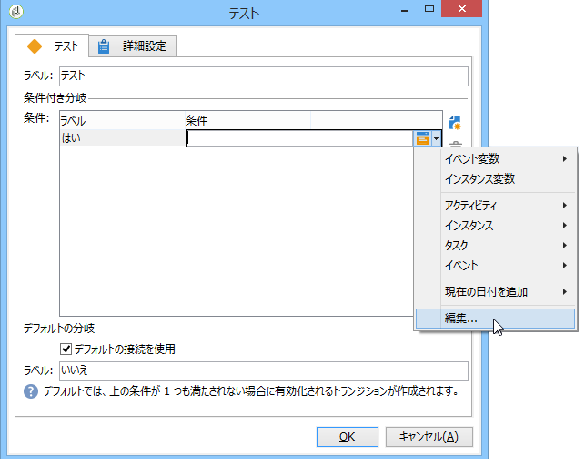

<?xml version="1.0" encoding="UTF-8"?>
<xliff xmlns="urn:oasis:names:tc:xliff:document:1.2" xmlns:okp="okapi-framework:xliff-extensions" xmlns:its="http://www.w3.org/2005/11/its" xmlns:itsxlf="http://www.w3.org/ns/its-xliff/" version="1.2" its:version="2.0">
<file original="help/workflow/using/test.md.mdsc" source-language="en-US" target-language="en-XX" datatype="x-text/markdown">
<body>
<trans-unit id="tu8" xml:space="preserve">
<source xml:lang="en-US">https://experienceleague.adobe.com/en/tools/campaign-api</source>
<target xml:lang="en-XX">https://experienceleague.adobe.com/ja/tools/campaign-api</target>
</trans-unit>
<trans-unit id="tu1" restype="x-YAML_METADATA_HEADER_VALUE" xml:space="preserve">
<source xml:lang="en-US">Test</source>
<target xml:lang="en-XX">テスト</target>
</trans-unit>
<trans-unit id="tu2" restype="x-YAML_METADATA_HEADER_VALUE" xml:space="preserve">
<source xml:lang="en-US">Learn more about the Test workflow activity</source>
<target xml:lang="en-XX">テストワークフローアクティビティの詳細を説明します</target>
</trans-unit>
<trans-unit id="tu3" xml:space="preserve">
<source xml:lang="en-US">Test</source>
<target xml:lang="en-XX">テスト</target>
</trans-unit>
<trans-unit id="tu4" xml:space="preserve">
<source xml:lang="en-US">A <ph id="1" ctype="x-STRONG_EMPHASIS">**</ph>Test<ph id="2" ctype="x-STRONG_EMPHASIS">**</ph> type activity activates the first transition that satisfies the condition associated with it. If no condition is satisfied and if the <ph id="3" ctype="x-STRONG_EMPHASIS">**[!UICONTROL </ph>Use the default fork<ph id="5" ctype="x-LINK_REF">]**</ph> option is activated, the default transition will be activated.</source>
<target xml:lang="en-XX">「<ph id="1" ctype="x-STRONG_EMPHASIS">**</ph>テスト<ph id="2" ctype="x-STRONG_EMPHASIS">**</ph>」タイプのアクティビティは、自身に関連付けられている条件を最初に満たしたトランジションを有効化します。 条件が 1 つも満たされず、「<ph id="3" ctype="x-STRONG_EMPHASIS">**[!UICONTROL </ph>デフォルト分岐を使用<ph id="5" ctype="x-LINK_REF">]**</ph>」オプションが有効化されている場合、デフォルトのトランジションが有効化されます。</target>
</trans-unit>
<trans-unit id="tu5" xml:space="preserve">
<source xml:lang="en-US">A condition is a JavaScript expression that must be evaluated to 'true' or 'false'. To enter the expression, click the icon to the right of the name of the condition, and then select <ph id="1" ctype="x-STRONG_EMPHASIS">**[!UICONTROL </ph>Edit...<ph id="3" ctype="x-LINK_REF">]**</ph>.</source>
<target xml:lang="en-XX">条件は、true または false によって必ず評価される JavaScript 式です。 式を入力するには、条件名の右にあるアイコンをクリックし、「<ph id="1" ctype="x-STRONG_EMPHASIS">**[!UICONTROL </ph>編集...<ph id="3" ctype="x-LINK_REF">]**</ph>」を選択します。</target>
</trans-unit>
<trans-unit id="tu6" xml:space="preserve">
<source xml:lang="en-US"><ph id="1" ctype="x-IMAGE"></ph></source>
<target xml:lang="en-XX"><ph id="1" ctype="x-IMAGE"></ph></target>
</trans-unit>
<trans-unit id="tu7" xml:space="preserve">
<source xml:lang="en-US">For more information on all the additional JavaScript functions and SOAP methods of the applicative server accessible via workflow JavaScript, refer to <ph id="1" ctype="x-LINK">&lbrack;</ph>JSAPI documentation<ph id="2" ctype="x-LINK">[#$tu8]</ph>.</source>
<target xml:lang="en-XX">ワークフロー JavaScript 経由でアクセス可能なアプリケーションサーバーのその他すべての JavaScript 関数および SOAP メソッドの詳細については、<ph id="1" ctype="x-LINK">&lbrack;</ph>JSAPI ドキュメント<ph id="2" ctype="x-LINK">[#$tu8]</ph>を参照してください。</target>
</trans-unit>
<trans-unit id="tu9" xml:space="preserve">
<source xml:lang="en-US">You can also insert variables directly from this editor. For more  information on how to work with variables, refer to <ph id="1" ctype="x-LINK">[</ph>this section<ph id="2" ctype="x-LINK">](javascript-scripts-and-templates.md#variables)</ph>.</source>
<target xml:lang="en-XX">このエディターから変数を直接挿入することもできます。 変数の使用方法について詳しくは、<ph id="1" ctype="x-LINK">[</ph>この節<ph id="2" ctype="x-LINK">](javascript-scripts-and-templates.md#variables)</ph>を参照してください。</target>
</trans-unit>
<trans-unit id="tu10" xml:space="preserve">
<source xml:lang="en-US">Conditions can be added, deleted, or ordered from the activity property edit window, but can also be modified from the transition.</source>
<target xml:lang="en-XX">条件は、アクティビティプロパティの編集ウィンドウから追加や削除、並べ替えるができますが、トランジションから編集することもできます。</target>
</trans-unit>
<trans-unit id="tu11" xml:space="preserve">
<source xml:lang="en-US">If the result of a calculation is to be reused by different conditions, it is possible to calculate it in the initialization script of the activity. The result must be stored in a variable of the task to be accessed by the condition scripts (task.vars.xxx).</source>
<target xml:lang="en-XX">計算結果を別の条件で再利用する場合、アクティビティの初期化スクリプトで再計算することも可能です。 結果は、条件スクリプトによってアクセスされるタスクの変数（task.vars.xxx）に格納する必要があります。</target>
</trans-unit>
</body>
</file>
</xliff>