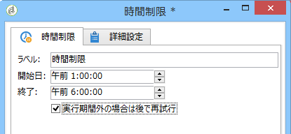

# 時間制限{#time-constraint}

**時間制限**&#x200B;アクティビティでは、タスクの実行を延期または中止できます。

アクティビティのラベルを入力し、ワークフロータスクを一時停止する期間を指定します。

「**[!UICONTROL 実行期間外で後でもう一度試す]**」オプションが選択されている場合、実行時間枠外でタスクを再開できます。 ワークフローアクションを休止した後に破棄する場合は、このオプションの選択を解除します。

