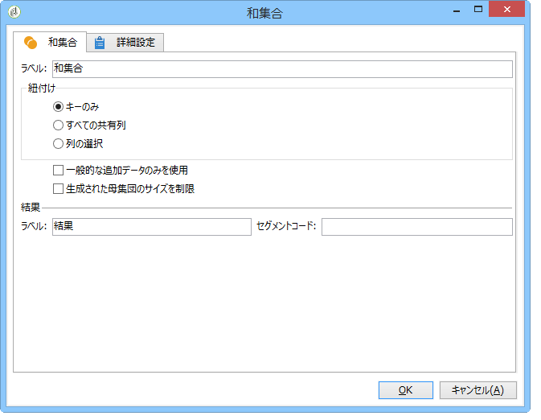
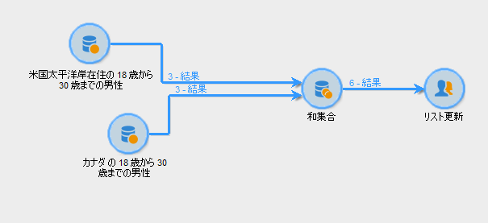

# 和集合{#union}

和集合は、複数のインバウンドアクティビティの結果を 1 つのターゲット内にグループ化します。 ターゲットは、受信したすべての結果から作成されます。そのため、すべての先行アクティビティは、和集合が実行される前に完了している必要があります。

>[!NOTE]
>
>和集合アクティビティの設定と使用について詳しくは、[複数のターゲットの組み合わせ（和集合）](targeting-data.md#combining-several-targets--union-)を参照してください。

## 和集合の例 {#union-example}

次の例では、リストを更新するために、2 つのクエリからの結果が結合されています。 2 つのクエリは、受信者をターゲットにしています。 このため、結果は同じテーブルに基づいています。

1. 「**[!UICONTROL 和集合]**」タイプのアクティビティを、2 つのクエリの直後、リストの更新タイプアクティビティの前に挿入してから開きます。
1. ラベルを入力できます。
1. この例では、クエリから生成された母集団に一貫したデータが含まれるので、「**[!UICONTROL キーのみ]**」紐付けメソッドを選択します。
1. クエリのために追加データを追加した場合、共有されているデータのみを保持するように指定できます。
1. 最終的な母集団のサイズを制限したい場合、「**[!UICONTROL 生成された母集団のサイズを制限]**」ボックスを選択します。

   受信者の最大数を入力することによって、また、母集団が優先されるクエリを選択することによって、この最終的な数を指定します。

1. 和集合アクティビティを承認してから、リスト更新アクティビティを設定します（[リスト更新](list-update.md)を参照）。
1. ワークフローを開始します。 結果数が表示され、リスト更新アクティビティ内に定義されたリストが作成または更新されます。 このリストには、両方のクエリのための受信者のセット、または該当する場合は前述の手順で定義した数が含まれます。

   

## 入力パラメーター {#input-parameters}

* tableName
* スキーマ

各インバウンドイベントは、これらのパラメーターによって定義されるターゲットを指定する必要があります。

## 出力パラメーター {#output-parameters}

* tableName
* スキーマ
* recCount

この 3 つの値セットは、和集合によって生成されたターゲットを識別します。 **[!UICONTROL tableName]** はターゲットの識別子を記録するテーブル名、**[!UICONTROL schema]** は母集団のスキーマ（通常は nms:recipient）、**[!UICONTROL recCount]** はテーブル内の要素の数です。

