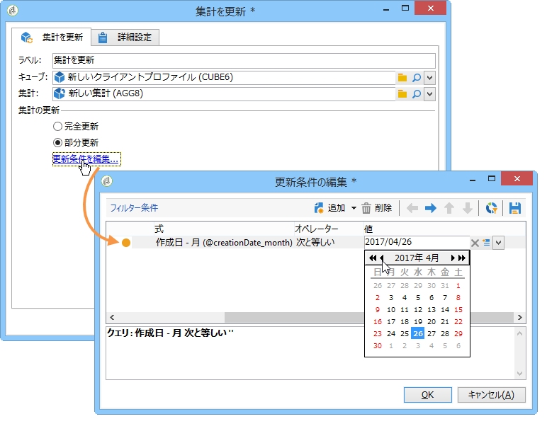
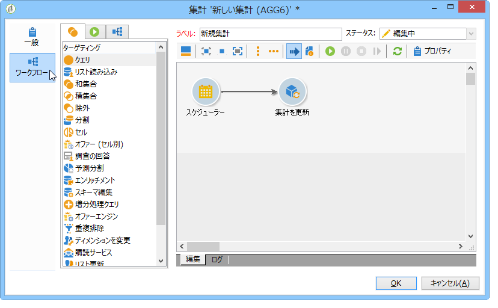

# 集計を更新{#update-aggregate}

集計は、レポーティングの目的のためキューブレベルで定義できます。A **[!UICONTROL Workflow]** tab is available when configuring an aggregate.

キューブおよび Adobe Campaign での集計の使用方法について、詳しくはこの[節](../../reporting/using/concepts-and-methodology.md#calculating-and-using-aggregates)を参照してください。

The **[!UICONTROL Update aggregate]** activity lets you select the update mode to apply: full or partial.

デフォルトでは、各計算時に完全更新が実行されます。部分的更新を有効にするには、該当するオプションを選択し、更新の条件を定義します。

**ベストプラクティス**:アクティビテ **[!UICONTROL Scheduler]** ィを使用して、計算の更新の頻度を指定できます。

