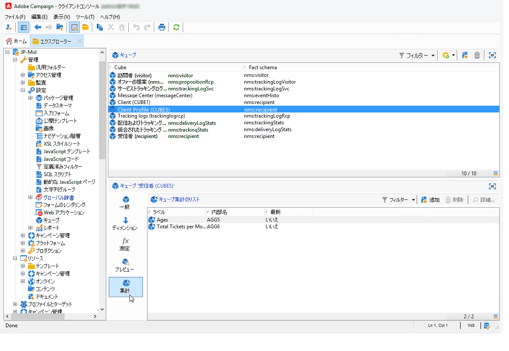
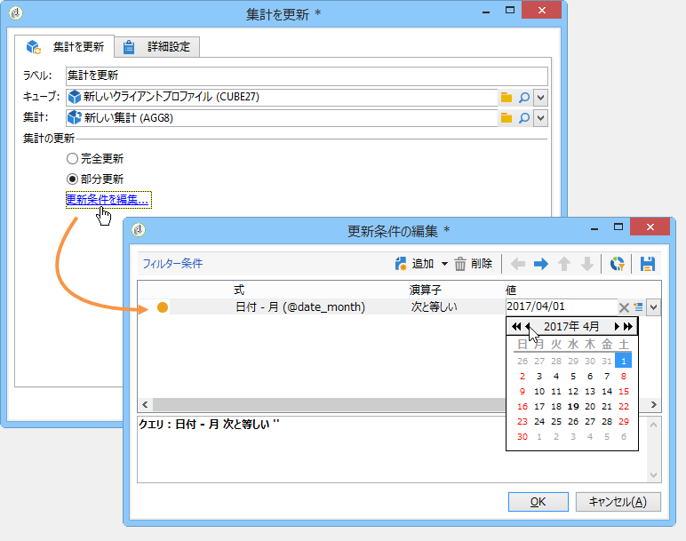
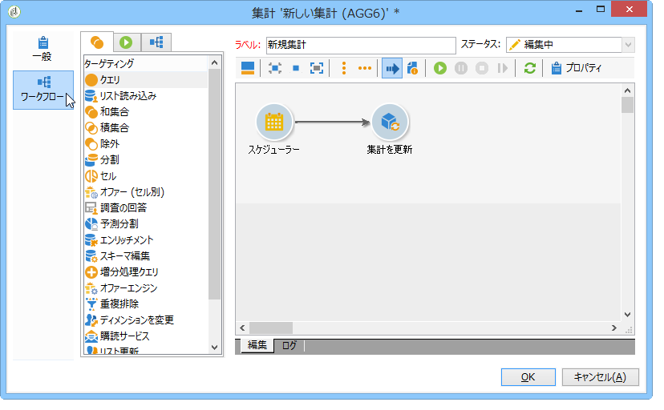

# 集計の更新{#update-aggregate}

集計は、レポーティングの目的のためキューブレベルで定義できます。 集計の設定は、「**[!UICONTROL ワークフロー]**」タブでおこないます。

集計は、大量のデータを操作するときに役に立ちます。 専用のワークフローボックスで定義した設定に基づいて集計が自動的に更新され、最近収集したデータが指標に統合されます。

集計は各キューブの関連タブで定義されます。

「**[!UICONTROL 集計を更新]**」アクティビティで、適用する更新モード（完全または部分的）を選択できます。

デフォルトでは、各計算時に完全更新が実行されます。 部分的更新を有効にするには、該当するオプションを選択し、更新の条件を定義します。

**ベストプラクティス**：アクティビティを使用して、計算の更新頻度をスケジュール設定できる「**[!UICONTROL スケジューラー]**」アクティビティ。

