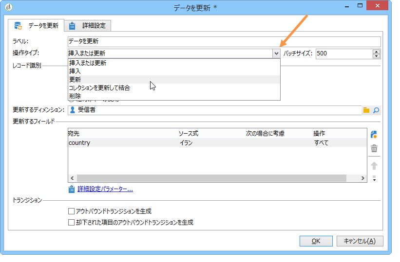
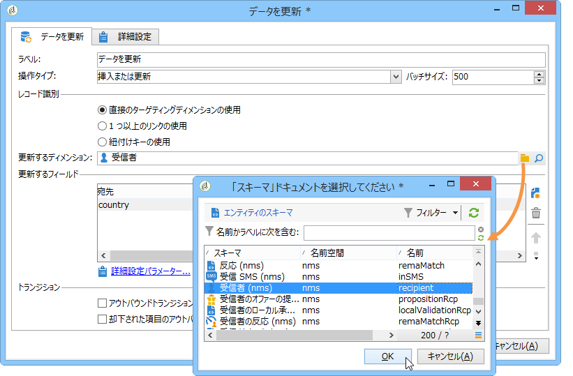
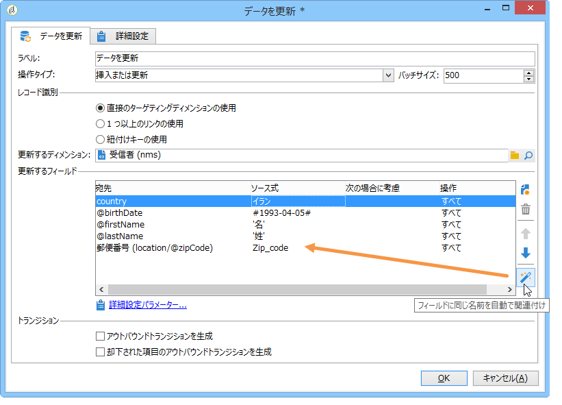
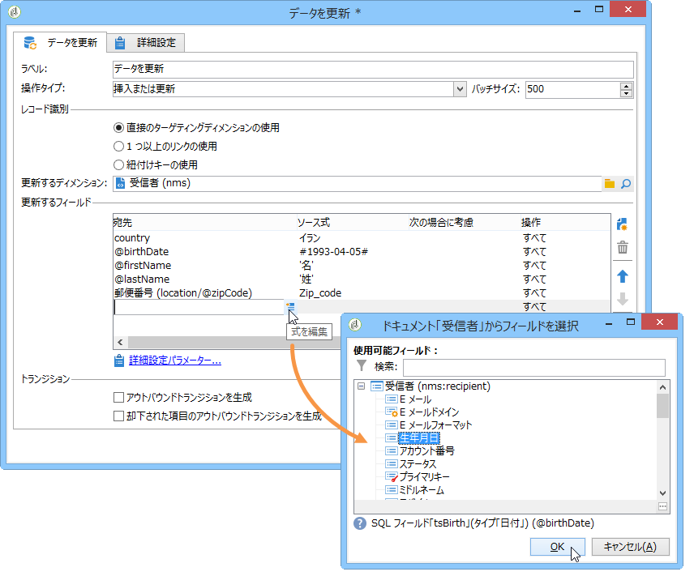
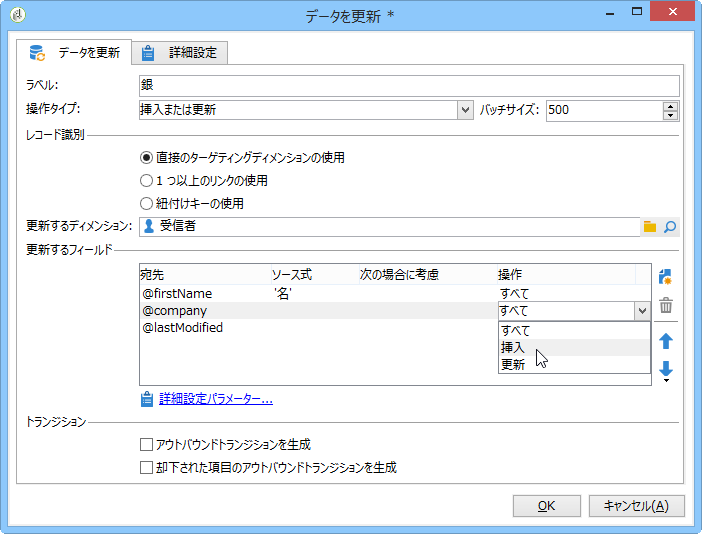
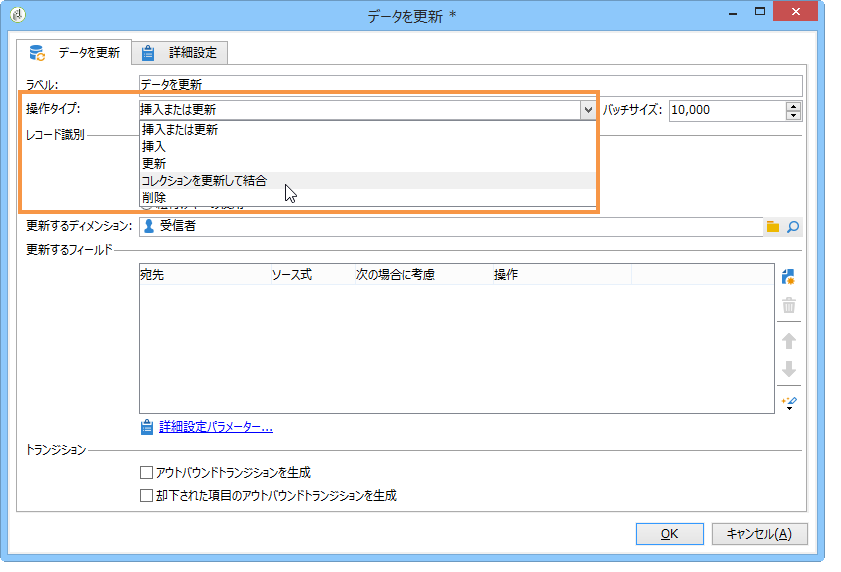
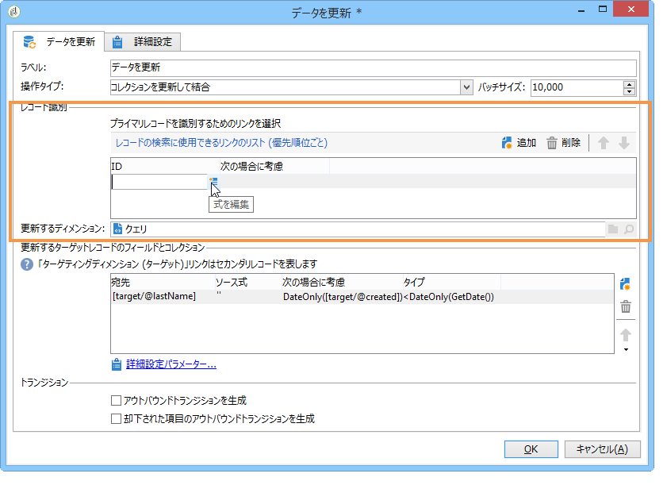
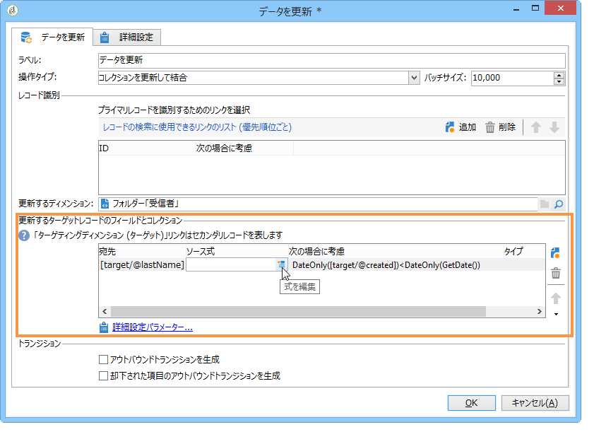

# データ更新{#update-data}

**データを更新**&#x200B;タイプのアクティビティは、データベースのフィールドを一括で更新します。

## 操作のタイプ {#operation-type}

The **[!UICONTROL Operation type]** field lets you choose the process to be carried out on the data in the database:

* **[!UICONTROL Insert or update]**:データを追加するか、既に追加されている場合は更新します。
* **[!UICONTROL Insert]**:データのみを追加します。
* **[!UICONTROL Update]**:データの更新のみ。
* **[!UICONTROL Update and merge collections]**:データを更新して「マスター」レコードを選択し、このマスターレコード内の重複にリンクされた要素をリンクします。 重複レコードは、孤立した接続要素を作成することなく、削除できます。
* **[!UICONTROL Delete]**:データを削除します。

The **[!UICONTROL Batch size]** field lets you select the number of inbound transition elements to be updated. 例えば 500 を選択すると、処理される最初の 500 レコードが更新されます。

## レコード識別 {#record-identification}

データベース内のレコードを識別する方法を指定します。

* データエントリが既存のターゲットディメンションに関連付けられている場合は、こ **[!UICONTROL By directly using the targeting dimension]** のオプションを選択し、フィールドで選択 **[!UICONTROL Updated dimension]** します。

   You can display the fields for the selected dimension using the **[!UICONTROL Edit this link]** magnifying glass button.

* または、データベース内のデータの識別または紐付けキーの直接使用を可能にするリンクを 1 つまたは複数指定します。

## 更新するフィールドの選択 {#selecting-the-fields-to-be-updated}

このオプション **[!UICONTROL Automatically associate fields with the same name]** を使用すると、Adobe Campaignで更新するフィールドが自動的に識別されます。

You can also use the **[!UICONTROL Insert]** icon to manually select the database fields to be updated.

更新するフィールドを選択したら、必要に応じて、更新を実行する条件を追加します。これを行うには、列を使用し **[!UICONTROL Taken into account if]** ます。 条件は 1 つずつ、リストの順番に適用されます。更新の順番を変更するには、右側の矢印を使用します。

同じ方向のフィールドを何度も使用できます。

Within an **[!UICONTROL Insert or update]** operation, you can select the campaign to be applied, either individually or for each field. To do this, select the desired value in the **[!UICONTROL Operation]** column.

The **[!UICONTROL modifiedDate]**, **[!UICONTROL modifiedBy]**, **[!UICONTROL createdDate]** and **[!UICONTROL createdBy]** fields are updated automatically during data updates, unless their management mode is configured specifically in the field update table.

レコードの更新は、異なる値がレコードに少なくとも 1 つ含まれている場合のみ実行されます。すべての値が同じ場合は、更新はおこなわれません。

The **[!UICONTROL Advanced parameters]** link lets you specify additional options to deal with updating data as well as managing duplicates. また以下のオプションも設定できます。

* **[!UICONTROL Disable automatic key management]**&#x200B;を参照してください。
* **[!UICONTROL Disable audit]**&#x200B;を参照してください。
* **[!UICONTROL Empty the destination value if the source value is empty (NULL)]**. このオプションはデフォルトで選択されています。
* **[!UICONTROL Update all columns with matching names]**&#x200B;を参照してください。
* Specify conditions that consider source elements using an expression in the **[!UICONTROL Enabled if]** field.
* 式を使用して重複データを考慮する条件を指定する。このオプションを **[!UICONTROL Ignore records which concern the same target]** 選択すると、式のリストの最初のものだけが考慮されます。

**[!UICONTROL Generate an outbound transition]**

実行の終了時に有効化される出力トランジションを生成します。通常は、更新によってターゲティングワークフローの終了が示されるので、このオプションはデフォルトでは有効化されません。

**[!UICONTROL Generate an outbound transition for the rejects]**

更新後、（例えば、重複レコードが存在するなどで）正しく処理されなかったレコードを含むアウトバウンドトランジションを生成します。通常は、更新によってターゲティングワークフローの終了が示されるので、このオプションはデフォルトでは有効化されません。

## コレクションの更新と結合 {#updating-and-merging-collections}

データの更新とコレクションの結合により、1 つまたは複数のセカンダリレコードのデータを使用して、レコード内のデータを更新できます（レコードを 1 つにしておきたい場合）。この更新は、ルールで管理されます。

>[!NOTE]
>
>このオプションで、ワークフローの作業用テーブル（targetWorkflow）、配信（targetDelivery）およびリスト（targetList）からのセカンダリレコードへの参照を処理できます。必要に応じて、これらのリンクは、フィールドとコレクションを選択するリストに表示されます。

1. 操作を選択 **[!UICONTROL Update and merge collections]** します。

   

1. 処理するリンクの優先順位を決めます。これにより、メインレコードを特定できます。処理できるリンクは、インバウンドトラジションによって変わります。

   

1. プライマリレコードへ移動するコレクションと更新するフィールドを選択します。

   セカンダリレコードが 1 つまたは複数見つかったときに、これらのコレクションおよびフィールドに適用するルールを入力します。そのためには、式ビルダーを使用できます。詳しくは、[この節](../../platform/using/defining-filter-conditions.md#building-expressions)を参照してください。例えば、すべての異なるレコードの更新値のうち最新のものを必ず保持するように指定します。

   次に、ルールで考慮する条件を入力します。

   最後に、実行する更新のタイプを指定します。例えば、データの更新後に、セカンダリレコードを削除するように選択できます。

   例えば、受信者用の購読リストなど、異種のデータが含まれるコレクションの結合を設定できます。また、ルールを使用して、セカンダリレコードの購読から購読履歴を新しく作成したり、セカンダリレコードからプライマリレコードへ購読リストを移動させることもできます。

1. Specify the order in which you would like the secondary records to be processed, by selecting **[!UICONTROL Advanced parameters]** > **[!UICONTROL Duplicates]**.

   

定義したルールに該当する場合、セカンダリレコードのデータはメインレコードに関連付けられます。選択した更新のタイプに従って、セカンダリレコードは削除されることもあります。

## Example: Update data following an enrichment {#example--update-data-following-an-enrichment}

手 [順2:リンチアクティビティ後のデータ更新の例としては](../../workflow/using/creating-a-summary-list.md#step-2--writing-enriched-data-to-the--purchases--table) 、リンチアップリストの作成の詳細を示すユースケースの「購入」テーブルセクションにリンチデータを書き込む方法があります。

## 入力パラメーター {#input-parameters}

* tableName
* schema

各インバウンドイベントは、これらのパラメーターによって定義されるターゲットを指定する必要があります。
