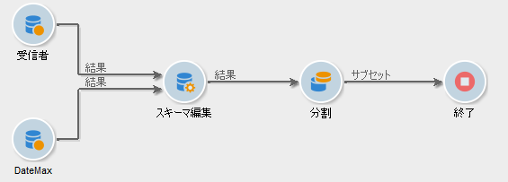
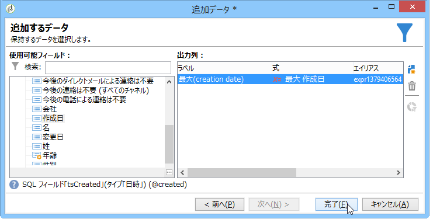
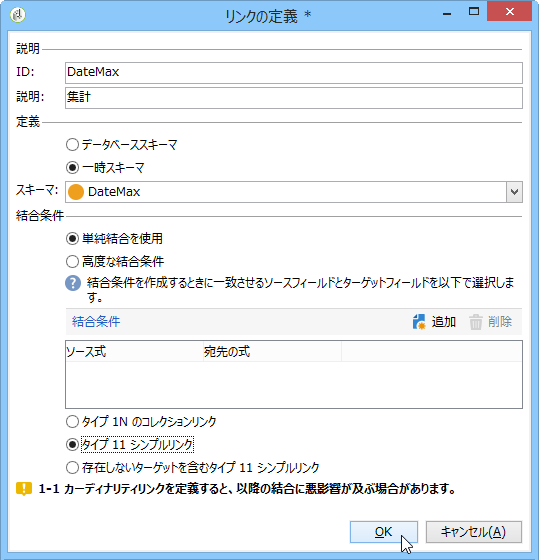
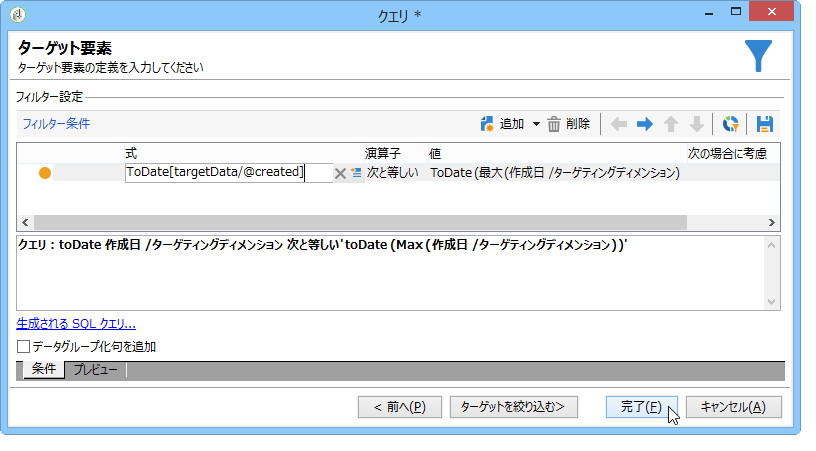

# 集計の使用{#using-aggregates}

この使用例では、データベースに追加された最新の受信者を自動的に特定する方法を詳しく説明します。

集計を使用して受信者を作成した既知の最新の日付と、データベース内にある受信者の作成日付を、次のプロセスを使用して比較します。同じ日に作成された受信者もすべて選択されます。

受信者に対して「**作成日付 = 最大（作成日付）**」タイプフィルターを実行するには、ワークフローを実行して、以下のプロセスに従う必要があります。

1. 基本的なクエリを使用して、データベース内の受信者を取得します。この手順の詳細については、「クエリの作成」を [参照してください](../../workflow/using/query.md#creating-a-query)。
1. 「**最大（作成日付）**」集計機能で生成された結果を使用して受信者を作成した最新の既知の日付を割り出します。
1. 各受信者を、同じスキーマの、集計機能の結果とリンクします。
1. 編集済みのスキーマで集計をおこない、受信者をフィルタリングします。

## Step 1: Calculating the aggregate result {#step-1--calculating-the-aggregate-result}

1. クエリを作成します。ここでの目標は、データベース内のすべての受信者について、最新の既知の作成日付を割り出すことにあります。そのため、クエリには、フィルターは含まれません。
1. 選択 **[!UICONTROL Add data]**.
1. 開いたウィンドウで、を選択し **[!UICONTROL Data linked to the filtering dimension]** ます **[!UICONTROL Filtering dimension data]**。
1. In the **[!UICONTROL Data to add]** window, add a column that calculates the maximum value for the **Creation date** field in the table of recipients. You can use the expression editor or enter **max(@created)** directly into a field in the **[!UICONTROL Expression]** column. Then click the **[!UICONTROL Finish]** button.

   

1. 「>」をク **[!UICONTROL Edit additional data]** リックしま **[!UICONTROL Advanced parameters...]**&#x200B;す。 オプションをオン **[!UICONTROL Disable automatic adding of the primary keys of the targeting dimension]** にします。

   このオプションにより、どの受信者も結果として表示されなくなり、明示的に追加したデータは維持されません。このケースでは、受信者を作成した最新の日付を参照します。

   このオプションはチ **[!UICONTROL Remove duplicate rows (DISTINCT)]** ェックしたままにします。

## Step 2: Linking the recipients and the aggregation function result {#step-2--linking-the-recipients-and-the-aggregation-function-result}

受信者を処理するクエリと、集計の計算をおこなうクエリをリンクするに、「スキーマ編集」アクティビティを使用する必要があります。

1. 受信者について問い合わせるクエリをメインセットとして定義します。
1. In the **[!UICONTROL Links]** tab, add a new link and enter the information in the window that opens as follows:

   * 集計に関係する一時なスキーマを選択します。このスキーマのデータは、メインセットのメンバーに追加されます。
   * Select **[!UICONTROL Use a simple join]** to link the aggregate result to every recipient of the main set.
   * 最後に、リンクが **[!UICONTROL Type 11 simple link]**
   

これにより、集計結果がすべての受信者とリンクします。

## Step 3: Filtering recipients using the aggregate. {#step-3--filtering-recipients-using-the-aggregate-}

リンクが確立すると、集計結果と対象の受信者は同じ一時スキーマの一部となります。そのため、このスキーマ上にフィルターを作成して、受信者の作成日付と最新の既知の日付とを比較することができます。これらの日付は集計機能により表示されます。このフィルターは「分割」アクティビティを使用して実行します。

1. In the **[!UICONTROL General]** tab, select **Recipients** as the targeting dimension and **Edit schema** as the filtering dimension (to filter on the inbound transition schema activity).
1. タブでを選 **[!UICONTROL subsets]** 択し、をクリ **[!UICONTROL Add a filtering condition on the inbound population]** ックしま **[!UICONTROL Edit...]**&#x200B;す。
1. 式エディターを使用して、集計で割り出した作成日付と受信者の作成日付との間に等価基準を追加します。

   データベースのデータタイプフィールドは通常、ミリ秒で保存されます。そのため、同じミリ秒内だけに作成された受信者を取得しないよう、ミリ秒を 1 日に拡張する必要があります。

   これをおこなうには、「**ToDate**」関数を使用して日付と時間をシンプルなものに変換します。この関数は式エディターで使用できます。

   この基準に使用する式は次のようになります。

   * **[!UICONTROL Expression]**: `toDate([target/@created])`.
   * **[!UICONTROL Value]**: `toDate([datemax/expr####])`式#####は、集計関数クエリで指定された集計に関連します。
   

この結果、「分割」アクティビティで得られる結果は、最新の既知の作成日付と同じ日付に作成された受信者と関連性があります。

これにより、「リスト更新」や「配信」などのほかのアクティビティを追加してワークフローをエンリッチメントすることができます。
