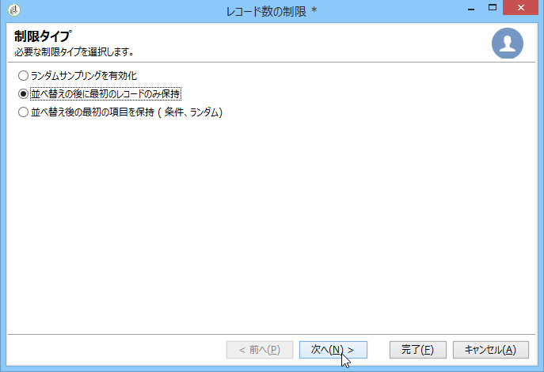

# ローカルの承認アクティビティの使用{#using-the-local-approval-activity}

The **[!UICONTROL Local approval]** activity integrated into a targeting workflow lets you set up a recipient approval process before the delivery is sent.

>[!CAUTION]
>
>この機能を利用するには、キャンペーンのオプション、分散型マーケティングモジュールを購入する必要があります。使用許諾契約書を確認してください。

この使用例を設定するうえで、以下のターゲティングワークフローを作成しました。

ローカルの承認プロセスの主な手順は次のとおりです。

1. The population resulting from targeting can be limited thanks to a **[!UICONTROL Split]** type activity using a data distribution model.

   

1. The **[!UICONTROL Local approval]** activity then takes over and sends a notification email to each local supervisor. ローカルの個々のスーパーバイザーが各自に割り当てられた受信者を承認するまでは、アクティビティは保留されます。

   

1. 承認の期限を過ぎると、ワークフローが再度開始されます。In this example, the **[!UICONTROL Delivery]** activity starts and the delivery is sent to the approved targets.

   >[!NOTE]
   >
   >承認の期限を過ぎると、受信者を承認することはできなくなり、ターゲティングから除外されます。

   

1. A few days later, the second **[!UICONTROL Local approval]** type activity sends a notification email to each local supervisor with a summary of the actions carried out by their contacts (clicks, opens, etc.).

   

## Step 1: Creating the data distribution template {#step-1--creating-the-data-distribution-template-}

データ配分テンプレートを使用すると、ターゲティングによって生じる母集団の数をデータのグループ別に制限できるほか、個々の値をローカルのスーパーバイザーに割り当てることが可能です。In this example, we have defined the **[!UICONTROL Email address domain]** field as a distribution field and assigned a domain to each local supervisor

データ配信テンプレートの作成について詳しくは、「データ配信ご [とのサブセットレコード数の制限」を参照してください](../../workflow/using/split.md#limiting-the-number-of-subset-records-per-data-distribution)。

1. データ配布テンプレートを作成するには、ノードに移動し、を **[!UICONTROL Resources > Campaign management > Data distribution]** クリックしま **[!UICONTROL New]**&#x200B;す。

   

1. タブを選択 **[!UICONTROL General]** します。

   

1. とを入力 **[!UICONTROL Label]** します **[!UICONTROL Distribution context]**。 In this example, we have selected the **[!UICONTROL Recipient]** targeting schema and the **[!UICONTROL Email domain]** field as a distribution field. 受信者のリストが、ドメインごとに分割されます。
1. In the **[!UICONTROL Distribution type]** field, select how the target limitation value will be expressed in the **[!UICONTROL Distribution]** tab. Here, we have chosen **[!UICONTROL Percentage]**.
1. In the **[!UICONTROL Approval storage]** field, enter the storage schema of the approvals that match the targeting schema in use. Here we are going to use the default storage schema: **[!UICONTROL Local approval of recipients]**.
1. Then click the **[!UICONTROL Advanced parameters]** link.

   

1. Keep the **[!UICONTROL Approve the targeted messages]** option checked so that all recipients are pre-selected from the list of recipients to approve.
1. In the **[!UICONTROL Delivery label]** field, we&#39;ve left the default expression (compute string of the delivery). フィードバックの通知には、標準の配信ラベルを使用します。
1. In the **[!UICONTROL Grouping field]** section, we have selected the **[!UICONTROL Gender]** field as a grouping field for displaying recipients in the approval and feedback notifications.
1. この節で **[!UICONTROL Edit targeted messages]** は、Webアプリケーションとパラメ **[!UICONTROL Edit recipients]** ーターを選択し **[!UICONTROL recipientId]** ました。 承認およびフィードバックの通知で受信者をクリックできるようになります。受信者は、Web アプリケーションの URL をポイントします。追加の URL パラメーターは、**[!UICONTROL recipientId]** になります。
1. Then click the **[!UICONTROL Distribution]** tab. 各ドメインについて、以下のフィールドの内容を入力します。

   

   * **[!UICONTROL Value]**:ドメイン名の値を入力します。
   * **[!UICONTROL Percentage / Fixed]**:各ドメインに対して、最大値を入力します。 配信先の受信者数。 この例では、ドメインあたりの配信を 10% に制限します。
   * **[!UICONTROL Label]**:承認およびフィードバック通知に表示するドメインのラベルを入力します。
   * **[!UICONTROL Group or operator]**:ドメインに割り当てられている演算子または演算子のグループを選択します。

      >[!CAUTION]
      >
      >オペレーターには必ず適切な権限を付与するようにしてください。

## Step 2: Creating the targeting workflow {#step-2--creating-the-targeting-workflow}

この使用例を設定するうえで、以下のターゲティングワークフローを作成しました。

以下のアクティビティを追加します。

* 2つ **[!UICONTROL Query]** の活動
* 1つのア **[!UICONTROL Intersection]** クティビティ、
* 1つのア **[!UICONTROL Split]** クティビティ、
* 1つのア **[!UICONTROL Local approval]** クティビティ、
* 1つのア **[!UICONTROL Delivery]** クティビティ、
* 1つのア **[!UICONTROL Wait]** クティビティ、
* 2つ目のア **[!UICONTROL Local approval]** クティビティ
* 1つのア **[!UICONTROL End]** クティビティ。

### クエリ、積集合、および分割 {#queries--intersection-and-split}

上流のターゲティングは、2 つのクエリ、1 つの積集合、1 つの分割で構成されます。The population resulting from targeting can be limited using a **[!UICONTROL Split]** activity using a data distribution template.

For more on configuring a split activity, refer to [Split](../../workflow/using/split.md). データ配信テンプレートの作成について詳しくは、データ配信ご [とのサブセットレコード数の制限を参照してください](../../workflow/using/split.md#limiting-the-number-of-subset-records-per-data-distribution)。

If you do not want to limit the population from the query, you do not have to use the **[!UICONTROL Query]**, **[!UICONTROL Intersection]**, and **[!UICONTROL Split]** activities. In this case, complete the data distribution template in the first **[!UICONTROL Local approval]** activity.

1. セクション **[!UICONTROL Record count limitation]** で、オプションを選択 **[!UICONTROL Limit the selected records]** し、リンクをクリック **[!UICONTROL Edit]** します。

   

1. オプションを選 **[!UICONTROL Keep only the first records after sorting]** 択し、をクリックしま **[!UICONTROL Next]**&#x200B;す。

   

1. In the **[!UICONTROL Sort columns]** section, add the field which the sort is applied to. Here, we have chosen the **[!UICONTROL Email]** field. クリック **[!UICONTROL Next]**.

   

1. このオプション **[!UICONTROL By data distribution]** を選択し、前に作成した配布テンプレートを選択します(手順1 [を参照)。データ配布テンプレートの作成](#step-1--creating-the-data-distribution-template-))をクリックし、をクリックしま **[!UICONTROL Finish]**&#x200B;す。

   

ワークフローに表示される値と一致するよう、配分テンプレートで、グループ値別の母集団を 10% に制限します（340 の入力に対して出力が 34 になります）。

### 承認通知 {#approval-notification}

The **[!UICONTROL Local approval]** activity lets you send a notification to each local supervisor.

アクティビティの設定について詳し **[!UICONTROL Local approval]** くは、「ローカル承認」を [参照してくださ](../../workflow/using/local-approval.md)い。

以下のフィールドの内容を入力する必要があります。

1. セクション **[!UICONTROL Action to execute]** で、オプションを選択 **[!UICONTROL Target approval notification]** します。
1. セクション **[!UICONTROL Distribution context]** で、オプションを選択 **[!UICONTROL Specified in the transition]** します。

   If you don&#39;t want to limit the targeted population, select the **[!UICONTROL Explicit]** option here and enter the distribution template created previously in the **[!UICONTROL Data distribution]** field.

1. In the **[!UICONTROL Notification]** section, select the delivery template and the subject to be used for the notification email. Here, we have chosen the default template: **[!UICONTROL Local approval notification]**.
1. In the **[!UICONTROL Approval schedule]** section, we&#39;ve kept the default approval deadline (3 days) and added a reminder. 承認が開始されてから 3 日間、配信が有効になります。承認期限が経過すると、承認されていない受信者はターゲティングの対象から除外されます。

The notification email sent by the **[!UICONTROL Local approval]** activity to local supervisors is as follows:

### 待機 {#wait}

「待機」アクティビティを使用すると、フィードバック通知を配信する 2 つ目の「ローカルの承認」アクティビティの開始を延期することができます。In the **[!UICONTROL Duration]** field, we have entered the **[!UICONTROL 5d]** value (5 days). 配信後の 5 日間に受信者がおこなったアクションがフィードバック通知に記載されます。

### フィードバック通知 {#feedback-notification}

The second **[!UICONTROL Local approval]** activity lets you send a delivery feedback notification to each local supervisor.

以下のフィールドの内容を入力する必要があります。

1. セクションで、 **[!UICONTROL Action to execute]** を選択しま **[!UICONTROL Delivery feedback report]**&#x200B;す。
1. セクションで、 **[!UICONTROL Delivery]** を選択しま **[!UICONTROL Specified in the transition]**&#x200B;す。
1. In the **[!UICONTROL Notification]** section, select the delivery template and the subject to be used for the notification email.

Once the deadline configured in the wait activity is reached, the second **[!UICONTROL Local approval]** type activity sends the following notification email to each local supervisor:

### 管理者による承認トラッキングの通知メールを送信します。{#approval-tracking-by-the-administrator}

「ローカルの承認」アクティビティが起動されるごとに、承認タスクが作成されます。管理者は、これらの承認タスクを個々に管理することができます。

Go to the targeting workflow of your campaign and click the **[!UICONTROL Local approval tasks]** tab.

The list of local approval tasks can also be accessed via the **[!UICONTROL Approval tasks]** tab of the data distribution template.

Select the task you want to monitor and click the **[!UICONTROL Detail]** button. The **[!UICONTROL General]** tab of the local approval task lets you view information on the task. 必要に応じて、承認の日付やリマインダーの日付を変更することもできます。

このタブには、以下の情報が表示されます。

* タスクのラベルとその ID
* 使用する配分テンプレート
* ターゲットメッセージの数
* リンク先のワークフローとキャンペーン
* タスクのスケジュール

The **[!UICONTROL Distribution]** tab for the task lets you view the approval logs, their status, the number of messages targeted, the approval date, as well as the operator who approved the delivery.

Select an approval log and click the **[!UICONTROL Detail]** button to display more information. The **[!UICONTROL General]** tab of the local approval log lets you view general log information. ここでは、承認ステータスを変更することもできます。

このタブには、以下の情報が表示されます。

* リンク先の承認タスク
* 承認ステータス(**[!UICONTROL Approved]** または **[!UICONTROL Pending]**)
* 使用する配分テンプレート
* 承認をおこなったローカルのスーパーバイザーと承認日
* ターゲットメッセージの数と承認済みメッセージの数

The **[!UICONTROL Targeted]** tab of the approval log displays the list of targeted recipients and their approval status. このステータスは必要に応じて変更できます。

