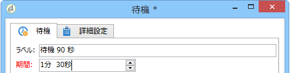

# 待機{#wait}

「**待機**」アクティビティは、数秒から数ヶ月間の任意の遅延時間が経過した後で、トランジションを有効化します。待機は、ほかのタスクの実行をブロックしません。ワークフローは、このタスクが保留になっている間に並行してタスクを実行できます。

下例の図に示すように、エディターを使用してラベルと待機時間を入力できます。

このフィ **[!UICONTROL Duration]** ールドでは、選択した単位で値を表すことができます。（事業者の地域設定による）

* 地域の設定を指定しない場合： **秒** 、分、 **m** 、 **h** 、時 **、d、****** 年。 承認時に、値は最も読みやすい単位に自動的に変換されます。

   デフォルトの単位は日付（**d**）です。

* 一方、例えば、地域設定が「フランス語」に設定されている場合は、次のようになります。秒数分時 **** 間h **時** 間 **j** 時間分mn時 ************ 間 承認時に、値は最も読みやすい単位に自動的に変換されます。上の例では、「**90s**」は「**1mn 30s**」のように変換されます。

   デフォルトの単位は日付（**d**）です。

