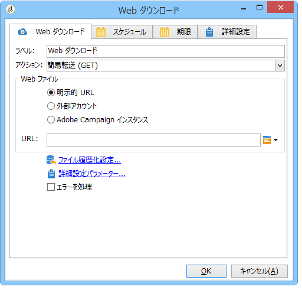
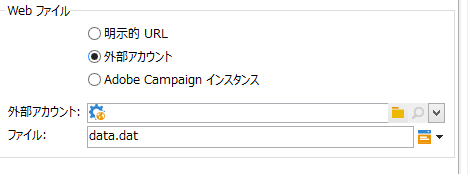
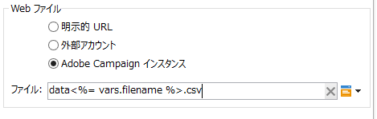
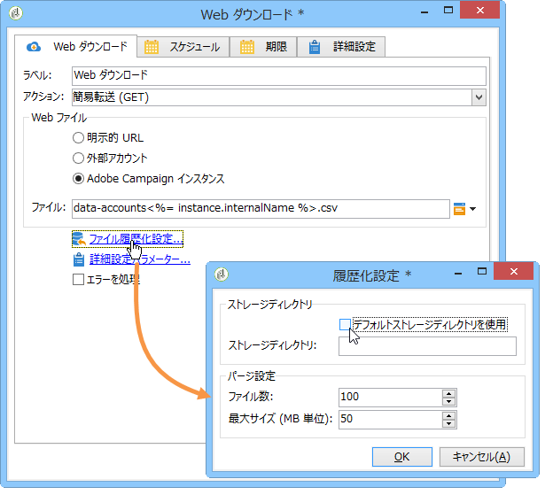
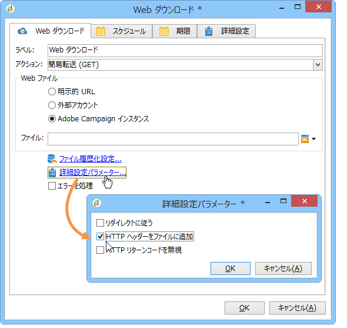

# Web ダウンロード{#web-download}

「**Web ダウンロード**」アクティビティは、明示的 URL、外部アカウント、Adobe Campaign インスタンス上のファイルのダウンロードを開始します。HTTP プロトコルが使用されます。GET または POST のいずれかによるダウンロードです。

## プロパティ {#properties}

1. **Web ファイルの選択**

   インターネット経由でファイルをダウンロードする方法としては、ファイルの URL を直接指定する方法、ファイルが保存されている外部の HTTP アカウントを使用する方法、Adobe Campaign インスタンスからファイルをダウンロードする方法があります。使用できるパラメーターは以下のとおりです。

   * To directly enter the URL of the file to be downloaded, select the **[!UICONTROL Explicit URL]** option and specify the URL in the appropriate field. この URL は変数データで構成することもできます。

      

   * To use an **[!UICONTROL External account]**, select the account from the drop-down list, and specify the file to be downloaded.

      外部アカウントは、Adobe Campaignツリー **[!UICONTROL Administration > Platform > External accounts]** のノードから設定します。 The account parameters can be edited via the **[!UICONTROL Edit link]** icon.

      

   * To download the file from the Adobe Campaign instance, select the **[!UICONTROL Adobe Campaign Instance]** option.

      

1. **ファイルの履歴化**

   The **[!UICONTROL File historization settings...]** link lets you specify the file storage directory and the purge frequency of this directory.

   

   次のオプションを使用できます。

   * **[!UICONTROL Use a default storage directory]**:ファイルは常に処理前に移動されます。 このオプションを選択すると、ファイルはデフォルトのストレージディレクトリ（Adobe Campaign インストールフォルダーの **vars** ディレクトリ）に移されます。To specify a storage directory, uncheck the box and enter its path in the **[!UICONTROL Storage directory]** field
   * **[!UICONTROL Number of files]**:ストレージディレクトリに保存するファイルの最大数を入力します。
   * **[!UICONTROL Maximum size (in Mb)]**:ストレージディレクトリの最大容量をMB単位で入力します。
   各ファイルは、定義したパージルールが適用されるまで、ディレクトリに 24 時間保持されます。パージはアクティビティの開始直前におこなわれるので、作業中のワークフローファイルには影響しません。

   ファイルは、作成日にしたがって古いものから削除されます。最も古いファイルは、両方のパージルールが確定するまでパージされます。したがって、ファイルの最大数を 100 に設定した場合、ワークフローが開始される前に、常に最新の 100 個のファイルがストレージディレクト内に存在し、それらのファイルが進行中のワークフローで処理されていきます。

   オプションとオプションの制限を設定しな **[!UICONTROL Number of files]** い場 **[!UICONTROL Maximum size (in Mb)]** 合は、値として0を入力します。

1. **詳細設定パラメーター**

   The **[!UICONTROL Advanced parameters...]** link lets you specify the additional options shown below:

   

   このオ **[!UICONTROL Process errors]** プションは「処理エラー」 [で詳しく説明します](../../workflow/using/monitoring-workflow-execution.md#processing-errors)。

## 出力パラメーター {#output-parameters}

* filename

   ダウンロードファイルの名前を入力します。

