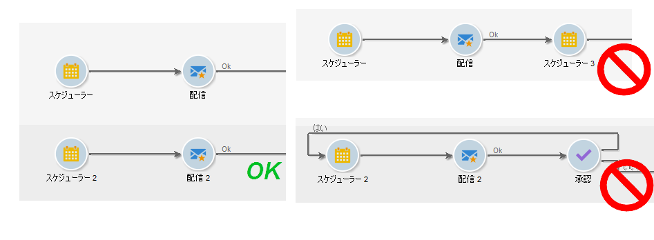

# ワークフローのベストプラクティス{#workflow-best-practices}

## 実行とパフォーマンス {#execution-and-performance}

以下に、ワークフローに適用するベストプラクティスを含む、キャンペーンのパフォーマンスの最適化に関する一般的なガイドラインを示します。

ワークフローの実行に関するトラブルシューティングガイドラインについては、こ [の節でも説明しま](../../production/using/workflow-execution.md)す。

### ログ {#logs}

The JavaScript method **[!UICONTROL logInfo()]** is a great solution for debugging a workflow. これは利用価値がありますが、特に頻繁に動作するアクティビティでは注意が必要です。過度な負荷がログかかり、ログテーブルのサイズを大幅に増大させてしまう可能性があります。一方で、**[!UICONTROL logInfo()]** () の以外のログが必要となることもあります。

他には役に立つソリューションが 2 つあります。

* **2 つの実行間の中間母集団の結果を保持**

   このオプションでは、ワークフローの 2 つの実行の間に一時テーブルを保持します。It is available in the workflow properties&#39; **[!UICONTROL General]** tab, and can be used for development and test purpose to monitor data and check results. このオプションは開発環境では使用できますが、本番環境では絶対に使用しないでください。一時テーブルを保持していると、データベースのサイズが大幅に増大し、サイズの制限に達してしまうかもしれません。更に、バックアップも遅くなります。

   最後に実行したワークフローの作業用テーブルのみ保持されます。Working tables from previous executions are purged by the **[!UICONTROL cleanup]** workflow, which runs on a daily basis.

   >[!CAUTION]
   >
   >プロダクションワークフローでは、このオプションを選択しないでください。このオプションは結果の分析に使用され、テスト目的でのみ設計されているので、開発環境またはステージング環境でのみ使用する必要があります。

* **SQL クエリをジャーナルに記録**

   Available in the **[!UICONTROL Execution]** tab of workflow properties, this option will log all SQL queries generated by the tool from the different activities. プラットフォームが実際に何を実行したのかを確認するのに適しています。ただし、このオプションは開発の際に一時的に利用するべきもので、本番では有効にしないでください。

不要になったログを削除します。 ワークフローの履歴は自動でパージされません。すべてのメッセージは、デフォルトで保持されます。History can be purged via the **[!UICONTROL File > Actions]** menu or by clicking the Actions button located in the toolbar above the list. 「履歴をパージ」を選択します。ログを削除する方法については、このドキュメントを参照してく [ださい](../../workflow/using/executing-a-workflow.md#actions-toolbar)。

### ワークフローの計画 {#workflow-planning}

* インスタンスのオーバーロードが発生するのを防ぐよう、1 日を通じてアクティビティのレベルを安定させ、ピークを回避してください。このためには、ワークフローの開始時間を 1 日を通じて均等に分散させる必要があります。
* リソースの競合を削減するため、データ負荷を夜間にスケジュールします。
* 時間がかかるワークフローは、サーバーおよびデータベースリソースに影響を与える可能性があります。処理時間を短縮するため、一番時間のかかるワークフローを分割します。
* 全体的なランタイムを短縮するには、時間のかかるアクティビティを、シンプルで迅速なアクティビティに置き換えます。
* 20を超えるワークフローを同時に実行しないでください。 同時に実行するワークフローが多すぎると、システムのリソースが不足し、不安定になる可能性があります。 ワークフローが開始しない理由について詳しくは、この記事を参照してく [ださい](https://helpx.adobe.com/ie/campaign/kb/workflows-not-starting-in-a-campaign-technical-workflows.html)。

### ワークフローの実行 {#workflow-execution}

システム全体のパフォーマンスが落ちたり、データベースにブロックが作成されたりする可能性があるので、ワークフローの実行スケジュールは 15 分以上の間隔を開けることをお勧めします。

ワークフローが一時停止の状態のままにならないようにします。If you create a temporary workflow, make sure it will be able to finish correctly and not stay in a **[!UICONTROL paused]** state. 一時停止となった場合、一時テーブルを保持する必要があることを意味し、データベースのサイズが増大します。ワークフローが失敗した場合やシステムによって一時停止された場合にアラートを送信するには、「ワークフローのプロパティ」の下のワークフロースーパーバイザーを割り当てます。

ワークフローが一時停止の状態にならないようにするには：

* ワークフローを定期的に調べ、予期しないエラーが発生していないことを確認します。
* 可能な限りワークフローをシンプルにします。例えば、大きなワークフローは複数のワークフローに分割します。You can use **[!UICONTROL External signal]** activities trigger their execution based on other workflows&#39; execution.
* ワークフローのフローでアクティビティを無効にしてスレッドを開いたままにし、多くの一時テーブルを作成して大量の領域を消費するのを防ぎます。 ワークフローでアクティビティやステ **[!UICONTROL Do not enable]** ータスを **[!UICONTROL Enable but do not execute]** 保持しないでください。

また、未使用のワークフローを停止します。 実行中のワークフローは、データベースへの接続を維持します。

最も頻繁なケースでは、無条件の停止のみを使用します。 このアクションは定期的に使用しないでください。 ワークフローによって生成された接続に対してデータベースへのクリーンクロージャを実行しないと、パフォーマンスに影響します。

### エンジン内で実行オプション {#execute-in-the-engine-option}

ウィンドウで、 **[!UICONTROL Workflow properties]** このオプションは決してオンにし **[!UICONTROL Execute in the engine]** ません。 このオプションを有効にした場合、そのワークフローが優先され、優先されたワークフローが完了するまで、その他すべてのワークフローがワークフローエンジンによって中断されます。

## ワークフローのプロパティ {#workflow-properties}

### ワークフローフォルダー {#workflow-folders}

専用フォルダーでワークフローを作成することをお勧めします。

If the workflow affects the whole platform (cleansing processes for example), you can consider adding a sub-folder in the built-in **[!UICONTROL Technical Workflows]** folder.

### ワークフローの命名 {#workflow-naming}

ワークフローには、適切な名前とラベルを付けることをお勧めします。そうすると、正常に機能していないワークフローを簡単に見つけてトラブルシューティングできるようになります。また、オペレーターが理解しやすいように、実行される処理の概要をワークフローの説明フィールドに記述してください。

そのワークフローが、複数のワークフローが関与する処理の一部となっている場合、ラベルの入力は手動で行います。ワークフローを（ラベルによって）順序付けるには数字の利用が適しています。

次に例を示します。

* 001 — インポート — 受信者のインポート
* 002 — インポート — 販売のインポート
* 003 — インポート — 販売の詳細のインポート
* 010 — エクスポート — 配信ログのエクスポート
* 011 — エクスポート — トラッキングログのエクスポート

### ワークフローの重大度 {#workflow-severity}

You can configure the severity of a workflow in the workflow properties, in the **[!UICONTROL Execution]** tab:

* Normal（標準）
* Production（本番）
* Critical（重要）

ワークフローを作成する際にこの情報を入力しておくと、設定されている処理の重大度を理解するのに役立ちます。

このオプションでは、キャンペーンワークフロー以外のワークフローに対する機能上の影響はありません。

重要度の高いキャンペーンワークフロー（キャンペーン／操作の一部として作成されたワークフロー）は、同時に実行されるべきプロセスがキャンペーンに多数ある場合に、優先して実行されます。デフォルトでは、1 つのキャンペーンで同時に実行できるプロセスは最大 10 個です。この数は、NmsOperation_LimitConcurrency オプションによって決まります。例えば、キャンペーンに 25 個のワークフローが含まれている場合、重要度の高いワークフローが最初の 10 個のプロセスで実行されることになります。

### ワークフロー監視 {#workflow-monitoring}

エラーが発生した場合に通知を受けられるよう、本番環境で動作するすべてのスケジュール設定されたワークフローを監視する必要があります。

In the workflow properties, select a Supervisor group, either the default **[!UICONTROL Workflow supervisors]** or a custom group. 少なくとも 1 人のオペレーターがこのグループに属し、E メールも設定されていることを確認します。

ワークフローを作成する前に、ワークフロースーパーバイザーを必ず定義します。エラーが発生した場合、スーパーバイザーに通知されます。For more on this, refer to [Managing errors](../../workflow/using/monitoring-workflow-execution.md#managing-errors).

Regularly check the **[!UICONTROL Monitoring]** universe to view the overall status of the active workflows. For more on this, refer to [Instance supervision](../../workflow/using/monitoring-workflow-execution.md#instance-supervision).

ワークフローヒートマップを使用すれば、Adobe Campaign 管理者はインスタンス上の負荷を監視し、それに従ってワークフローを計画することができます。詳しくは、[ワークフローの監視](../../workflow/using/heatmap.md)を参照してください。

## アクティビティの使用 {#using-activities}

>[!CAUTION]
>
>同じワークフロー内でアクティビティをコピーして貼り付けることができます。 ただし、異なるワークフロー間で貼り付けアクティビティをコピーすることはお勧めしません。 配信やスケジューラーなどのアクティビティに関連付けられた一部の設定は、宛先ワークフローの実行中に競合やエラーを引き起こす可能性があります。 代わりに、ワークフローの複製をお勧 **めします** 。 詳しくは、ワークフローの複製を参 [照してください](../../workflow/using/building-a-workflow.md#duplicating-workflows)。

### アクテビティの名前 {#name-of-the-activity}

ワークフローを開発する際、アクティビティには他の Adobe Campaign オブジェクト同様に名前が付けられます。名前はツールが生成しますが、アクティビティを設定する際にわかりやすい名前に変更することをお勧めします。後から名前変更をおこなうと、それより前の他のアクティビティの名前を使用するアクティビティを含むワークフローが中断する恐れがあります。このため、後から名前を変更するのは困難な作業になります。

The activity name can be found in the **[!UICONTROL Advanced]** tab. Don’t leave them named **[!UICONTROL query]**, **[!UICONTROL query1]**, **[!UICONTROL query11]**, but give them explicit names such as **[!UICONTROL querySubscribedRecipients]**. この名前は、ジャーナルおよび場合によっては SQL ログに表示され、ワークフロー設定の際、デバッグするのに役立ちます。

### 最初と最後のアクティビティ {#first-and-last-activities}

* Always start your workflow with a **[!UICONTROL Start]** activity or a **[!UICONTROL Scheduler]** activity. When relevant, you can also use an **[!UICONTROL External signal]** activity.
* When building your workflow, only use one **[!UICONTROL Scheduler]** activity per branch. ワークフローの同じ分岐に、相互にリンクされた複数のスケジューラーがある場合、実行タスクの数が指数関数的に増大するので、データベースに膨大な負荷がかかりかねません。This rule also applies to all activities with a **[!UICONTROL Scheduling & History]** tab. スケジュールの詳細 [を表示](../../workflow/using/scheduler.md)。

   

* Use **[!UICONTROL End]** activities for every workflow. これにより、ワークフロー内で計算に使用される一時スペースが解放されます。詳しくは、次を参照してください。 [開始と終了](../../workflow/using/start-and-end.md)。

### アクティビティ内の Javascript {#javascript-within-an-activity}

ワークフローアクティビティを初期化する際、JavaScript を追加する必要がある場合があります。This can be done in an activity&#39;s **[!UICONTROL Advanced]** tab of the activity.

To make spotting the workflow easier, we recommend using double dashes at the start and end of the activity label as follows: -- My label --.

### シグナル {#signal}

大抵の場合、シグナルがどこから呼び出されたのかは判断できません。In order to avoid this problem, use the **[!UICONTROL Comment]** field within the **[!UICONTROL Advanced]** tab of the signal activity to document the expected origin of a signal for this activity.

## ワークフローの更新 {#workflow-update}

本番ワークフローは直接更新しないでください。テンプレートワークフローを使用してキャンペーンを作成する以外の作業は、まず開発環境でテストしてください。この検証が終了したら、本番環境にワークフローをデプロイし、開始することができます。

すべてのテストは、実稼働環境ではなく、開発環境またはステージング環境で実行します。 この場合、性能を確保することはできない。

開発あるいはテストプラットフォーム上で、アーカイブ済みフォルダー内にアーカイブ済みのワークフローを保存しておくことはできますが、本番環境では可能な限り削除してください。アクティブでない古いワークフローは、本番環境から削除してください。
