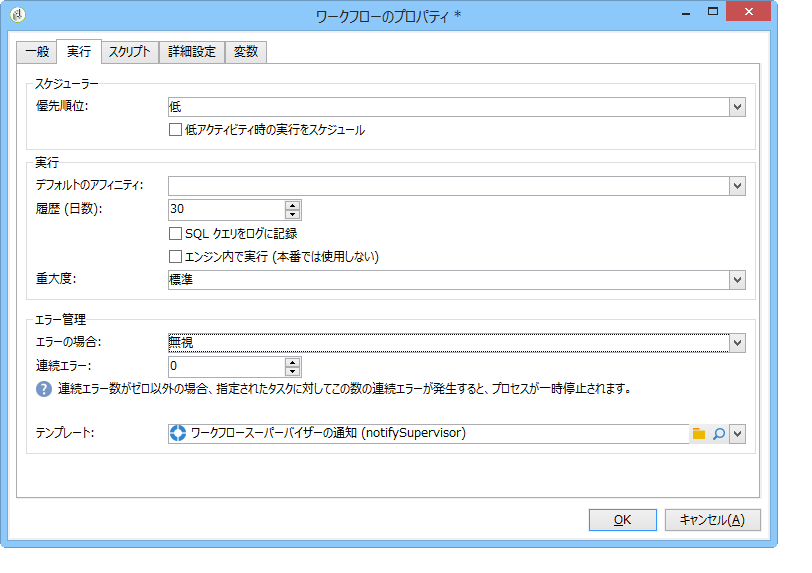
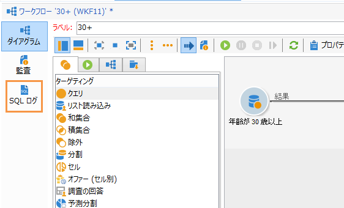

# ワークフローのプロパティ{#workflow-properties}

## 「実行」タブ{#execution-tab}

The **[!UICONTROL Execution]** tab of the **[!UICONTROL Properties]** window in a workflow is broken down into 3 sections:

### スケジューラー {#scheduler}

このセクションは、キャンペーンワークフローにのみ表示されます。

* **[!UICONTROL Priority]**

   このワークフローエンジンは、このフィールドに定義された優先順位の基準に応じて、ワークフローの実行を処理します。For instance, all workflows with an **[!UICONTROL Average]** priority will be executed before those with a **[!UICONTROL Low]** priority.

* **[!UICONTROL Schedule execution for a time of low activity]**

   このオプションでは、ワークフローの起動を低アクティビティの時間帯へと延期することができます。一部のワークフローはデータベースエンジンのリソースの観点からみて、コストが割高になることがあります。このような場合、実行スケジュールを夜間などの低アクティビティの時間に設定するようお勧めします。低いアクティビティ期間は、技術ワークフローで **[!UICONTROL Processes on campaigns]** 定義されます。

### 実行 {#execution}

* **[!UICONTROL Default affinity]**

   インストールに複数のワークフローサーバーが存在する場合、このフィールドを使用して、ワークフローを実行するマシンを選択します。このフィールドで定義した値がどのサーバーにも存在しない場合、ワークフローは保留中となります。

   この[節](../../installation/using/configuring-campaign-server.md#high-availability-workflows-and-affinities)を参照してください。

* **[!UICONTROL History in days]**

   データベースの作業用テーブルには、タスク、イベント、ログなどの実行履歴が保存されています。このフィールドでは、対象のワークフローをアーカイブしておく日数を定義できます。最も古いアーカイブはクリーンアッププロセスが 1 日に 1 回削除します。このフィールドの値がゼロの場合、アーカイブは削除されません。

* **[!UICONTROL Log SQL queries in the journal]**

   この機能を設定できるのは上級ユーザーに限られます。クエリ、和集合、積集合などのターゲット設定アクティビティを含むワークフローに関係する機能です。このオプションのチェックボックスがオンであると、ワークフローの実行中にデータベースに送信される SQL クエリが Adobe Campaign に表示されるので、この内容を分析することで、クエリの最適化や問題の診断が可能になります。

   Queries are displayed in an **[!UICONTROL SQL logs]** tab which is added to the workflow (except campaign workflows) and to the **[!UICONTROL Properties]** activity when the option is enabled. The **[!UICONTROL Audit]** tab also includes SQL queries.

   

* **[!UICONTROL Execute in the engine]**

   このオプションはデバッグのみで使用し、本番では絶対に使用しないでください。このオプションが有効になると、対象のワークフローのみが優先され、そのワークフローが完了するまで、ほかのワークフローはすべて停止されます。

### エラー管理 {#error-management}

* **[!UICONTROL Troubleshooting]**

   このフィールドでは、ワークフロータスクでエラーが発生した場合におこなうアクションを定義できます。次の 2 つのオプションが使用可能です。

   * **[!UICONTROL Stop the process]**:ワークフローは自動的に一時停止されます。 ワークフローのステータスがに変わりま **[!UICONTROL Failed]**&#x200B;す。 Once the issue is solved, restart the workflow using the **[!UICONTROL Start]** or **[!UICONTROL Restart]** buttons.
   * **[!UICONTROL Ignore]**:エラーをトリガーしたタスクのステータスはに変わりますが、ワ **[!UICONTROL Failed]**&#x200B;ークフローはステータスを維持 **[!UICONTROL Started]** します。 この設定は繰り返しタスクと関係があり、分岐にスケジューラーが含まれる場合、ワークフローは次に実行されるときに、正常に起動します。

* **[!UICONTROL Consecutive errors]**

   このフィールドは、フィールドで値が選 **[!UICONTROL Ignore]** 択されている場合に使用可能にな **[!UICONTROL In case of errors]** ります。 プロセスを停止するまでに無視するエラーの数を指定できます。Once this number is reached, the workflow status changes to **[!UICONTROL Failed]**. このフィールドの値が 0 の場合、エラーの数にかかわらず、ワークフローが停止することはありません。

* **[!UICONTROL Template]**

   This field lets you select the notification template to be sent to the workflow supervisors when its status changes to **[!UICONTROL Failed]**.

   テンプレートのプロファイルに E メールアドレスが記入されている場合は、E メールで通知がおこなわれます。To define workflow supervisors, go to the **[!UICONTROL Supervisor(s)]** field of the properties (**[!UICONTROL General]** tab).

   

   The **[!UICONTROL Notification to a workflow supervisor]** default template includes a link for accessing the Adobe Campaign console via the Web so that the recipient can work on the issue once they are logged on.

   パーソナライズされたテンプレートを作成するには、に進みま **[!UICONTROL Administration>Campaign management>Technical deliveries and templates]**&#x200B;す。

